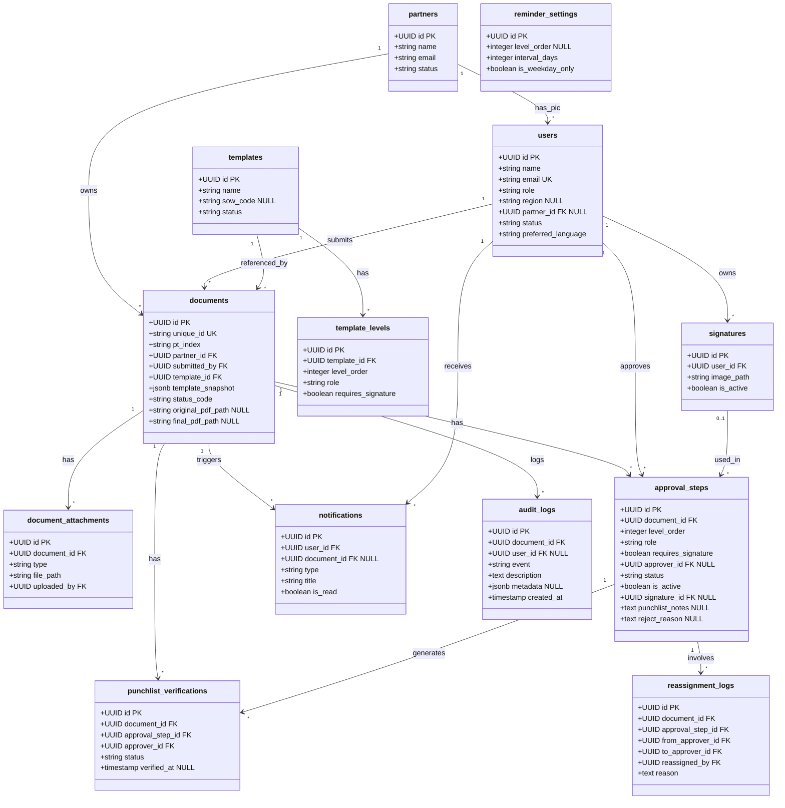

# Data Model

| | |
|---|---|
| **Document Version** | v1.0 |
| **Project** | Acceptra — Document Approval System |
| **Product** | Web Application Pengesahan Dokumen ATP/BAST |
| **Status** | Draft — for development |
| **Last Updated** | 2026-06-23 |
| **Author** | PT Anugerah Mahameru Nusantara (AMN) |
| **Customer Pertama** | PT XLSmart (via Aviat Networks Indonesia) |
| **Tech Stack** | Laravel 11 · Inertia.js · React · shadcn/ui · Tailwind CSS · PostgreSQL |
| **Source** | Derived from SRS Acceptra v2.0 & IA Acceptra v2.0 |

---

## 1. Overview

Dokumen ini mendefinisikan data model untuk **Acceptra** — sistem pengesahan dokumen ATP/BAST digital. Model ini diturunkan dari SRS §6 (Model Data Konseptual) dan IA Acceptra v2.0.

Acceptra memiliki **13 tabel utama** yang mendukung alur penuh: user & role management → partner & template SOW → submission dokumen → approval berjenjang → PDF stamping → punchlist → audit trail.

**Keputusan Desain Utama:**

| Aspek | Keputusan | Alasan / Referensi |
|---|---|---|
| Primary Key | **UUID v7** (semua tabel) | SRS C-7, NFR-SEC-08 — sequential & non-enumerable di URL |
| Kode Bisnis Dokumen | `unique_id` (`ACC-{YYYY}-{urut}`) terpisah dari UUID | SRS FR-SUB-04, §6.3 — tidak dipakai di URL, tidak di-stamp ke PDF |
| Snapshot Struktur Approval | `template_snapshot` JSONB di `documents` | SRS FR-TPL-06 — perubahan template tidak mempengaruhi dokumen berjalan |
| Status Dokumen | `status_code` VARCHAR (draft + 01–16) di `documents` | SRS §7 — di-update via state machine aplikasi berdasarkan kondisi `approval_steps` |
| Soft Delete | `deleted_at` NULL di `users`, `partners`, `templates` | SRS FR-USR-05 (approver aktif), FR-TPL-05 (template terpakai) |
| RBAC | Kolom `role` di `users` + spatie/laravel-permission (middleware/gate) | SRS C-4, FR-USR-02 — satu user = satu role dari 8 role tetap |
| File Storage | Path string di database; file fisik di S3-compatible storage | SRS NFR-STOR-03, NFR-SEC-06 — signed/temporary URL |
| Audit Trail | Tabel `audit_logs` append-only (tanpa `updated_at`) | SRS FR-AUD-03, NFR-AUDIT-01 — immutable |

---

## 2. Class Diagram



---

## 3. Entity Descriptions

### 3.1 users

Seluruh pengguna sistem: Aviat internal (Super Admin, Admin, Viewer), Partner eksternal (subkontraktor), dan Approver customer. Satu user memiliki tepat satu role (SRS FR-USR-02). Soft-delete mencegah penghapusan user yang masih menjadi approver aktif (SRS FR-USR-05).

| Kolom | Tipe | Constraint | Deskripsi |
|---|---|---|---|
| id | UUID | PRIMARY KEY | UUID v7, di-generate aplikasi |
| name | VARCHAR(150) | NOT NULL | Nama lengkap |
| email | VARCHAR(255) | UNIQUE, NOT NULL | Email login & penerima notifikasi |
| password_hash | VARCHAR(255) | NOT NULL | Bcrypt/Argon2 hash (SRS NFR-SEC-02) |
| role | VARCHAR(30) | NOT NULL | Salah satu dari 8 role (lihat di bawah) |
| region | VARCHAR(100) | NULL | Region opsional (SRS FR-USR-03) |
| partner_id | UUID | FK partners.id, NULL | Diisi untuk user bertipe `partner` |
| status | VARCHAR(20) | NOT NULL, DEFAULT 'active' | `active` / `inactive` |
| preferred_language | VARCHAR(5) | NOT NULL, DEFAULT 'id' | `id` / `en` (SRS FR-I18N-01) |
| email_verified_at | TIMESTAMP | NULL | NULL = belum diverifikasi |
| invitation_token | VARCHAR(255) | NULL | Token undangan one-time (SRS FR-AUTH-05) |
| invitation_expires_at | TIMESTAMP | NULL | Batas waktu token (SRS FR-AUTH-06) |
| created_at | TIMESTAMP | NOT NULL, DEFAULT NOW() | |
| updated_at | TIMESTAMP | NOT NULL, DEFAULT NOW() | |
| deleted_at | TIMESTAMP | NULL | Soft delete |

**Nilai valid `role`:**

| Role | Kode | Tipe |
|---|---|---|
| Super Admin | `super_admin` | Aviat internal |
| Admin | `admin` | Aviat internal (approver L1) |
| Viewer | `viewer` | Aviat internal (read-only) |
| Partner / Subcon | `partner` | Eksternal (originator) |
| Approver MS BO | `approver_ms_bo` | Customer (approve-only) |
| Approver MS RTS | `approver_ms_rts` | Customer (TTD) |
| Approver XLS RTH Team | `approver_xls_rth_team` | Customer (TTD) |
| Approver XLS RTH | `approver_xls_rth` | Customer (TTD) |

---

### 3.2 partners

Master data subkontraktor/vendor pelaksana. Satu partner dapat memiliki lebih dari satu user PIC (SRS FR-PTR-03). Soft-delete dibolehkan jika tidak ada dokumen aktif yang terhubung.

| Kolom | Tipe | Constraint | Deskripsi |
|---|---|---|---|
| id | UUID | PRIMARY KEY | UUID v7 |
| name | VARCHAR(200) | NOT NULL | Nama perusahaan partner |
| email | VARCHAR(255) | NOT NULL | Email kontak utama partner |
| status | VARCHAR(20) | NOT NULL, DEFAULT 'active' | `active` / `inactive` |
| created_at | TIMESTAMP | NOT NULL, DEFAULT NOW() | |
| updated_at | TIMESTAMP | NOT NULL, DEFAULT NOW() | |
| deleted_at | TIMESTAMP | NULL | Soft delete |

---

### 3.3 signatures

Saved signature milik user, disimpan sebagai gambar di S3-compatible storage. Hanya satu yang `is_active = true` per user pada satu waktu. Signature lama tidak dihapus — dipertahankan sebagai riwayat untuk audit (SRS FR-SIG-04/06).

| Kolom | Tipe | Constraint | Deskripsi |
|---|---|---|---|
| id | UUID | PRIMARY KEY | UUID v7 |
| user_id | UUID | FK users.id, NOT NULL | Pemilik signature |
| image_path | VARCHAR(500) | NOT NULL | Path file gambar di S3-compatible storage |
| is_active | BOOLEAN | NOT NULL, DEFAULT true | Hanya 1 aktif per user (enforce di aplikasi) |
| created_at | TIMESTAMP | NOT NULL, DEFAULT NOW() | |
| updated_at | TIMESTAMP | NOT NULL, DEFAULT NOW() | |

---

### 3.4 templates

Definisi struktur alur approval per SOW. Template hanya menyimpan struktur level — PIC approver dipilih saat submission (SRS FR-TPL-02). Soft-delete dilarang jika template masih dipakai dokumen aktif (SRS FR-TPL-05). Perubahan template setelah dokumen submit **tidak** mempengaruhi dokumen berjalan karena dokumen menyimpan snapshot (SRS FR-TPL-06).

| Kolom | Tipe | Constraint | Deskripsi |
|---|---|---|---|
| id | UUID | PRIMARY KEY | UUID v7 |
| name | VARCHAR(200) | NOT NULL | Nama template/SOW (mis. "Install Microwave") |
| sow_code | VARCHAR(50) | NULL | Kode singkat SOW (mis. `INSTALL`, `UPGRADE`) |
| description | TEXT | NULL | Deskripsi opsional |
| status | VARCHAR(20) | NOT NULL, DEFAULT 'active' | `active` / `inactive` |
| created_at | TIMESTAMP | NOT NULL, DEFAULT NOW() | |
| updated_at | TIMESTAMP | NOT NULL, DEFAULT NOW() | |
| deleted_at | TIMESTAMP | NULL | Soft delete |

---

### 3.5 template_levels

Level approval berurutan dalam satu template. `level_order = 1` selalu L1 (Admin Aviat, approve-only). Jumlah level bervariasi per SOW (mis. 3 atau 4 level) sesuai SRS FR-TPL-03.

| Kolom | Tipe | Constraint | Deskripsi |
|---|---|---|---|
| id | UUID | PRIMARY KEY | UUID v7 |
| template_id | UUID | FK templates.id, NOT NULL | Template induk |
| level_order | SMALLINT | NOT NULL, CHECK (>= 1) | Urutan: 1 = L1, 2 = L2, dst. |
| role | VARCHAR(30) | NOT NULL | Role yang dibutuhkan di level ini |
| requires_signature | BOOLEAN | NOT NULL, DEFAULT false | `true` = wajib TTD; `false` = approve-only |
| created_at | TIMESTAMP | NOT NULL, DEFAULT NOW() | |
| updated_at | TIMESTAMP | NOT NULL, DEFAULT NOW() | |

**Constraint:** `UNIQUE (template_id, level_order)` — urutan unik per template.

**Aturan:** L1 dan MS BO selalu `requires_signature = false` (SRS FR-TPL-04).

---

### 3.6 documents

Entitas inti sistem. Menyimpan metadata ATP, referensi file PDF, status lifecycle 16 tahap, dan **snapshot** lengkap struktur approval saat dokumen disubmit. `unique_id` adalah kode bisnis terpisah dari UUID — dipakai di tampilan dan pencarian, bukan di URL dan tidak di-stamp ke PDF (SRS FR-SUB-04, FR-SUB-09, §6.3).

| Kolom | Tipe | Constraint | Deskripsi |
|---|---|---|---|
| id | UUID | PRIMARY KEY | UUID v7 — dipakai di URL & FK |
| unique_id | VARCHAR(20) | UNIQUE, NOT NULL | Kode bisnis `ACC-{YYYY}-{urut}`, reset per tahun |
| pt_index | VARCHAR(100) | NOT NULL | Wajib; tampil di form & di-stamp ke PDF (SRS FR-SUB-09) |
| link_id | VARCHAR(100) | NULL | Link ID proyek |
| link_name | VARCHAR(200) | NULL | Link Name proyek |
| project_code | VARCHAR(100) | NULL | Project Code |
| vendor_contractor | VARCHAR(200) | NOT NULL | Default: `PT Aviat Solusi Komunikasi Indonesia` (SRS FR-SUB-08) |
| partner_id | UUID | FK partners.id, NOT NULL | Partner pemilik dokumen |
| submitted_by | UUID | FK users.id, NOT NULL | User yang submit (Partner atau Admin) |
| template_id | UUID | FK templates.id, NOT NULL | Referensi template asal |
| template_snapshot | JSONB | NOT NULL | Snapshot struktur level+role+requires_signature saat submit |
| sow_name | VARCHAR(200) | NOT NULL | Nama SOW disalin dari template saat submit |
| tower_id_ne | VARCHAR(100) | NULL | Tower ID Near End |
| site_name_ne | VARCHAR(200) | NULL | Site Name Near End |
| tower_id_fe | VARCHAR(100) | NULL | Tower ID Far End |
| site_name_fe | VARCHAR(200) | NULL | Site Name Far End |
| original_pdf_path | VARCHAR(500) | NULL | PDF asli yang diunggah |
| final_pdf_path | VARCHAR(500) | NULL | PDF final ter-stamp setelah semua approval |
| status_code | VARCHAR(10) | NOT NULL, DEFAULT 'draft' | Lihat SRS §7: `draft` / `01`–`16` |
| date_atp_submission | DATE | NULL | Auto-set saat pertama kali submit (SRS FR-SUB-04) |
| date_atp_approved | DATE | NULL | Auto-set saat approver terakhir approve (SRS FR-APR-09) |
| atp_punchlist | TEXT | NULL | Agregat catatan punchlist semua approver (SRS FR-SUB-04) |
| acceptance_status | VARCHAR(50) | NULL | Status penerimaan ATP; di-stamp ke PDF (SRS FR-SUB-04) |
| is_imported | BOOLEAN | NOT NULL, DEFAULT false | `true` = dokumen impor offline (SRS FR-IMP) |
| created_at | TIMESTAMP | NOT NULL, DEFAULT NOW() | |
| updated_at | TIMESTAMP | NOT NULL, DEFAULT NOW() | |
| deleted_at | TIMESTAMP | NULL | Soft delete |

**Contoh nilai `template_snapshot` (JSONB):**
```json
{
  "template_id": "019xxx-uuid-v7",
  "template_name": "SOW Install Microwave",
  "levels": [
    { "level_order": 1, "role": "admin",              "requires_signature": false },
    { "level_order": 2, "role": "approver_ms_bo",     "requires_signature": false },
    { "level_order": 3, "role": "approver_ms_rts",    "requires_signature": true  },
    { "level_order": 4, "role": "approver_xls_rth",   "requires_signature": true  }
  ]
}
```

> **Catatan `unique_id`:** Di-generate di application layer dengan pola `ACC-{YYYY}-{NNNN}` menggunakan counter per tahun dari tabel `documents` (`SELECT MAX(unique_id) WHERE unique_id LIKE 'ACC-{YYYY}-%'`). Reset ke `0001` setiap tahun baru.

---

### 3.7 document_attachments

Seluruh lampiran per dokumen, dibedakan via kolom `type`. Menangani 4 jenis lampiran dalam satu tabel: Excel view-only, bukti approval offline (import), attachment reassign, dan PDF revisi punchlist (SRS FR-ATT, FR-IMP-03, FR-RSG-04, FR-PCL-02).

| Kolom | Tipe | Constraint | Deskripsi |
|---|---|---|---|
| id | UUID | PRIMARY KEY | UUID v7 |
| document_id | UUID | FK documents.id, NOT NULL | Dokumen induk |
| type | VARCHAR(30) | NOT NULL | Kategori lampiran (lihat tabel di bawah) |
| file_path | VARCHAR(500) | NOT NULL | Path file di S3-compatible storage |
| original_filename | VARCHAR(255) | NOT NULL | Nama file asli saat upload |
| file_size_bytes | BIGINT | NULL | Ukuran file (bytes), opsional |
| uploaded_by | UUID | FK users.id, NOT NULL | User yang mengupload |
| notes | TEXT | NULL | Catatan kontekstual (mis. keterangan bukti offline) |
| created_at | TIMESTAMP | NOT NULL, DEFAULT NOW() | |

**Nilai valid `type`:**

| Type | Deskripsi | FR |
|---|---|---|
| `excel` | Lampiran Excel view-only per dokumen | FR-ATT-01 |
| `offline_evidence` | Bukti approval yang sudah dilakukan offline (import) | FR-IMP-03 |
| `reassign_evidence` | Attachment saat reassign approver | FR-RSG-04 |
| `punchlist_revision` | PDF revisi punchlist yang di-upload Admin | FR-PCL-02 |

> **Validasi aplikasi:** Maksimal 1 lampiran bertipe `excel` per dokumen (SRS FR-ATT-01).

---

### 3.8 approval_steps

Step approval per level per dokumen — tabel sentral alur approval. Dibuat otomatis dari `template_snapshot` saat dokumen disubmit. Nilai `role` dan `requires_signature` disalin langsung dari snapshot — **bukan FK ke `template_levels`** — sehingga perubahan template tidak berdampak (SRS §6.3).

`is_active = true` menandai step yang **sedang menunggu aksi**. Untuk L1 (`level_order = 1`), `approver_id = NULL` — admin mana pun dapat bertindak (SRS FR-SUB-02). Alur strictly sequential (SRS FR-APR-11).

| Kolom | Tipe | Constraint | Deskripsi |
|---|---|---|---|
| id | UUID | PRIMARY KEY | UUID v7 |
| document_id | UUID | FK documents.id, NOT NULL | Dokumen terkait |
| level_order | SMALLINT | NOT NULL | Urutan: 1 = L1, 2 = L2, dst. |
| role | VARCHAR(30) | NOT NULL | Role yang dibutuhkan (disalin dari snapshot) |
| requires_signature | BOOLEAN | NOT NULL | Dari snapshot — menentukan apakah Signature Pad muncul |
| approver_id | UUID | FK users.id, NULL | PIC approver; NULL untuk L1 (siapa saja admin) |
| status | VARCHAR(30) | NOT NULL, DEFAULT 'pending' | Status step (lihat tabel di bawah) |
| action_at | TIMESTAMP | NULL | Waktu aksi approve/reject dilakukan |
| signature_id | UUID | FK signatures.id, NULL | Signature yang dipakai (hanya bila `requires_signature = true`) |
| punchlist_notes | TEXT | NULL | Catatan punchlist (bila `approved_with_punchlist`) |
| reject_reason | TEXT | NULL | Alasan reject (wajib diisi saat reject) |
| is_offline | BOOLEAN | NOT NULL, DEFAULT false | `true` = sudah disetujui offline sebelum import |
| offline_date | DATE | NULL | Tanggal approval offline |
| is_active | BOOLEAN | NOT NULL, DEFAULT false | Step yang sedang aktif menunggu aksi |
| created_at | TIMESTAMP | NOT NULL, DEFAULT NOW() | |
| updated_at | TIMESTAMP | NOT NULL, DEFAULT NOW() | |

**Constraint:** `UNIQUE (document_id, level_order)` — satu step per level per dokumen.

**Nilai valid `status`:**

| Status | Deskripsi |
|---|---|
| `pending` | Menunggu aksi approver |
| `approved` | Disetujui tanpa punchlist |
| `approved_with_punchlist` | Disetujui dengan catatan punchlist |
| `rejected` | Ditolak; dokumen kembali ke originator untuk revisi |
| `offline_approved` | Sudah disetujui sebelumnya di luar sistem (import dokumen berjalan) |
| `skipped` | Level tidak dipakai karena SOW memiliki level lebih sedikit |

---

### 3.9 punchlist_verifications

Melacak status verifikasi revisi punchlist per approver yang membuat punchlist. Digunakan untuk menentukan transisi status: `14` (ATP Done w/ Punchlist) → `15` (Punchlist Revised) → `16` (Closed). Status `16` dicapai saat **semua** baris di tabel ini untuk dokumen terkait bernilai `verified` (SRS FR-PCL-03/04).

| Kolom | Tipe | Constraint | Deskripsi |
|---|---|---|---|
| id | UUID | PRIMARY KEY | UUID v7 |
| document_id | UUID | FK documents.id, NOT NULL | Dokumen terkait |
| approval_step_id | UUID | FK approval_steps.id, NOT NULL | Step yang menghasilkan punchlist |
| approver_id | UUID | FK users.id, NOT NULL | Approver pembuat punchlist |
| status | VARCHAR(20) | NOT NULL, DEFAULT 'pending' | `pending` / `verified` / `rejected` |
| verified_at | TIMESTAMP | NULL | Waktu verifikasi dilakukan |
| notes | TEXT | NULL | Catatan opsional dari approver saat verifikasi |
| created_at | TIMESTAMP | NOT NULL, DEFAULT NOW() | |
| updated_at | TIMESTAMP | NOT NULL, DEFAULT NOW() | |

**Constraint:** `UNIQUE (document_id, approval_step_id)` — satu record verifikasi per step punchlist per dokumen.

---

### 3.10 reassignment_logs

Mencatat seluruh kejadian reassign approver. Append-only (tidak ada UPDATE); merupakan bagian dari audit trail dan berdampak pada `approval_steps.approver_id` yang di-update saat reassign (SRS FR-RSG-07).

| Kolom | Tipe | Constraint | Deskripsi |
|---|---|---|---|
| id | UUID | PRIMARY KEY | UUID v7 |
| document_id | UUID | FK documents.id, NOT NULL | Dokumen terkait |
| approval_step_id | UUID | FK approval_steps.id, NOT NULL | Step yang di-reassign |
| from_approver_id | UUID | FK users.id, NOT NULL | Approver asal (kehilangan akses) |
| to_approver_id | UUID | FK users.id, NOT NULL | Approver pengganti (mendapat akses & notifikasi) |
| reassigned_by | UUID | FK users.id, NOT NULL | Admin yang melakukan reassign |
| reason | TEXT | NOT NULL | Alasan reassign (wajib diisi) |
| attachment_path | VARCHAR(500) | NULL | Path file attachment opsional |
| reassigned_at | TIMESTAMP | NOT NULL, DEFAULT NOW() | Waktu reassign dilakukan |
| created_at | TIMESTAMP | NOT NULL, DEFAULT NOW() | |

---

### 3.11 notifications

Notifikasi in-app per user. Topbar menampilkan 10 terbaru; halaman penuh tersedia di `/notifications`. Deep link `action_url` mengarahkan user ke halaman tujuan setelah dibaca (SRS FR-NTF-01/02, Matriks §10.2).

| Kolom | Tipe | Constraint | Deskripsi |
|---|---|---|---|
| id | UUID | PRIMARY KEY | UUID v7 |
| user_id | UUID | FK users.id, NOT NULL | Penerima notifikasi |
| document_id | UUID | FK documents.id, NULL | Dokumen terkait; NULL untuk notifikasi sistem |
| type | VARCHAR(30) | NOT NULL | Kategori event (lihat tabel di bawah) |
| title | VARCHAR(255) | NOT NULL | Judul singkat notifikasi |
| body | TEXT | NOT NULL | Isi notifikasi lengkap |
| action_url | VARCHAR(500) | NULL | Deep link ke halaman tujuan (SRS FR-AUTH-03) |
| is_read | BOOLEAN | NOT NULL, DEFAULT false | Status baca |
| read_at | TIMESTAMP | NULL | Waktu pertama kali dibaca |
| created_at | TIMESTAMP | NOT NULL, DEFAULT NOW() | |

**Nilai valid `type` (sesuai Matriks SRS §10.2):**

| Type | Event | Penerima |
|---|---|---|
| `submission` | Dokumen disubmit (sent receipt) | Semua Admin Aviat |
| `approval_turn` | Giliran approval tiba | Approver giliran aktif |
| `approved` | Approve / Approve with Punchlist | Semua Admin Aviat |
| `rejected` | Reject | Semua Admin Aviat |
| `flow_completed` | Alur selesai (status 13/14) | Semua Admin + approver terkait |
| `punchlist_revised` | Admin upload revisi punchlist (status 15) | Approver pembuat punchlist |
| `reassigned` | Reassign ke approver baru | Approver baru |
| `result_partner` | Hasil s/d L1 & dokumen reject (revisi) | Partner pemilik |
| `reminder` | Reminder pending weekday | Approver terkait + semua Admin |

---

### 3.12 reminder_settings

Konfigurasi interval reminder email per tingkat approval. Default: setiap hari kerja (Senin–Jumat). Dapat dikonfigurasi per level oleh Super Admin melalui `/settings/reminders` (SRS FR-RMD-01/02).

| Kolom | Tipe | Constraint | Deskripsi |
|---|---|---|---|
| id | UUID | PRIMARY KEY | UUID v7 |
| level_order | SMALLINT | NULL | `NULL` = global untuk semua level; isi angka = level spesifik |
| interval_days | SMALLINT | NOT NULL, DEFAULT 1, CHECK (>= 1) | Interval hari kerja antar reminder |
| is_weekday_only | BOOLEAN | NOT NULL, DEFAULT true | `true` = hanya Senin–Jumat (SRS FR-RMD-01) |
| created_at | TIMESTAMP | NOT NULL, DEFAULT NOW() | |
| updated_at | TIMESTAMP | NOT NULL, DEFAULT NOW() | |

---

### 3.13 audit_logs

Jejak audit append-only untuk setiap kejadian per dokumen. Diakses oleh Aviat & Approver (akses penuh) dan Partner (terbatas s/d L1). Tidak ada kolom `updated_at` karena tabel ini benar-benar immutable (SRS FR-AUD-03, NFR-AUDIT-01/02).

| Kolom | Tipe | Constraint | Deskripsi |
|---|---|---|---|
| id | UUID | PRIMARY KEY | UUID v7 |
| document_id | UUID | FK documents.id, NOT NULL | Dokumen terkait |
| user_id | UUID | FK users.id, NULL | Aktor; `NULL` untuk kejadian sistem/otomatis |
| event | VARCHAR(100) | NOT NULL | Kode kejadian (lihat contoh di bawah) |
| description | TEXT | NOT NULL | Deskripsi naratif kejadian (bahasa Inggris) |
| metadata | JSONB | NULL | Data kontekstual tambahan (mis. nilai lama/baru, path file) |
| created_at | TIMESTAMP | NOT NULL, DEFAULT NOW() | Immutable; timezone-aware (SRS NFR-AUDIT-02) |

**Contoh nilai `event`:**
`document.submitted` · `document.revised` · `document.auto_approved_l1` · `step.approved` · `step.approved_with_punchlist` · `step.rejected` · `step.reassigned` · `step.offline_imported` · `punchlist.revision_uploaded` · `punchlist.verified` · `punchlist.revision_rejected` · `pdf.stamped` · `signature.saved` · `signature.replaced`

---

## 4. Relationships

| Relasi | Tipe | Kardinalitas | Keterangan |
|---|---|---|---|
| Partner → User | One-to-Many | 1 : N | Satu partner dapat memiliki beberapa user PIC (SRS FR-PTR-03) |
| User → Signature | One-to-Many | 1 : N | Satu user memiliki riwayat signature; satu aktif via `is_active` |
| Template → TemplateLevel | One-to-Many | 1 : N | Satu template memiliki banyak level berurutan |
| Partner → Document | One-to-Many | 1 : N | Satu partner memiliki banyak dokumen |
| User → Document | One-to-Many | 1 : N | Satu user (partner/admin) dapat submit banyak dokumen |
| Template → Document | One-to-Many | 1 : N | Template sebagai referensi asal; dokumen menyimpan snapshot-nya |
| Document → ApprovalStep | One-to-Many | 1 : N | Satu dokumen memiliki N step sesuai jumlah level SOW |
| Document → DocumentAttachment | One-to-Many | 1 : N | Satu dokumen dapat memiliki banyak lampiran (berbeda type) |
| Document → PunchlistVerification | One-to-Many | 1 : N | Satu dokumen dapat memiliki banyak verifikasi punchlist |
| Document → AuditLog | One-to-Many | 1 : N | Setiap kejadian pada dokumen tercatat sebagai baris baru |
| Document → Notification | One-to-Many | 1 : N | Satu dokumen memicu banyak notifikasi ke berbagai user |
| User → ApprovalStep | One-to-Many | 1 : N | Satu user dapat menjadi approver di banyak step (dokumen berbeda) |
| Signature → ApprovalStep | One-to-Many | 0..1 : N | Satu saved signature dapat dipakai di banyak step |
| ApprovalStep → PunchlistVerification | One-to-One | 1 : 1 | Satu step punchlist → satu record verifikasi per dokumen |
| ApprovalStep → ReassignmentLog | One-to-Many | 1 : N | Satu step dapat memiliki riwayat reassign (bila di-reassign berkali) |
| User → Notification | One-to-Many | 1 : N | Satu user menerima banyak notifikasi dari berbagai event |

---

## 5. Business Rules

### 5.1 User & Role Rules

- Satu user memiliki tepat satu role dari 8 role yang tersedia (SRS FR-USR-02).
- User dengan role `partner` wajib memiliki `partner_id` yang valid; role lain `partner_id = NULL`.
- User yang menjadi approver aktif (`approval_steps.status = 'pending'` dengan `approver_id = user.id`) tidak dapat dihapus — arahkan ke reassign terlebih dahulu (SRS FR-USR-05).
- Akun Partner dan Approver dibuat Admin Aviat; set password via email undangan (SRS FR-AUTH-05, A-4).
- Link undangan kedaluwarsa setelah `invitation_expires_at`; dapat dikirim ulang oleh Admin (SRS FR-AUTH-06).

### 5.2 Template & Level Rules

- Template yang dipakai dokumen aktif (non-draft) tidak dapat dihapus permanen; gunakan soft-delete atau deaktivasi (SRS FR-TPL-05).
- `level_order = 1` (L1) selalu `requires_signature = false` (SRS FR-TPL-04).
- `role approver_ms_bo` juga selalu `requires_signature = false` (SRS FR-TPL-04).
- `UNIQUE (template_id, level_order)` — satu urutan per template.
- Snapshot (`template_snapshot` di `documents`) disalin saat submit — perubahan template sesudahnya tidak mempengaruhi dokumen berjalan (SRS FR-TPL-06).

### 5.3 Document Rules

- `unique_id` di-generate sequential per tahun: `ACC-{YYYY}-{0001, 0002, ...}`, counter reset setiap 1 Januari (SRS FR-SUB-04).
- `pt_index` wajib; ditampilkan di form dan di-stamp ke PDF (SRS FR-SUB-09). `unique_id` hanya tampil di aplikasi — tidak di URL, tidak di PDF.
- `date_atp_submission` auto-set saat pertama kali submit (bukan saat draft disimpan).
- `date_atp_approved` auto-set saat approver terakhir (sesuai SOW) menyetujui (SRS FR-APR-09).
- Submit oleh Partner → `status_code = '01'`; submit langsung Admin → `status_code = '04'` (auto-approve L1) (SRS FR-SUB-03/06).
- Satu dokumen maksimal memiliki **1 lampiran** bertipe `excel` (SRS FR-ATT-01); divalidasi di application layer.

### 5.4 Approval Flow Rules

- Alur strictly sequential — hanya step dengan `is_active = true` yang dapat menerima aksi (SRS FR-APR-01/11).
- L1 (`level_order = 1`): `approver_id = NULL`; semua admin/super-admin dapat mengambil aksi (SRS FR-SUB-02).
- Level dengan `requires_signature = true`: `signature_id` wajib diisi sebelum approve/approve_with_punchlist (SRS FR-APR-04).
- Level dengan `requires_signature = false`: Approve atau Reject saja, tanpa signature (SRS FR-APR-03).
- **Reject**: wajib isi `reject_reason`; status dokumen ke "Need Rectification"; Partner/Admin revisi PDF → resubmit hanya ke level yang reject; sequence tidak reset; approval sebelumnya tetap sah (SRS FR-APR-07/08).
- Approver terakhir approve tanpa punchlist → `status_code = '13'`; dengan punchlist → `status_code = '14'` (SRS FR-APR-09).
- **Tidak ada OTP** di seluruh alur approval (SRS C-9, FR-APR-05).

### 5.5 Signature Rules

- Hanya satu `signatures.is_active = true` per user pada satu waktu (enforce di application layer).
- Saat user mengganti signature: yang lama di-set `is_active = false`; yang baru `is_active = true` (SRS FR-SIG-04).
- `approval_steps.signature_id` menyimpan referensi ke signature yang **digunakan saat aksi** — tidak berubah meski user ganti signature setelahnya.

### 5.6 Punchlist Rules

- `punchlist_verifications` dibuat otomatis untuk setiap approver yang melakukan `approved_with_punchlist`.
- Admin upload PDF revisi → `status_code = '15'`; notifikasi ke semua approver pembuat punchlist (SRS FR-PCL-02).
- Status `16` (Closed) dicapai saat **semua** `punchlist_verifications.status = 'verified'` untuk dokumen terkait (SRS FR-PCL-04).
- Approver dapat menolak revisi (`punchlist_verifications.status = 'rejected'`) → dokumen kembali ke `status_code = '14'` (SRS FR-PCL-06).

### 5.7 Reassign Rules

- Hanya Admin dan Super Admin yang dapat melakukan reassign (SRS FR-RSG-01).
- Berlaku untuk step aktif (`is_active = true`) dan step yang belum tiba gilirannya (SRS FR-RSG-02).
- Step yang sudah `approved` atau `approved_with_punchlist` tidak dapat di-reassign (SRS FR-RSG-03).
- Saat reassign: update `approval_steps.approver_id` ke approver baru; catat di `reassignment_logs`; approver lama kehilangan akses (SRS FR-RSG-05).
- Sequence tidak mundur; jika step aktif, approver baru langsung mendapat notifikasi tanpa OTP (SRS FR-RSG-06).

### 5.8 Audit Trail Rules

- `audit_logs` adalah append-only — tidak ada UPDATE atau DELETE (SRS FR-AUD-03).
- Setiap perubahan state dokumen wajib menghasilkan satu baris baru di `audit_logs` (SRS NFR-AUDIT-01).
- Partner hanya dapat melihat `audit_logs` dari step `level_order <= 1` dokumen miliknya (SRS FR-AUD-02).
- `audit_logs.created_at` harus timezone-aware (gunakan TIMESTAMPTZ di produksi) (SRS NFR-AUDIT-02).

### 5.9 File & Storage Rules

- File fisik (PDF, Excel, signature image) disimpan di S3-compatible storage; database hanya menyimpan path string (SRS NFR-STOR-03).
- Akses file via signed/temporary URL atau proxy ber-otorisasi — tidak pernah publik tanpa autentikasi (SRS NFR-SEC-06).
- `original_pdf_path` tetap dipertahankan meski `final_pdf_path` sudah di-generate (SRS FR-PDF-01).
- File signature lama (`is_active = false`) tidak dihapus dari storage — dipertahankan sebagai bukti audit.

### 5.10 Data Retention

- Dokumen final (status 13/16) disimpan permanen (SRS FR-ARC-01).
- `audit_logs`: tidak pernah dihapus; retention selamanya.
- Signature lama (`is_active = false`): dipertahankan untuk audit; tidak dihapus dari storage.
- File di object storage: durable dengan backup berkala; strategi retention ditetapkan sebelum produksi (SRS NFR-REL-02).

---

## 6. Indexes

| Tabel | Nama Index | Kolom | Tujuan |
|---|---|---|---|
| users | idx_users_email | email | Lookup login & undangan |
| users | idx_users_role | role | Filter user per role |
| users | idx_users_partner | partner_id | Lookup user per partner |
| partners | idx_partners_status | status | Filter partner aktif |
| signatures | idx_signatures_user_active | user_id, is_active | Ambil saved signature aktif per user |
| templates | idx_templates_status | status | Filter template aktif |
| template_levels | idx_tpl_levels_template | template_id, level_order | Ambil level berurutan per template |
| documents | idx_docs_unique_id | unique_id | Pencarian kode bisnis (`ACC-YYYY-NNNN`) |
| documents | idx_docs_partner | partner_id | Filter dokumen per partner (SRS FR-PTR-02) |
| documents | idx_docs_status | status_code | Filter per status |
| documents | idx_docs_submitted_by | submitted_by | Filter dokumen per submitter |
| documents | idx_docs_template | template_id | Cek apakah template masih dipakai |
| documents | idx_docs_created_at | created_at | Sort & filter berdasarkan tanggal submit |
| documents | idx_docs_project_code | project_code | Pencarian per project code |
| approval_steps | idx_steps_document | document_id | Ambil semua step per dokumen |
| approval_steps | idx_steps_approver | approver_id | Dokumen menunggu approver tertentu |
| approval_steps | idx_steps_active | document_id, is_active | Cari step aktif per dokumen |
| approval_steps | idx_steps_status | status | Filter step per status (mis. pending reminder) |
| punchlist_verifications | idx_pv_document | document_id | Ambil semua verifikasi per dokumen |
| punchlist_verifications | idx_pv_approver | approver_id | Verifikasi yang perlu dilakukan approver tertentu |
| reassignment_logs | idx_reassign_step | approval_step_id | Riwayat reassign per step |
| reassignment_logs | idx_reassign_doc | document_id | Riwayat reassign per dokumen |
| notifications | idx_notif_user_unread | user_id, is_read | Badge unread count & dropdown topbar |
| notifications | idx_notif_created | created_at | Sort notifikasi terbaru |
| audit_logs | idx_audit_document | document_id | Audit trail per dokumen |
| audit_logs | idx_audit_created | created_at | Sort & filter audit berdasarkan waktu |

---

## 7. SQL DDL (PostgreSQL)

> **Catatan Implementasi:**
> - UUID v7 di-generate di application layer via Laravel `Str::uuid7()` (trait `HasUuids`). `DEFAULT gen_random_uuid()` di bawah adalah fallback dan menghasilkan UUID v4 — **bukan** UUID v7. Di produksi, biarkan Laravel yang mengelola.
> - Gunakan `TIMESTAMPTZ` (timezone-aware) untuk kolom timestamp di lingkungan produksi (SRS NFR-AUDIT-02).
> - Spatie/laravel-permission membuat tabel tambahan (`roles`, `permissions`, `model_has_roles`, dll.) yang di-generate otomatis via migration package — tidak didefinisikan di sini.

```sql
-- Enable UUID extension (untuk fallback gen_random_uuid)
CREATE EXTENSION IF NOT EXISTS "pgcrypto";

-- ============================================================
-- PARTNERS
-- ============================================================
CREATE TABLE partners (
    id              UUID          PRIMARY KEY DEFAULT gen_random_uuid(),
    name            VARCHAR(200)  NOT NULL,
    email           VARCHAR(255)  NOT NULL,
    status          VARCHAR(20)   NOT NULL DEFAULT 'active'
                                  CHECK (status IN ('active', 'inactive')),
    created_at      TIMESTAMP     NOT NULL DEFAULT NOW(),
    updated_at      TIMESTAMP     NOT NULL DEFAULT NOW(),
    deleted_at      TIMESTAMP     NULL
);

-- ============================================================
-- USERS
-- ============================================================
CREATE TABLE users (
    id                      UUID          PRIMARY KEY DEFAULT gen_random_uuid(),
    name                    VARCHAR(150)  NOT NULL,
    email                   VARCHAR(255)  UNIQUE NOT NULL,
    password_hash           VARCHAR(255)  NOT NULL,
    role                    VARCHAR(30)   NOT NULL
                                          CHECK (role IN (
                                              'super_admin', 'admin', 'viewer', 'partner',
                                              'approver_ms_bo', 'approver_ms_rts',
                                              'approver_xls_rth_team', 'approver_xls_rth'
                                          )),
    region                  VARCHAR(100)  NULL,
    partner_id              UUID          NULL REFERENCES partners(id),
    status                  VARCHAR(20)   NOT NULL DEFAULT 'active'
                                          CHECK (status IN ('active', 'inactive')),
    preferred_language      VARCHAR(5)    NOT NULL DEFAULT 'id'
                                          CHECK (preferred_language IN ('id', 'en')),
    email_verified_at       TIMESTAMP     NULL,
    invitation_token        VARCHAR(255)  NULL,
    invitation_expires_at   TIMESTAMP     NULL,
    created_at              TIMESTAMP     NOT NULL DEFAULT NOW(),
    updated_at              TIMESTAMP     NOT NULL DEFAULT NOW(),
    deleted_at              TIMESTAMP     NULL
);

-- ============================================================
-- SIGNATURES
-- ============================================================
CREATE TABLE signatures (
    id          UUID          PRIMARY KEY DEFAULT gen_random_uuid(),
    user_id     UUID          NOT NULL REFERENCES users(id),
    image_path  VARCHAR(500)  NOT NULL,
    is_active   BOOLEAN       NOT NULL DEFAULT true,
    created_at  TIMESTAMP     NOT NULL DEFAULT NOW(),
    updated_at  TIMESTAMP     NOT NULL DEFAULT NOW()
);

-- ============================================================
-- TEMPLATES
-- ============================================================
CREATE TABLE templates (
    id          UUID          PRIMARY KEY DEFAULT gen_random_uuid(),
    name        VARCHAR(200)  NOT NULL,
    sow_code    VARCHAR(50)   NULL,
    description TEXT          NULL,
    status      VARCHAR(20)   NOT NULL DEFAULT 'active'
                              CHECK (status IN ('active', 'inactive')),
    created_at  TIMESTAMP     NOT NULL DEFAULT NOW(),
    updated_at  TIMESTAMP     NOT NULL DEFAULT NOW(),
    deleted_at  TIMESTAMP     NULL
);

-- ============================================================
-- TEMPLATE LEVELS
-- ============================================================
CREATE TABLE template_levels (
    id                  UUID      PRIMARY KEY DEFAULT gen_random_uuid(),
    template_id         UUID      NOT NULL REFERENCES templates(id),
    level_order         SMALLINT  NOT NULL CHECK (level_order >= 1),
    role                VARCHAR(30) NOT NULL,
    requires_signature  BOOLEAN   NOT NULL DEFAULT false,
    created_at          TIMESTAMP NOT NULL DEFAULT NOW(),
    updated_at          TIMESTAMP NOT NULL DEFAULT NOW(),
    UNIQUE (template_id, level_order)
);

-- ============================================================
-- DOCUMENTS
-- ============================================================
CREATE TABLE documents (
    id                  UUID          PRIMARY KEY DEFAULT gen_random_uuid(),
    unique_id           VARCHAR(20)   UNIQUE NOT NULL,   -- ACC-{YYYY}-{NNNN}
    pt_index            VARCHAR(100)  NOT NULL,
    link_id             VARCHAR(100)  NULL,
    link_name           VARCHAR(200)  NULL,
    project_code        VARCHAR(100)  NULL,
    vendor_contractor   VARCHAR(200)  NOT NULL DEFAULT 'PT Aviat Solusi Komunikasi Indonesia',
    partner_id          UUID          NOT NULL REFERENCES partners(id),
    submitted_by        UUID          NOT NULL REFERENCES users(id),
    template_id         UUID          NOT NULL REFERENCES templates(id),
    template_snapshot   JSONB         NOT NULL,
    sow_name            VARCHAR(200)  NOT NULL,
    tower_id_ne         VARCHAR(100)  NULL,
    site_name_ne        VARCHAR(200)  NULL,
    tower_id_fe         VARCHAR(100)  NULL,
    site_name_fe        VARCHAR(200)  NULL,
    original_pdf_path   VARCHAR(500)  NULL,
    final_pdf_path      VARCHAR(500)  NULL,
    status_code         VARCHAR(10)   NOT NULL DEFAULT 'draft'
                                      CHECK (status_code IN (
                                          'draft',
                                          '01','02','03','04','05','06','07','08',
                                          '09','10','11','12','13','14','15','16'
                                      )),
    date_atp_submission DATE          NULL,
    date_atp_approved   DATE          NULL,
    atp_punchlist       TEXT          NULL,
    acceptance_status   VARCHAR(50)   NULL,
    is_imported         BOOLEAN       NOT NULL DEFAULT false,
    created_at          TIMESTAMP     NOT NULL DEFAULT NOW(),
    updated_at          TIMESTAMP     NOT NULL DEFAULT NOW(),
    deleted_at          TIMESTAMP     NULL
);

-- ============================================================
-- DOCUMENT ATTACHMENTS
-- ============================================================
CREATE TABLE document_attachments (
    id                UUID          PRIMARY KEY DEFAULT gen_random_uuid(),
    document_id       UUID          NOT NULL REFERENCES documents(id),
    type              VARCHAR(30)   NOT NULL
                                    CHECK (type IN (
                                        'excel', 'offline_evidence',
                                        'reassign_evidence', 'punchlist_revision'
                                    )),
    file_path         VARCHAR(500)  NOT NULL,
    original_filename VARCHAR(255)  NOT NULL,
    file_size_bytes   BIGINT        NULL,
    uploaded_by       UUID          NOT NULL REFERENCES users(id),
    notes             TEXT          NULL,
    created_at        TIMESTAMP     NOT NULL DEFAULT NOW()
);

-- ============================================================
-- APPROVAL STEPS
-- ============================================================
CREATE TABLE approval_steps (
    id                  UUID          PRIMARY KEY DEFAULT gen_random_uuid(),
    document_id         UUID          NOT NULL REFERENCES documents(id),
    level_order         SMALLINT      NOT NULL,
    role                VARCHAR(30)   NOT NULL,
    requires_signature  BOOLEAN       NOT NULL,
    approver_id         UUID          NULL REFERENCES users(id),
    status              VARCHAR(30)   NOT NULL DEFAULT 'pending'
                                      CHECK (status IN (
                                          'pending', 'approved', 'approved_with_punchlist',
                                          'rejected', 'offline_approved', 'skipped'
                                      )),
    action_at           TIMESTAMP     NULL,
    signature_id        UUID          NULL REFERENCES signatures(id),
    punchlist_notes     TEXT          NULL,
    reject_reason       TEXT          NULL,
    is_offline          BOOLEAN       NOT NULL DEFAULT false,
    offline_date        DATE          NULL,
    is_active           BOOLEAN       NOT NULL DEFAULT false,
    created_at          TIMESTAMP     NOT NULL DEFAULT NOW(),
    updated_at          TIMESTAMP     NOT NULL DEFAULT NOW(),
    UNIQUE (document_id, level_order)
);

-- ============================================================
-- PUNCHLIST VERIFICATIONS
-- ============================================================
CREATE TABLE punchlist_verifications (
    id                UUID          PRIMARY KEY DEFAULT gen_random_uuid(),
    document_id       UUID          NOT NULL REFERENCES documents(id),
    approval_step_id  UUID          NOT NULL REFERENCES approval_steps(id),
    approver_id       UUID          NOT NULL REFERENCES users(id),
    status            VARCHAR(20)   NOT NULL DEFAULT 'pending'
                                    CHECK (status IN ('pending', 'verified', 'rejected')),
    verified_at       TIMESTAMP     NULL,
    notes             TEXT          NULL,
    created_at        TIMESTAMP     NOT NULL DEFAULT NOW(),
    updated_at        TIMESTAMP     NOT NULL DEFAULT NOW(),
    UNIQUE (document_id, approval_step_id)
);

-- ============================================================
-- REASSIGNMENT LOGS
-- ============================================================
CREATE TABLE reassignment_logs (
    id                UUID          PRIMARY KEY DEFAULT gen_random_uuid(),
    document_id       UUID          NOT NULL REFERENCES documents(id),
    approval_step_id  UUID          NOT NULL REFERENCES approval_steps(id),
    from_approver_id  UUID          NOT NULL REFERENCES users(id),
    to_approver_id    UUID          NOT NULL REFERENCES users(id),
    reassigned_by     UUID          NOT NULL REFERENCES users(id),
    reason            TEXT          NOT NULL,
    attachment_path   VARCHAR(500)  NULL,
    reassigned_at     TIMESTAMP     NOT NULL DEFAULT NOW(),
    created_at        TIMESTAMP     NOT NULL DEFAULT NOW()
);

-- ============================================================
-- NOTIFICATIONS
-- ============================================================
CREATE TABLE notifications (
    id          UUID          PRIMARY KEY DEFAULT gen_random_uuid(),
    user_id     UUID          NOT NULL REFERENCES users(id),
    document_id UUID          NULL REFERENCES documents(id),
    type        VARCHAR(30)   NOT NULL
                              CHECK (type IN (
                                  'submission', 'approval_turn', 'approved', 'rejected',
                                  'flow_completed', 'punchlist_revised',
                                  'reassigned', 'result_partner', 'reminder'
                              )),
    title       VARCHAR(255)  NOT NULL,
    body        TEXT          NOT NULL,
    action_url  VARCHAR(500)  NULL,
    is_read     BOOLEAN       NOT NULL DEFAULT false,
    read_at     TIMESTAMP     NULL,
    created_at  TIMESTAMP     NOT NULL DEFAULT NOW()
);

-- ============================================================
-- REMINDER SETTINGS
-- ============================================================
CREATE TABLE reminder_settings (
    id              UUID      PRIMARY KEY DEFAULT gen_random_uuid(),
    level_order     SMALLINT  NULL,    -- NULL = global untuk semua level
    interval_days   SMALLINT  NOT NULL DEFAULT 1 CHECK (interval_days >= 1),
    is_weekday_only BOOLEAN   NOT NULL DEFAULT true,
    created_at      TIMESTAMP NOT NULL DEFAULT NOW(),
    updated_at      TIMESTAMP NOT NULL DEFAULT NOW()
);

-- ============================================================
-- AUDIT LOGS (append-only; tanpa updated_at)
-- ============================================================
CREATE TABLE audit_logs (
    id          UUID          PRIMARY KEY DEFAULT gen_random_uuid(),
    document_id UUID          NOT NULL REFERENCES documents(id),
    user_id     UUID          NULL REFERENCES users(id),
    event       VARCHAR(100)  NOT NULL,
    description TEXT          NOT NULL,
    metadata    JSONB         NULL,
    created_at  TIMESTAMP     NOT NULL DEFAULT NOW()
);

-- ============================================================
-- INDEXES
-- ============================================================
-- users
CREATE INDEX idx_users_email        ON users(email);
CREATE INDEX idx_users_role         ON users(role);
CREATE INDEX idx_users_partner      ON users(partner_id);

-- partners
CREATE INDEX idx_partners_status    ON partners(status);

-- signatures
CREATE INDEX idx_signatures_user_active ON signatures(user_id, is_active);

-- templates
CREATE INDEX idx_templates_status   ON templates(status);

-- template_levels
CREATE INDEX idx_tpl_levels_template ON template_levels(template_id, level_order);

-- documents
CREATE INDEX idx_docs_unique_id     ON documents(unique_id);
CREATE INDEX idx_docs_partner       ON documents(partner_id);
CREATE INDEX idx_docs_status        ON documents(status_code);
CREATE INDEX idx_docs_submitted_by  ON documents(submitted_by);
CREATE INDEX idx_docs_template      ON documents(template_id);
CREATE INDEX idx_docs_created_at    ON documents(created_at);
CREATE INDEX idx_docs_project_code  ON documents(project_code);

-- approval_steps
CREATE INDEX idx_steps_document     ON approval_steps(document_id);
CREATE INDEX idx_steps_approver     ON approval_steps(approver_id);
CREATE INDEX idx_steps_active       ON approval_steps(document_id, is_active);
CREATE INDEX idx_steps_status       ON approval_steps(status);

-- punchlist_verifications
CREATE INDEX idx_pv_document        ON punchlist_verifications(document_id);
CREATE INDEX idx_pv_approver        ON punchlist_verifications(approver_id);

-- reassignment_logs
CREATE INDEX idx_reassign_step      ON reassignment_logs(approval_step_id);
CREATE INDEX idx_reassign_doc       ON reassignment_logs(document_id);

-- notifications
CREATE INDEX idx_notif_user_unread  ON notifications(user_id, is_read);
CREATE INDEX idx_notif_created      ON notifications(created_at);

-- audit_logs
CREATE INDEX idx_audit_document     ON audit_logs(document_id);
CREATE INDEX idx_audit_created      ON audit_logs(created_at);
```

---

## 8. Traceability

| Entitas | Referensi SRS | FR / NFR |
|---|---|---|
| users | §6.1, §2.3, §2.4 C-7 | FR-AUTH, FR-USR, NFR-SEC-02, NFR-SEC-03, NFR-SEC-08 |
| partners | §6.1 | FR-PTR |
| signatures | §6.1 | FR-SIG |
| templates | §6.1 | FR-TPL |
| template_levels | §6.1 | FR-TPL-02, FR-TPL-03, FR-TPL-04 |
| documents | §6.1, §6.3, §7 | FR-SUB, FR-IMP, FR-PDF, FR-ARC, C-7 |
| document_attachments | §6.1 | FR-ATT, FR-IMP-03, FR-RSG-04, FR-PCL-02 |
| approval_steps | §6.1, §7 | FR-APR, FR-SIG-06, FR-IMP, FR-RSG |
| punchlist_verifications | §6.1 | FR-PCL-03, FR-PCL-04, FR-PCL-06 |
| reassignment_logs | §6.1 | FR-RSG-07 |
| notifications | §6.1, §10.2 | FR-NTF, FR-RMD |
| reminder_settings | §6.1 | FR-RMD-02 |
| audit_logs | §6.1 | FR-AUD, NFR-AUDIT-01, NFR-AUDIT-02 |

---

*— End of Data Model v1.0 —*
