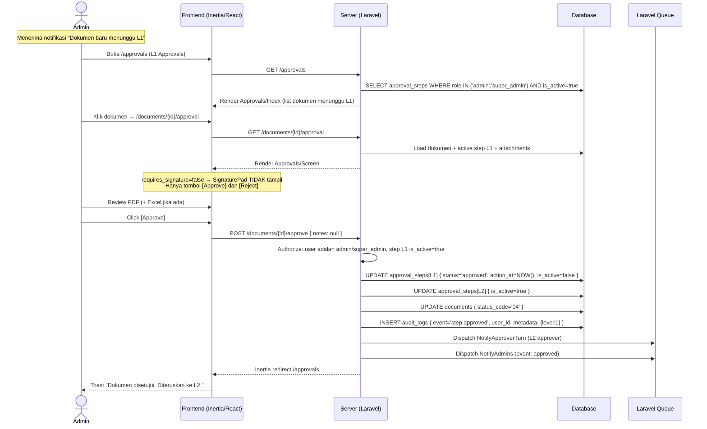
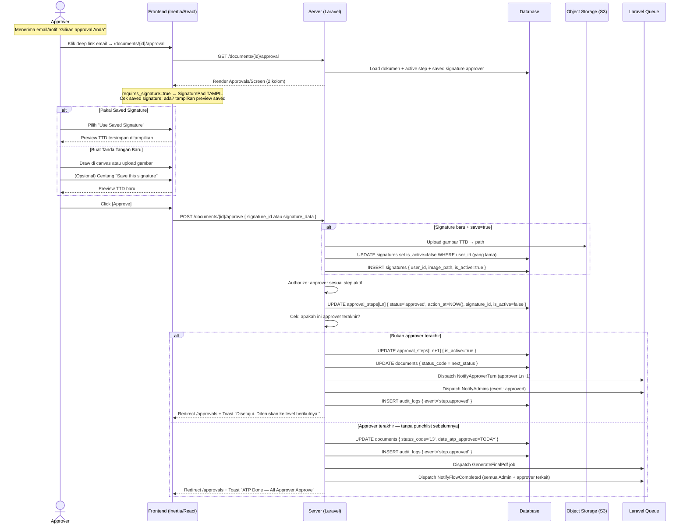
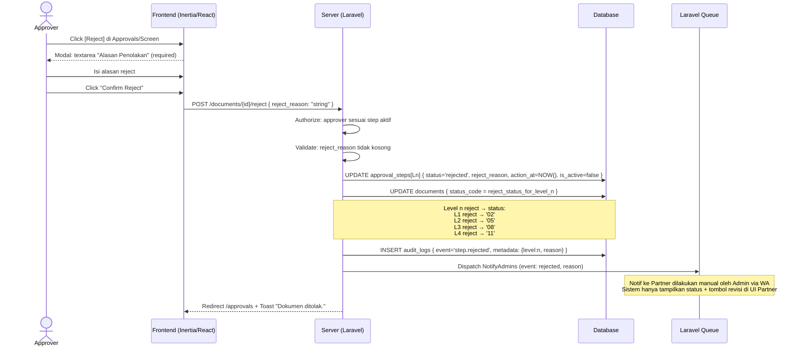
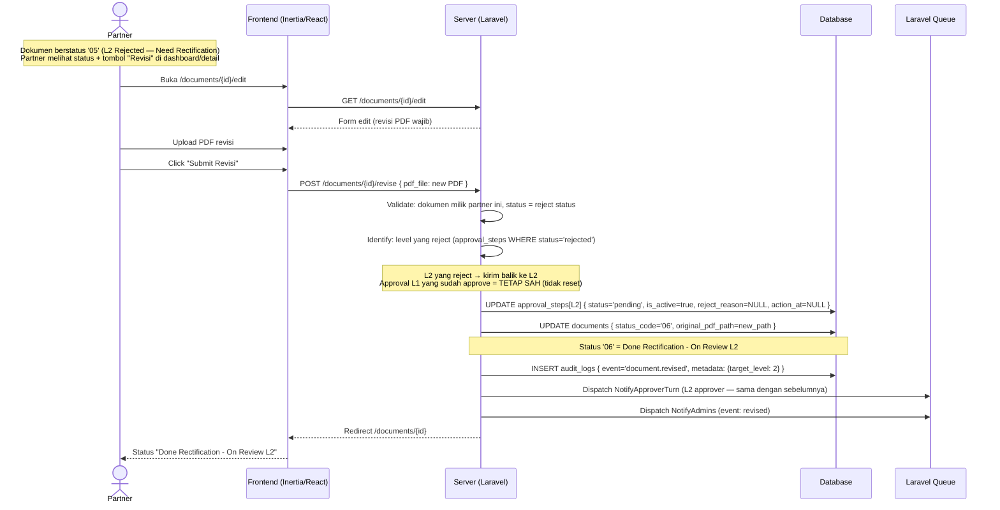
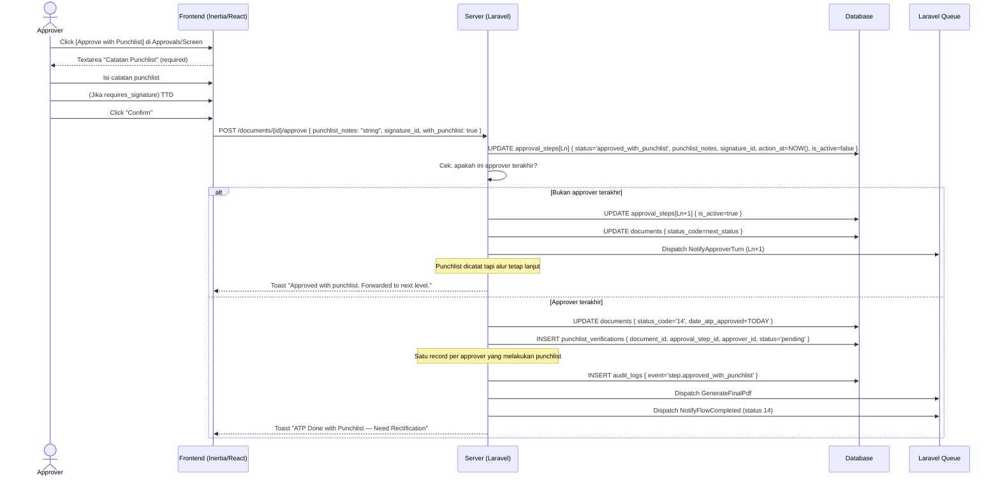
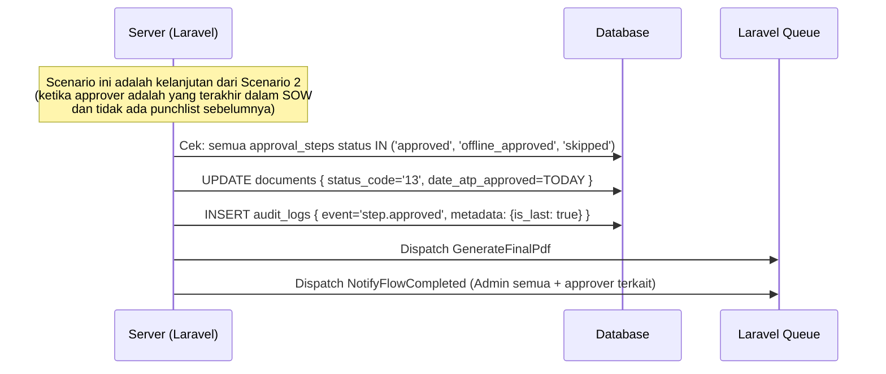
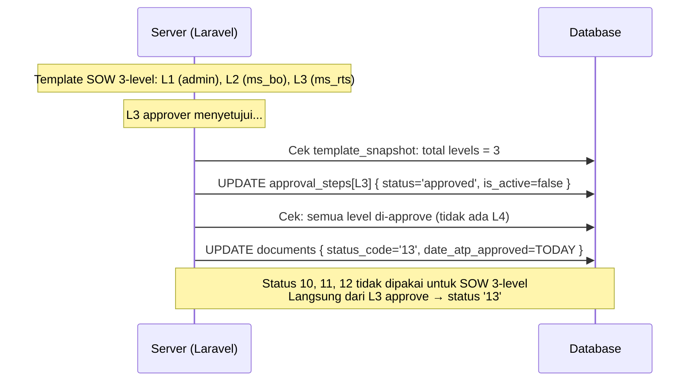

# System Logic: FR-APR — Approval Flow

| | |
|---|---|
| **Document Version** | v1.0 |
| **FR Group ID** | FR-APR |
| **FR Group Name** | Approval Flow |
| **Status** | Draft |
| **Last Updated** | 2026-06-23 |
| **Author** | System Analyst AI |
| **Source** | SRS §3.8 · IA §6.7–6.9 · Data Model §3.8–3.9 · SRS §7 (16 Status Lifecycle) |

---

## 1. Overview

Modul inti sistem — mengelola alur persetujuan dokumen ATP secara **strictly sequential** dengan 16 status lifecycle. L1 (Admin Aviat) adalah **approve-only** (tanpa TTD). Level L2+ sesuai `requires_signature` dari template. Tidak ada OTP dalam seluruh alur. Sequence tidak mundur saat reject — revisi dikirim kembali hanya ke level yang reject.

**Cakupan FR:**
| FR ID | Deskripsi | Prioritas |
|---|---|---|
| FR-APR-01 | Hanya approver giliran aktif yang dapat mengambil aksi | MUST |
| FR-APR-02 | Aksi: Approve, Approve with Punchlist, Reject | MUST |
| FR-APR-03 | Level approve-only (L1, MS BO): Approve/Reject tanpa TTD | MUST |
| FR-APR-04 | Level requires_signature=true: wajib TTD sebelum Approve / w-Punchlist | MUST |
| FR-APR-05 | Tidak ada konfirmasi OTP | MUST |
| FR-APR-06 | Approve with Punchlist: wajib catatan; dokumen tetap lanjut | MUST |
| FR-APR-07 | Reject: wajib alasan; status → "Need Rectification"; notif semua Admin | MUST |
| FR-APR-08 | Partner merevisi dokumen reject & resubmit ke level yang reject; sequence tidak reset | MUST |
| FR-APR-09 | Approver terakhir approve → set Date of ATP Approved; status 13 (tanpa punchlist) atau 14 (dengan) | MUST |
| FR-APR-10 | Timeline approval dapat dilihat Aviat & customer | MUST |
| FR-APR-11 | Alur strictly sequential | MUST |

---

## 2. Actors

| Actor | Role Kode | Level | TTD? |
|---|---|---|---|
| Admin / Super Admin | `admin`, `super_admin` | L1 | Tidak (approve-only) |
| Approver MS BO | `approver_ms_bo` | L2 (umumnya) | Tidak (approve-only) |
| Approver MS RTS | `approver_ms_rts` | L2/L3 | Ya |
| Approver XLS RTH Team | `approver_xls_rth_team` | L3 | Ya |
| Approver XLS RTH | `approver_xls_rth` | L4 | Ya |
| System | — | — | Otomasi transisi status + notifikasi |

---

## 3. Sequence Diagrams

### Scenario 1: Admin Approve L1 (Approve-Only, Tanpa TTD)



---

### Scenario 2: Approver Approve dengan Tanda Tangan (L2–L4, requires_signature=true)



---

### Scenario 3: Approver Reject



---

### Scenario 4: Partner Revisi Pasca-Reject → Resubmit (Sequence Tidak Reset)



---

### Scenario 5: Approve with Punchlist (Alur Tetap Lanjut)



---

### Scenario 6: Approver Terakhir Approve → Status 13 (ATP Done)



---

### Scenario 7: Variasi SOW 3-Level (L3 = Level Terakhir → Langsung Status 13)



---

## 4. API Contract

### 4.1 Inertia Routes

| Method | Route | Inertia Page | Akses |
|---|---|---|---|
| GET | `/approvals` | `Approvals/Index` | Admin (L1), Super Admin (L1), Approver |
| GET | `/approvals/history` | `Approvals/History` | Approver, Admin (opsional) |
| GET | `/documents/{id}/approval` | `Approvals/Screen` | Approver giliran aktif, Admin (L1), Pembuat punchlist (status 15) |

**Props `Approvals/Screen`:**
```json
{
  "document": {
    "id": "uuid",
    "unique_id": "ACC-2026-0001",
    "pt_index": "string",
    "status_code": "04",
    "status_label": "L1 Approve - On Review L2",
    "partner": { "name": "string" },
    "sow_name": "string"
  },
  "active_step": {
    "id": "uuid",
    "level_order": 2,
    "role": "approver_ms_rts",
    "requires_signature": true,
    "approver_id": "uuid"
  },
  "approval_steps": [
    {
      "level_order": 1, "role": "admin", "status": "approved",
      "requires_signature": false, "action_at": "datetime", "approver_name": "string"
    },
    {
      "level_order": 2, "role": "approver_ms_rts", "status": "pending",
      "requires_signature": true, "is_active": true
    }
  ],
  "saved_signature": {
    "id": "uuid",
    "image_url": "signed_s3_url"
  },
  "excel_attachment": {
    "id": "uuid",
    "filename": "lampiran.xlsx",
    "size_bytes": 204800
  },
  "pdf_url": "signed_s3_url",
  "mode": "approve"
}
```

---

### 4.2 Form Actions

#### POST /documents/{id}/approve — Approve (dengan atau tanpa punchlist)
**Request Body:**
```json
{
  "with_punchlist": false,
  "punchlist_notes": "string (required if with_punchlist=true)",
  "signature_id": "uuid (required if requires_signature=true & use saved)",
  "signature_data": "base64_image (required if requires_signature=true & draw baru)"
}
```

**Success Response:**
```
Inertia redirect → /approvals
Flash: "Document approved." / "Approved with punchlist."
```

**Error Response (422):**
```json
{
  "errors": {
    "punchlist_notes": ["Punchlist notes are required when approving with punchlist."],
    "signature_id": ["Signature is required for this approval level."]
  }
}
```

**Error Response (403):**
```json
{
  "message": "It is not your turn to approve this document."
}
```

---

#### POST /documents/{id}/reject — Reject Dokumen
**Request Body:**
```json
{
  "reject_reason": "string (required, min 10 chars)"
}
```

**Success Response:**
```
Inertia redirect → /approvals
Flash: "Document rejected."
```

**Error Response (422):**
```json
{
  "errors": {
    "reject_reason": ["Rejection reason is required."]
  }
}
```

---

## 5. Data Flow

| Step | Input | Process | Output |
|---|---|---|---|
| 1 | Approve request | Authorize: user = active step approver | Authorized or 403 |
| 2 | Signature data (if required) | Upload to S3 / use existing | `signature_id` |
| 3 | Approve action | UPDATE `approval_steps[Ln]` status → approved/approved_with_punchlist | Step record updated |
| 4 | Next level check | Query `approval_steps` WHERE `level_order > Ln ORDER BY level_order LIMIT 1` | Next step or null |
| 5 | Not last approver | UPDATE next step `is_active=true`, UPDATE `documents.status_code` | Status advance |
| 6 | Last approver | UPDATE `documents.status_code='13'/'14'`, set `date_atp_approved` | Final status |
| 7 | With punchlist | INSERT `punchlist_verifications` per approver | Punchlist tracking |
| 8 | Reject action | UPDATE step rejected, UPDATE doc status to Need Rectification | Reject recorded |
| 9 | Revisi (Partner) | UPDATE rejected step → pending, UPDATE doc status | Rectification status |

---

## 6. Security Rules

| Rule | Deskripsi |
|---|---|
| Authorization per aksi | Server Policy cek: only active step approver (atau any admin for L1) bisa approve/reject |
| Tidak ada OTP | Aksi dilakukan langsung setelah login (SRS C-9) |
| Signature wajib | Server enforce: `requires_signature=true` → `signature_id` harus ada sebelum approve |
| Strictly sequential | Server block aksi pada step yang `is_active=false` |

---

## 7. Business Rules

| Rule ID | Deskripsi |
|---|---|
| BR-APR-01 | Hanya step dengan `is_active=true` yang dapat menerima aksi (SRS FR-APR-01) |
| BR-APR-02 | L1 (`role=admin`) dan MS BO (`role=approver_ms_bo`) → `requires_signature=false` — no TTD (SRS FR-APR-03) |
| BR-APR-03 | Level `requires_signature=true` → `signature_id` wajib sebelum approve (SRS FR-APR-04) |
| BR-APR-04 | Tidak ada OTP di seluruh alur approval (SRS FR-APR-05) |
| BR-APR-05 | Approve with Punchlist: catatan wajib; alur tetap lanjut ke level berikutnya (SRS FR-APR-06) |
| BR-APR-06 | Reject: alasan wajib; status → Need Rectification; notif semua Admin (SRS FR-APR-07) |
| BR-APR-07 | Revisi pasca-reject: hanya dikirim ke level yang reject; sequence tidak reset (SRS FR-APR-08) |
| BR-APR-08 | Approver terakhir approve tanpa punchlist → status `'13'`; dengan punchlist → `'14'` (SRS FR-APR-09) |
| BR-APR-09 | SOW 3-level: setelah L3 approve → langsung `'13'`; status 10–12 tidak dipakai |
| BR-APR-10 | `date_atp_approved` auto-set saat approver terakhir approve (SRS FR-APR-09) |
| BR-APR-11 | Notif reject ke Partner dilakukan **manual** Admin via WA; sistem tampilkan status + tombol revisi di UI Partner saja (SRS §2.5 A-7) |

---

## 8. Status Transition Map (16 Status Lifecycle)

| Status Asal | Aksi | Status Tujuan | Aktor |
|---|---|---|---|
| `draft` | Submit (Partner) | `01` | Partner |
| `draft` | Submit (Admin direct) | `04` | Admin (auto-approve L1) |
| `01` | Approve L1 | `04` | Admin |
| `01` | Reject L1 | `02` | Admin |
| `02` | Revisi + Resubmit | `03` | Partner / Admin |
| `03` | Approve L1 | `04` | Admin |
| `03` | Reject L1 | `02` | Admin |
| `04` | Approve L2 | `07` (atau `13` jika L2=last) | Approver L2 |
| `04` | Reject L2 | `05` | Approver L2 |
| `05` | Revisi + Resubmit | `06` | Partner / Admin |
| `06` | Approve L2 | `07` (atau `13`) | Approver L2 |
| `07` | Approve L3 | `10` (atau `13` jika L3=last) | Approver L3 |
| `07` | Reject L3 | `08` | Approver L3 |
| `08` | Revisi + Resubmit | `09` | Partner / Admin |
| `09` | Approve L3 | `10` (atau `13`) | Approver L3 |
| `10` | Approve L4 | `13` | Approver L4 |
| `10` | Reject L4 | `11` | Approver L4 |
| `11` | Revisi + Resubmit | `12` | Partner / Admin |
| `12` | Approve L4 | `13` | Approver L4 |
| Apapun | Approve w/ Punchlist (bukan last) | Lanjut ke next status normal | Approver |
| Apapun | Approve w/ Punchlist (last) | `14` | Approver terakhir |

---

## 9. Validations

| Field | Rule | Error Message (EN) |
|---|---|---|
| `reject_reason` | Required for reject, min 10 chars | "Rejection reason is required (min 10 characters)" |
| `punchlist_notes` | Required if `with_punchlist=true` | "Punchlist notes are required" |
| `signature_id` / `signature_data` | Required if `requires_signature=true` | "Signature is required for this approval level" |
| User authorization | Must be active step approver | "It is not your turn to approve this document" |

---

## 10. Edge Cases

| Skenario | Penanganan |
|---|---|
| Admin approve L1 dokumen yang bukan gilirannya (dokumen sudah di L2) | 403: "It is not your turn" |
| Approver pindah role setelah di-assign | Approval step tetap menggunakan `approver_id` yang tercatat; aksi masih bisa dilakukan |
| Concurrent approve oleh 2 admin di L1 bersamaan | Database transaction + lock; yang kedua mendapat 409 atau dialihkan karena step sudah approved |
| Revisi PDF tidak berubah konten | Sistem tidak validasi diff konten; yang penting file baru di-upload |
| SOW 3-level vs 4-level | Derive dari `template_snapshot.levels.length`; status 10–12 tidak dipakai untuk SOW ≤3 level |

---

## 11. Traceability

| Scenario | SRS FR | IA Page | Data Model | Controller |
|---|---|---|---|---|
| Approve L1 | FR-APR-01, 03 | `Approvals/Screen` §6.9 | `approval_steps`, `documents.status_code` | `ApprovalController@approve` |
| Approve dengan TTD | FR-APR-04 | `Approvals/Screen` §6.9 | `approval_steps.signature_id` | `ApprovalController@approve` |
| Reject | FR-APR-07 | `Approvals/Screen` §6.9 | `approval_steps.reject_reason` | `ApprovalController@reject` |
| Revisi pasca-reject | FR-APR-08 | `Documents/Edit` §6.14 | `approval_steps.status`, `documents.status_code` | `DocumentController@revise` |
| Approver terakhir | FR-APR-09 | `Approvals/Screen` §6.9 | `documents.date_atp_approved`, `status_code='13'/'14'` | `ApprovalController@approve` |
| Approve w/ Punchlist | FR-APR-06 | `Approvals/Screen` §6.9 | `punchlist_verifications` | `ApprovalController@approve` |
| Timeline view | FR-APR-10 | `Documents/Show` tab Timeline §6.13 | `approval_steps` | `DocumentController@show` |
