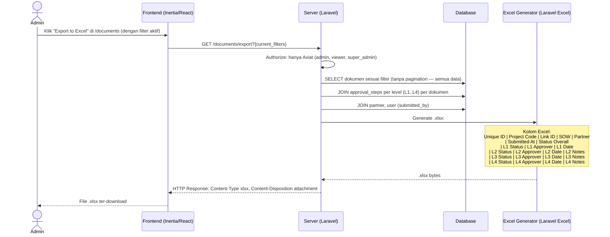
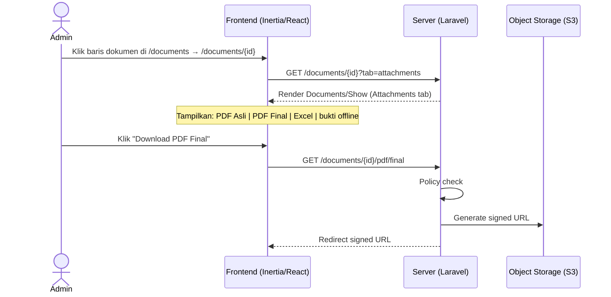

# System Logic: FR-ARC — Archive, Search & Export

| | |
|---|---|
| **Document Version** | v1.0 |
| **FR Group ID** | FR-ARC |
| **FR Group Name** | Archive, Search & Export |
| **Status** | Draft |
| **Last Updated** | 2026-06-23 |
| **Author** | System Analyst AI |
| **Source** | SRS §3.16 · IA §6.10 · Data Model §3.6 |

---

## 1. Overview

Modul ini menyediakan akses ke seluruh arsip dokumen dengan fitur pencarian, filter multi-kriteria, pagination, sorting, dan export Excel. Akses disesuaikan per role: Aviat melihat semua, Partner hanya miliknya, Approver hanya yang pernah mereka proses. Dokumen final disimpan **permanen** (tidak ada auto-delete).

**Cakupan FR:**
| FR ID | Deskripsi | Prioritas |
|---|---|---|
| FR-ARC-01 | Dokumen final disimpan permanen | MUST |
| FR-ARC-02 | Pencarian/filter: Unique ID, Link ID, Project Code, SOW, Partner, tanggal, status | MUST |
| FR-ARC-03 | Pagination & sorting; download PDF final & lampiran sesuai hak akses | MUST |
| FR-ARC-04 | Export Excel daftar dokumen semua status dengan kolom detail per level L1–L4 | MUST |

---

## 2. Actors

| Actor | Hak Akses |
|---|---|
| Admin / Super Admin | Semua dokumen, semua filter, Export Excel |
| Viewer | Semua dokumen (read-only), Export Excel |
| Partner | Dokumen miliknya saja (`scope=mine`) |
| Approver | Dokumen yang pernah mereka proses |

---

## 3. Sequence Diagrams

### Scenario 1: Search & Filter Dokumen

```mermaid
sequenceDiagram
    actor Admin
    participant Frontend as Frontend (Inertia/React)
    participant Server as Server (Laravel)
    participant Database

    Admin->>Frontend: Navigate ke /documents
    Frontend->>Server: GET /documents
    Server-->>Frontend: Render Documents/Index (empty filters)

    Admin->>Frontend: Isi filter: Partner="PT Maju Bersama", Status="L1 Approve"
    Admin->>Frontend: Klik "Search" atau auto-search (debounce)

    Frontend->>Server: GET /documents?partner_id={uuid}&status_code=04&sort=created_at&dir=desc&page=1

    Server->>Database: SELECT documents
        WHERE partner_id=? AND status_code=?
        ORDER BY created_at DESC
        LIMIT 20 OFFSET 0
        (+ join partner nama, approval_steps current step)

    Server-->>Frontend: Props: { documents: paginated_list, filters: active_filters, meta: { total, per_page, current_page } }
    Frontend-->>Admin: Tampilkan hasil filter dengan pagination
```

---

### Scenario 2: Export Excel Daftar Dokumen (FR-ARC-04)



---

### Scenario 3: View & Download PDF dari Arsip



---

## 4. API Contract

### 4.1 Inertia Routes

| Method | Route | Inertia Page | Akses |
|---|---|---|---|
| GET | `/documents` | `Documents/Index` | Admin, Viewer (all); Partner (mine); Approver (related) |

**Query Parameters:**
```
?search={string}          → cari di: unique_id, link_id, project_code
&partner_id={uuid}        → filter per partner
&status_code={string}     → filter per status (draft/01-16)
&sow_name={string}        → filter per SOW name
&date_from={YYYY-MM-DD}   → filter tanggal submit dari
&date_to={YYYY-MM-DD}     → filter tanggal submit sampai
&sort={column}            → kolom sort (created_at, unique_id, status_code)
&dir={asc|desc}           → arah sort
&page={int}               → halaman pagination
&scope={mine}             → partner: hanya dokumen miliknya (auto-applied)
```

**Props `Documents/Index`:**
```json
{
  "documents": {
    "data": [
      {
        "id": "uuid",
        "unique_id": "ACC-2026-0001",
        "pt_index": "PT-001",
        "project_code": "PRJ-2026-001",
        "sow_name": "SOW Install Microwave",
        "partner_name": "PT Maju Bersama",
        "status_code": "04",
        "status_label": "L1 Approve - On Review L2",
        "submitted_at": "2026-06-10",
        "has_excel": true,
        "has_final_pdf": false
      }
    ],
    "meta": { "total": 150, "per_page": 20, "current_page": 1 }
  },
  "filters": {},
  "partners": [{ "id": "uuid", "name": "string" }],
  "can_export": true
}
```

---

### 4.2 Form Actions

#### GET /documents/export — Export Excel
**Query:** Sama dengan filter `/documents`

**Authorization:** Admin, Super Admin, Viewer saja

**Response:**
```
HTTP 200
Content-Type: application/vnd.openxmlformats-officedocument.spreadsheetml.sheet
Content-Disposition: attachment; filename="acceptra_export_2026-06-23.xlsx"
Body: [binary xlsx]
```

---

## 5. Data Flow

| Step | Input | Process | Output |
|---|---|---|---|
| 1 | Filter params | Build WHERE clause + JOIN | Filtered query |
| 2 | Query | Paginate (LIMIT/OFFSET) | Paginated document list |
| 3 | Export request | Load all (no pagination) + join approval_steps L1-L4 | Full dataset |
| 4 | Full dataset | Generate .xlsx (Laravel Excel / PhpSpreadsheet) | Binary .xlsx |
| 5 | Response | Stream to client | File download |

---

## 6. Security Rules

| Rule | Deskripsi |
|---|---|
| Export hanya Aviat | Partner dan Approver tidak dapat export (SRS RBAC §10.1) |
| Partner scope enforced server-side | Filter `partner_id = current_partner.id` auto-applied untuk role partner |
| Dokumen final permanent | Tidak ada auto-delete; soft delete hanya untuk draft |

---

## 7. Business Rules

| Rule ID | Deskripsi |
|---|---|
| BR-ARC-01 | Dokumen final (status 13 atau 16) disimpan permanen (SRS FR-ARC-01) |
| BR-ARC-02 | Filter tersedia: Unique ID, Link ID, Project Code, SOW, Partner, tanggal submit, status (SRS FR-ARC-02) |
| BR-ARC-03 | Download PDF sesuai hak akses: Admin/Viewer (semua), Partner (miliknya), Approver (terkait) (SRS FR-ARC-03) |
| BR-ARC-04 | Export Excel mencakup **semua status** (draft, 01–16) dengan kolom detail L1–L4 per dokumen (SRS FR-ARC-04) |
| BR-ARC-05 | Unique ID `ACC-{YYYY}-{NNNN}` dapat dicari via search bar |

---

## 8. Validations

| Field | Rule |
|---|---|
| `date_from` / `date_to` | Valid date format; `date_from` ≤ `date_to` |
| `status_code` | Must be valid status code (draft, 01–16) |
| `page` | Min 1, integer |

---

## 9. Edge Cases

| Skenario | Penanganan |
|---|---|
| Export Excel dengan 10.000+ dokumen | Stream response (chunked); tidak load semua ke memory sekaligus |
| Filter menghasilkan 0 dokumen | Empty state: "No documents match your filters" + tombol "Clear Filters" |
| Partner mencoba akses dokumen orang lain via URL | Policy check → 403 Forbidden |
| Sort by `unique_id` | Sort sebagai string → urutan mungkin tidak numerik; pertimbangkan sort by `created_at` sebagai primary sort |

---

## 10. Traceability

| Scenario | SRS FR | IA Page | Data Model | Controller |
|---|---|---|---|---|
| Search & filter | FR-ARC-02 | `Documents/Index` §6.10 | `documents` + indexes | `DocumentController@index` |
| Pagination & sorting | FR-ARC-03 | `Documents/Index` §6.10 | `documents` | `DocumentController@index` |
| Export Excel | FR-ARC-04 | `Documents/Index` §6.10, `Dashboard/Admin` §6.4 | `documents`, `approval_steps` | `DocumentExportController@excel` |
| Download PDF | FR-ARC-03 | `Documents/Show` §6.13 | `documents.final_pdf_path` | `AttachmentController@download` |
