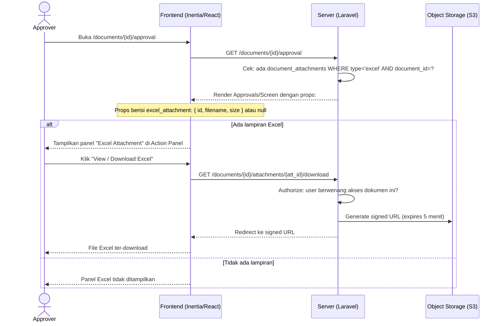
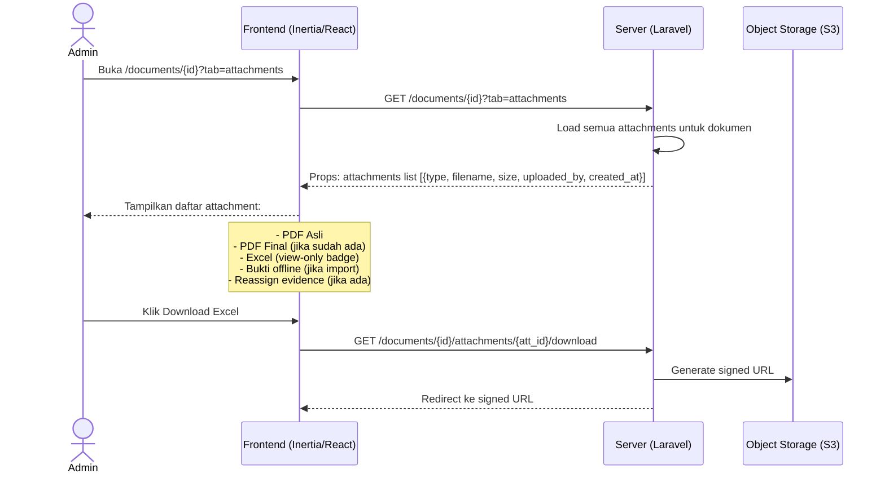

# System Logic: FR-ATT — Lampiran Excel

| | |
|---|---|
| **Document Version** | v1.0 |
| **FR Group ID** | FR-ATT |
| **FR Group Name** | Lampiran Excel (Attachment) |
| **Status** | Draft |
| **Last Updated** | 2026-06-23 |
| **Author** | System Analyst AI |
| **Source** | SRS §3.7 · IA §6.9 · Data Model §3.7 |

---

## 1. Overview

Modul ini mengelola lampiran Excel view-only yang dapat disertakan bersama dokumen ATP. Lampiran ini bersifat **informasional saja** — approver dapat melihat dan mengunduhnya, tetapi tidak ada tanda tangan atau stamp pada lampiran Excel. Satu dokumen maksimal memiliki **satu lampiran Excel**.

**Cakupan FR:**
| FR ID | Deskripsi | Prioritas |
|---|---|---|
| FR-ATT-01 | Satu dokumen dapat memiliki satu lampiran Excel (opsional), tersedia untuk semua SOW | MUST |
| FR-ATT-02 | Lampiran view-only: dapat dilihat/diunduh approver, tanpa TTD/stamping | MUST |
| FR-ATT-03 | Halaman approval menampilkan PDF dan akses ke lampiran Excel | MUST |

---

## 2. Actors

| Actor | Role Kode | Keterlibatan |
|---|---|---|
| Partner | `partner` | Upload Excel saat submission |
| Admin / Super Admin | `admin`, `super_admin` | Upload Excel saat direct submission atau edit |
| Approver | `approver_*` | View dan download Excel di approval screen |
| Viewer | `viewer` | Download Excel di halaman detail dokumen |

---

## 3. Sequence Diagrams

### Scenario 1: Upload Lampiran Excel saat Submit

```mermaid
sequenceDiagram
    actor Partner
    participant Frontend as Frontend (Inertia/React)
    participant Server as Server (Laravel)
    participant Storage as Object Storage (S3)
    participant Database

    Partner->>Frontend: Di /documents/create: upload Excel (opsional)
    Frontend->>Frontend: Client-side validate: .xlsx/.xls, max 10MB

    Partner->>Frontend: Click "Submit"
    Frontend->>Server: POST /documents (multipart, termasuk excel_file)

    Server->>Server: Server-side validate: MIME type, max 10MB
    Server->>Server: Cek: sudah ada excel untuk dokumen ini? (tidak untuk create baru)
    Server->>Storage: Upload Excel ke S3 → dapatkan path

    Server->>Database: INSERT document_attachments {
        document_id,
        type = 'excel',
        file_path,
        original_filename,
        file_size_bytes,
        uploaded_by
    }
    Server-->>Frontend: Dokumen berhasil dibuat (termasuk lampiran)
```

---

### Scenario 2: Approver View / Download Excel di Approval Screen



---

### Scenario 3: View Excel di Tab Attachments (Documents/Show)



---

## 4. API Contract

### 4.1 Inertia Routes

| Method | Route | Inertia Page | Akses |
|---|---|---|---|
| GET | `/documents/{id}?tab=attachments` | `Documents/Show` (tab: Attachments) | Aviat, Partner (miliknya), Approver (terkait) |
| GET | `/documents/{id}/approval` | `Approvals/Screen` (dengan excel props) | Approver giliran, Admin (L1) |

---

### 4.2 Form Actions

#### Upload Excel (bagian dari POST /documents atau PUT /documents/{id}/edit)
Excel diupload sebagai bagian dari form submission dokumen (FR-SUB) atau edit — bukan endpoint terpisah.

---

#### GET /documents/{id}/attachments/{att_id}/download — Download Attachment
**Request:** No body (authenticated)

**Authorization:**
- Admin, Super Admin, Viewer: akses semua lampiran
- Partner: hanya lampiran dokumen miliknya
- Approver: hanya lampiran dokumen yang pernah mereka proses

**Success Response:**
```
HTTP 302 Redirect → signed S3 URL (expires 5 menit)
Content-Disposition: attachment; filename="{original_filename}"
```

**Error Response (403):**
```json
{
  "message": "You are not authorized to access this attachment."
}
```

---

#### DELETE /documents/{id}/attachments/{att_id} — Hapus Excel Attachment
Hanya bisa dilakukan oleh Admin/Super Admin dan hanya saat dokumen masih draft.

**Request:** No body

**Success Response:**
```
JSON { "message": "Attachment deleted." }
```

**Error Response (403 atau 422):**
```json
{
  "message": "Cannot delete attachment on an active document."
}
```

---

## 5. Data Flow

| Step | Input | Process | Output |
|---|---|---|---|
| 1 | Excel file (form submit) | Validate MIME & size | Validated file |
| 2 | Valid Excel file | Upload to S3 | `file_path` di S3 |
| 3 | `file_path` | INSERT `document_attachments` (type='excel') | Attachment record |
| 4 | Download request | Check authorization policy | Allow or 403 |
| 5 | `file_path` | Generate S3 signed URL (TTL 5 menit) | Temporary download URL |

---

## 6. Security Rules

| Rule | Deskripsi |
|---|---|
| File tidak publik | Excel tidak pernah diakses via URL langsung; wajib via signed URL atau proxy |
| MIME validation | Server validasi MIME type, bukan hanya ekstensi (cegah file masquerade) |
| Authorization | Policy check per request download — role + kepemilikan dokumen |
| Max 1 Excel per dokumen | Enforce di application layer saat INSERT |

---

## 7. Business Rules

| Rule ID | Deskripsi |
|---|---|
| BR-ATT-01 | Maksimal 1 lampiran Excel per dokumen (SRS FR-ATT-01) |
| BR-ATT-02 | Lampiran Excel view-only: tidak di-stamp, tidak ada TTD di Excel (SRS FR-ATT-02) |
| BR-ATT-03 | Approval screen menampilkan akses ke Excel bila ada (SRS FR-ATT-03) |
| BR-ATT-04 | Excel dapat dilihat dan diunduh oleh: Admin, Viewer, Partner (miliknya), Approver (terkait) |
| BR-ATT-05 | Excel tidak wajib; submission tetap valid tanpa lampiran Excel |
| BR-ATT-06 | Jika Partner/Admin ingin mengganti Excel: hapus yang lama, upload baru (hanya saat draft atau revisi) |

---

## 8. Validations

| Field | Rule | Error Message (EN) |
|---|---|---|
| `excel_file` | Optional, MIME: `application/vnd.ms-excel` atau `application/vnd.openxmlformats-officedocument.spreadsheetml.sheet` | "Invalid file type. Only .xls and .xlsx are allowed." |
| `excel_file` size | Max 10MB | "Excel file must not exceed 10MB." |
| Jumlah Excel per dokumen | Max 1 | "A document can only have one Excel attachment." |

---

## 9. Edge Cases

| Skenario | Penanganan |
|---|---|
| Upload Excel kedua untuk dokumen yang sudah punya Excel | Server reject dengan 422: "A document can only have one Excel attachment. Delete the existing one first." |
| Excel di-hapus saat dokumen aktif (bukan draft) | Tidak diizinkan oleh Admin biasa; hanya Super Admin saat ada alasan teknis |
| File Excel corrupt | Server tidak validasi konten Excel; file disimpan apa adanya — tanggung jawab pengirim |
| Signed URL expired saat user klik download | User perlu refresh halaman dan klik ulang |

---

## 10. Traceability

| Scenario | SRS FR | IA Page | Data Model | Controller |
|---|---|---|---|---|
| Upload Excel saat submit | FR-ATT-01 | `Documents/Create` §6.11 | `document_attachments.type='excel'` | `DocumentController@store` |
| View di approval screen | FR-ATT-03 | `Approvals/Screen` §6.9 | `document_attachments` | `ApprovalController@show` |
| Download Excel | FR-ATT-02 | `Documents/Show` tab Attachments §6.13 | `document_attachments.file_path` | `AttachmentController@download` |
