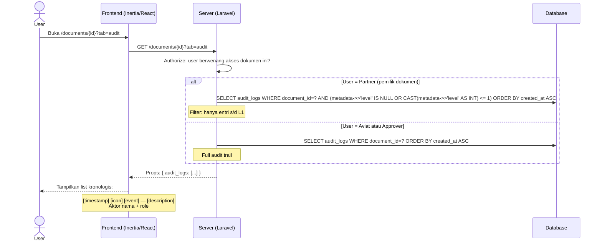

# System Logic: FR-AUD — Audit Trail

| | |
|---|---|
| **Document Version** | v1.0 |
| **FR Group ID** | FR-AUD |
| **FR Group Name** | Audit Trail |
| **Status** | Draft |
| **Last Updated** | 2026-06-23 |
| **Author** | System Analyst AI |
| **Source** | SRS §3.17 · IA §6.13 · Data Model §3.13 |

---

## 1. Overview

Modul audit trail merekam seluruh kejadian signifikan per dokumen sebagai log **append-only** dan **immutable**. Setiap perubahan state wajib menghasilkan satu entri baru. Akses dibatasi per role: Aviat dan Approver melihat full trail; Partner hanya melihat entri s/d L1.

**Cakupan FR:**
| FR ID | Deskripsi | Prioritas |
|---|---|---|
| FR-AUD-01 | Mencatat seluruh kejadian per dokumen + aktor, timestamp, catatan | MUST |
| FR-AUD-02 | Dapat dilihat Aviat & customer (dokumen relevan); Partner terbatas s/d L1 | MUST |
| FR-AUD-03 | Append-only (tidak ada UPDATE atau DELETE) | MUST |

---

## 2. Actors

| Actor | Akses Audit Trail |
|---|---|
| Admin / Super Admin / Viewer | Full audit trail semua dokumen |
| Approver | Full audit trail dokumen yang pernah mereka proses |
| Partner | Hanya entri s/d L1 (level_order ≤ 1) dokumen miliknya |
| System | Menulis entri audit (append-only) |

---

## 3. Sequence Diagrams

### Scenario 1: Write Audit Log (setiap event)

```mermaid
sequenceDiagram
    participant Service as ApplicationService
    participant Database

    Note over Service: Dipanggil dari setiap aksi yang mengubah state<br/>Contoh: ApprovalController@approve

    Service->>Database: INSERT audit_logs {
        document_id: uuid,
        user_id: current_user.id (NULL untuk system events),
        event: 'step.approved',
        description: 'Level 2 approved by John Doe',
        metadata: { level: 2, role: 'approver_ms_rts', signature_id: uuid },
        created_at: NOW()
    }

    Note over Database: Tidak ada UPDATE atau DELETE pada tabel audit_logs
```

---

### Scenario 2: View Audit Trail di Documents/Show



---

## 4. API Contract

### 4.1 Inertia Routes

| Method | Route | Inertia Page | Akses |
|---|---|---|---|
| GET | `/documents/{id}?tab=audit` | `Documents/Show` (tab: Audit Trail) | Aviat (full), Approver (terkait), Partner (s/d L1) |

**Props (audit_logs array dalam Documents/Show):**
```json
{
  "audit_logs": [
    {
      "id": "uuid",
      "event": "document.submitted",
      "description": "Document submitted by Partner User (PT Maju Bersama)",
      "actor": { "name": "Partner User", "role": "partner" },
      "metadata": {},
      "created_at": "2026-06-10T08:30:00Z"
    },
    {
      "id": "uuid",
      "event": "step.approved",
      "description": "Level 1 approved by Admin Aviat (approve-only)",
      "actor": { "name": "Admin Aviat", "role": "admin" },
      "metadata": { "level": 1 },
      "created_at": "2026-06-10T09:15:00Z"
    },
    {
      "id": "uuid",
      "event": "step.reassigned",
      "description": "Approver for Level 3 reassigned from John to Jane",
      "actor": { "name": "Admin Aviat", "role": "admin" },
      "metadata": { "level": 3, "from": "John", "to": "Jane", "reason": "John is on leave" },
      "created_at": "2026-06-11T10:00:00Z"
    }
  ]
}
```

---

## 5. Event Reference (semua nilai `audit_logs.event`)

| Event | Trigger | Deskripsi |
|---|---|---|
| `document.submitted` | Partner/Admin submit | Dokumen disubmit |
| `document.revised` | Partner/Admin revisi pasca-reject | Revisi dokumen |
| `document.auto_approved_l1` | Admin direct submit | L1 auto-approve |
| `document.draft_saved` | Save as draft | Draft disimpan |
| `step.approved` | Approver approve | Step level N disetujui |
| `step.approved_with_punchlist` | Approver approve w/ punchlist | Disetujui dengan catatan |
| `step.rejected` | Approver reject | Step level N ditolak |
| `step.reassigned` | Admin reassign | Approver diganti |
| `step.offline_imported` | Admin import | Step pre-existing offline |
| `punchlist.revision_uploaded` | Admin upload revisi | PDF revisi punchlist diupload |
| `punchlist.verified` | Approver verify | Revisi punchlist diterima |
| `punchlist.revision_rejected` | Approver tolak revisi | Revisi punchlist ditolak |
| `pdf.stamped` | System (queue) | PDF final di-generate |
| `signature.saved` | Approver save TTD | Saved signature baru |
| `signature.replaced` | Approver ganti TTD | Saved signature diganti |

---

## 6. Data Flow

| Step | Input | Process | Output |
|---|---|---|---|
| 1 | Any state-changing action | Call `AuditService::log(document_id, event, description, metadata)` | New row in `audit_logs` |
| 2 | View request (Aviat) | SELECT all audit_logs WHERE document_id | Full trail |
| 3 | View request (Partner) | SELECT audit_logs WHERE level ≤ 1 | Filtered trail |

---

## 7. Security Rules

| Rule | Deskripsi |
|---|---|
| Append-only | Tidak ada route/controller yang melakukan UPDATE/DELETE pada `audit_logs` |
| Partner scope | Server filter: hanya entri s/d L1 untuk Partner |
| Timestamp | Gunakan TIMESTAMPTZ (timezone-aware) di produksi (SRS NFR-AUDIT-02) |

---

## 8. Business Rules

| Rule ID | Deskripsi |
|---|---|
| BR-AUD-01 | Setiap state-changing action wajib menghasilkan satu `audit_logs` entry (SRS NFR-AUDIT-01) |
| BR-AUD-02 | `audit_logs` adalah append-only — tidak ada UPDATE atau DELETE (SRS FR-AUD-03) |
| BR-AUD-03 | Partner hanya melihat entri dengan `level_order ≤ 1` atau entri tanpa level context (SRS FR-AUD-02) |
| BR-AUD-04 | System events (PDF generated, auto-approve) memiliki `user_id=NULL` |
| BR-AUD-05 | `created_at` menggunakan timezone server yang konsisten; tampilkan di UI dalam WIB (SRS NFR-AUDIT-02) |

---

## 9. Edge Cases

| Skenario | Penanganan |
|---|---|
| Aksi gagal di tengah transaksi | Gunakan DB transaction: jika rollback, audit log juga di-rollback (belum tercommit) |
| Log sangat banyak untuk dokumen lama | Pagination pada tampilan audit trail (per 50 entri) |
| `user_id=NULL` | Tampil sebagai "System" di UI |

---

## 10. Traceability

| Scenario | SRS FR | IA Page | Data Model | Service |
|---|---|---|---|---|
| Write audit log | FR-AUD-01, 03 | — | `audit_logs` | `AuditService::log()` |
| View full trail (Aviat/Approver) | FR-AUD-02 | `Documents/Show` tab Audit §6.13 | `audit_logs` | `DocumentController@show` |
| View limited trail (Partner) | FR-AUD-02 | `Documents/Show` tab Audit §6.13 | `audit_logs` (filtered) | `DocumentController@show` |
