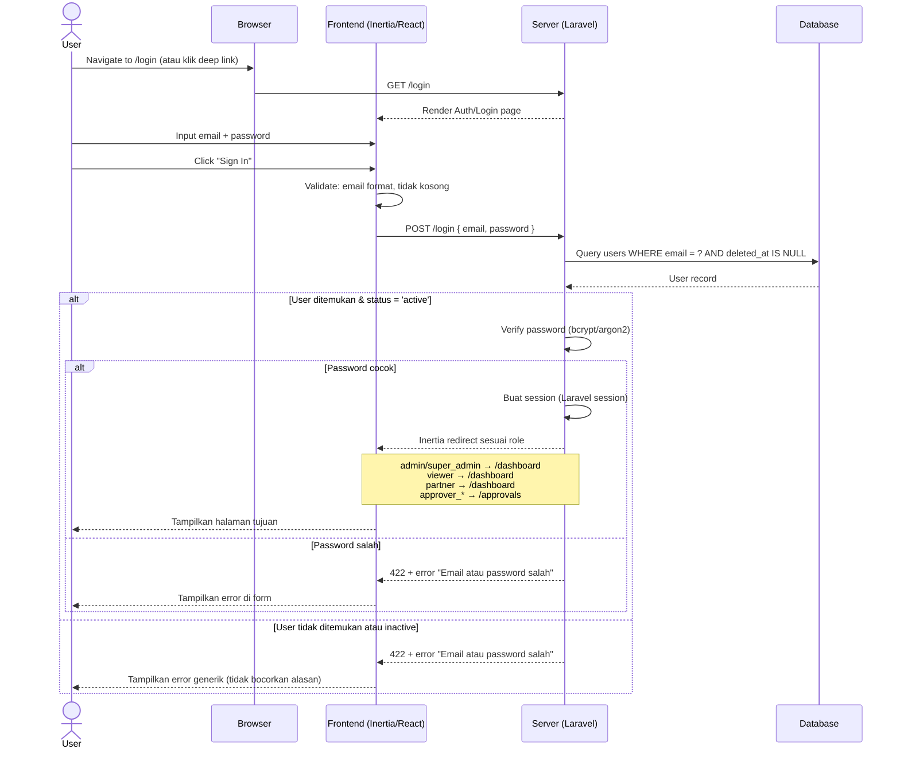
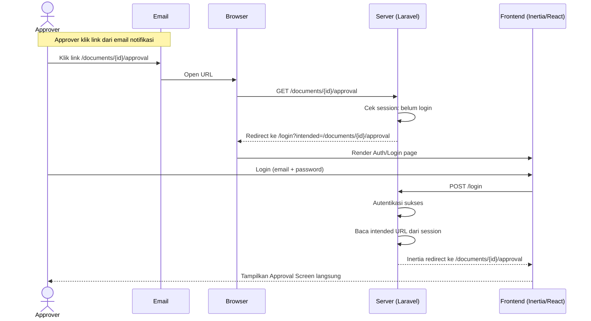
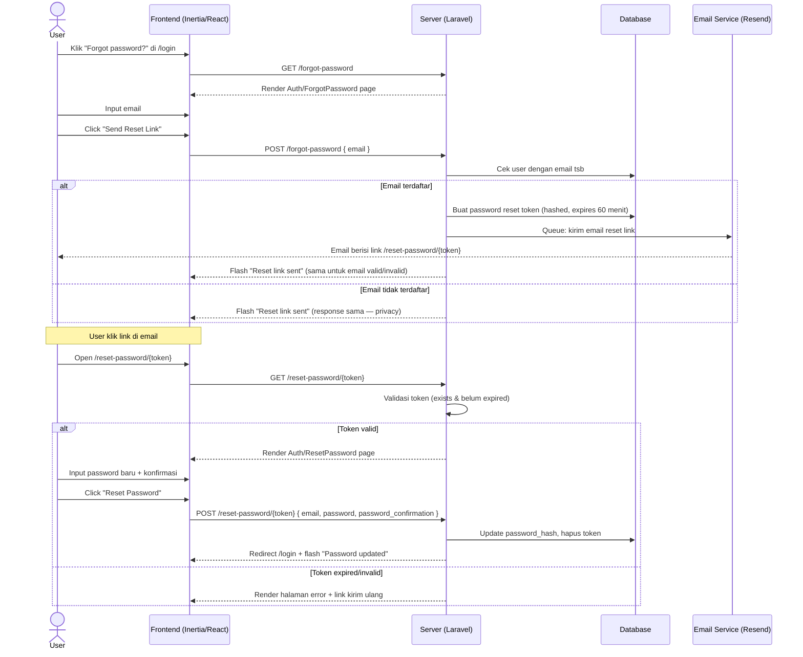
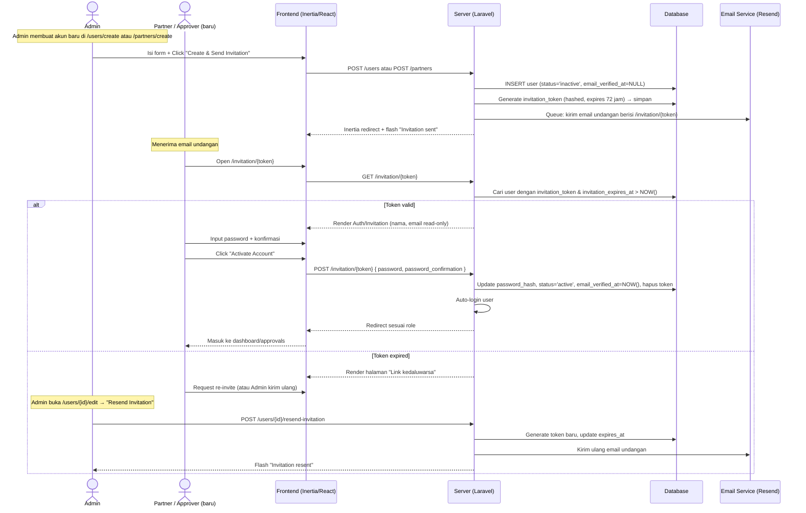
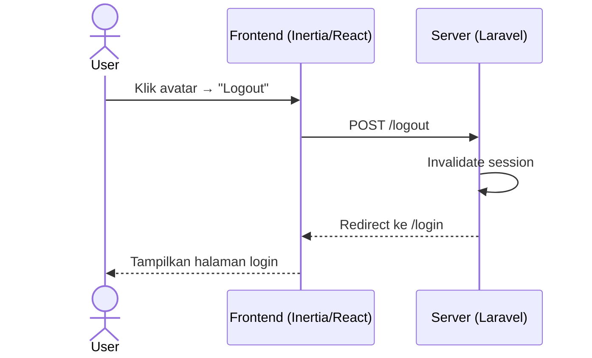

# System Logic: FR-AUTH — Authentication & Account

| | |
|---|---|
| **Document Version** | v1.0 |
| **FR Group ID** | FR-AUTH |
| **FR Group Name** | Authentication & Account |
| **Status** | Draft |
| **Last Updated** | 2026-06-23 |
| **Author** | System Analyst AI |
| **Source** | SRS §3.1 · IA §6.1–6.3 · Data Model §3.1 |

---

## 1. Overview

Modul ini mengelola seluruh siklus autentikasi pengguna: login, logout, reset password, dan aktivasi akun via undangan. Semua pengguna **wajib login** sebelum mengakses fitur apapun (SRS C-3). Tidak ada mekanisme OTP — autentikasi murni email + password (SRS C-9).

**Cakupan FR:**
| FR ID | Deskripsi | Prioritas |
|---|---|---|
| FR-AUTH-01 | Login email + password (tanpa OTP) | MUST |
| FR-AUTH-02 | Pengarahan pasca-login sesuai role | MUST |
| FR-AUTH-03 | Deep link: link notifikasi → dokumen tujuan setelah login | MUST |
| FR-AUTH-04 | Logout & reset password via email | MUST |
| FR-AUTH-05 | Akun Partner & Approver dibuat Admin → email undangan set password | MUST |
| FR-AUTH-06 | Link undangan/reset kedaluwarsa & dapat dikirim ulang | MUST |
| FR-AUTH-07 | Rate limiting/lockout login | SHOULD |

---

## 2. Actors

| Actor | Role Kode | Tipe | Keterlibatan |
|---|---|---|---|
| Semua Pengguna | `super_admin`, `admin`, `viewer`, `partner`, `approver_*` | Semua | Login, logout, reset password |
| Admin / Super Admin | `admin`, `super_admin` | Aviat | Membuat akun Partner & Approver, kirim ulang undangan |
| System | — | Internal | Kirim email undangan & reset password via queue |

---

## 3. Sequence Diagrams

### Scenario 1: Login Sukses → Redirect by Role



---

### Scenario 2: Login dengan Deep Link (FR-AUTH-03)



---

### Scenario 3: Forgot Password → Reset Password (FR-AUTH-04)



---

### Scenario 4: Aktivasi Akun via Undangan (FR-AUTH-05, FR-AUTH-06)



---

### Scenario 5: Logout (FR-AUTH-04)



---

## 4. API Contract

### 4.1 Inertia Routes (GET — render halaman)

| Method | Route | Inertia Page | Akses |
|---|---|---|---|
| GET | `/login` | `Auth/Login` | Public |
| GET | `/forgot-password` | `Auth/ForgotPassword` | Public |
| GET | `/reset-password/{token}` | `Auth/ResetPassword` | Public |
| GET | `/invitation/{token}` | `Auth/Invitation` | Public (token valid) |

**Props yang dikembalikan server untuk `Auth/Login`:**
```json
{
  "canResetPassword": true,
  "status": "string | null"
}
```

**Props yang dikembalikan server untuk `Auth/Invitation`:**
```json
{
  "token": "string",
  "email": "string",
  "name": "string"
}
```

---

### 4.2 Form Actions (POST)

#### POST /login
Authenticate user dan buat session.

**Request Body:**
```json
{
  "email": "string (required, email format)",
  "password": "string (required)"
}
```

**Success Response:**
```
Inertia redirect ke:
- /dashboard     → untuk super_admin, admin, viewer, partner
- /approvals     → untuk approver_*
```

**Error Response (422):**
```json
{
  "message": "Email atau password salah.",
  "errors": {
    "email": ["Email atau password salah."]
  }
}
```

---

#### POST /logout

**Request:** No body (CSRF token via header)

**Response:**
```
Inertia redirect → /login
```

---

#### POST /forgot-password

**Request Body:**
```json
{
  "email": "string (required, email format)"
}
```

**Response (selalu sama untuk privacy):**
```json
{
  "status": "passwords.sent"
}
```

---

#### POST /reset-password/{token}

**Request Body:**
```json
{
  "token": "string (required)",
  "email": "string (required, email format)",
  "password": "string (required, min 8 chars)",
  "password_confirmation": "string (required, must match password)"
}
```

**Success Response:**
```
Inertia redirect → /login
Flash: "Password berhasil diubah."
```

**Error Response (422):**
```json
{
  "errors": {
    "email": ["Token tidak valid atau sudah kedaluwarsa."]
  }
}
```

---

#### POST /invitation/{token}

**Request Body:**
```json
{
  "password": "string (required, min 8 chars)",
  "password_confirmation": "string (required, must match password)"
}
```

**Success Response:**
```
Auto-login → Inertia redirect sesuai role
```

**Error Response (422):**
```json
{
  "errors": {
    "token": ["Link undangan tidak valid atau sudah kedaluwarsa."]
  }
}
```

---

#### POST /users/{id}/resend-invitation

**Request:** No body

**Response:**
```
Inertia redirect → /users/{id}/edit
Flash: "Undangan berhasil dikirim ulang."
```

---

## 5. Data Flow

| Step | Input | Process | Output |
|---|---|---|---|
| 1 | Email + password | Frontend validation (format check) | Validated input |
| 2 | Validated credentials | Server: query user, verify bcrypt | Session created |
| 3 | User role | Server: determine redirect target | Intended URL |
| 4 | Deep link intended URL | Server: restore from session | Redirect ke tujuan asal |
| 5 | Email untuk reset | Server: generate token, queue email | Email terkirim |
| 6 | Reset token + password baru | Server: validate token, update hash | Password updated |
| 7 | Invitation token + password | Server: validate token, activate user | Akun aktif, auto-login |

---

## 6. Security Rules

| Rule | Deskripsi | Referensi |
|---|---|---|
| Password Hashing | Bcrypt atau Argon2 dengan cost factor ≥ 12 | SRS NFR-SEC-02 |
| Session Storage | HttpOnly cookie, Secure, SameSite=Lax | Laravel default |
| CSRF Protection | Token CSRF wajib pada semua POST | SRS NFR-SEC-04 |
| Rate Limiting | Maks 5 percobaan login per menit per IP → lockout (SHOULD) | SRS FR-AUTH-07 |
| Token Reset | Hashed di database; expires 60 menit; single-use | Laravel Breeze default |
| Invitation Token | Hashed di `users.invitation_token`; expires 72 jam | SRS FR-AUTH-06 |
| Error Generik | Response login error tidak membedakan "user tidak ada" vs "password salah" | Privacy best practice |
| UUID v7 | User ID tidak dapat dienumerasi di URL | SRS NFR-SEC-08 |

---

## 7. Business Rules

| Rule ID | Deskripsi |
|---|---|
| BR-AUTH-01 | Semua pengguna wajib login; tidak ada akses anonim (SRS C-3) |
| BR-AUTH-02 | Tidak ada OTP pada proses apapun (SRS C-9) |
| BR-AUTH-03 | Pasca-login redirect: admin/super/viewer/partner → `/dashboard`; approver → `/approvals` (SRS FR-AUTH-02) |
| BR-AUTH-04 | Deep link disimpan sebagai `intended` URL di session; dipulihkan setelah login (SRS FR-AUTH-03) |
| BR-AUTH-05 | Akun Partner & Approver **hanya** dapat dibuat oleh Admin/Super Admin (SRS FR-AUTH-05, A-4) |
| BR-AUTH-06 | Link undangan kedaluwarsa → Admin wajib kirim ulang (SRS FR-AUTH-06) |
| BR-AUTH-07 | User dengan `status = 'inactive'` tidak dapat login meski password benar |
| BR-AUTH-08 | Soft-deleted user (`deleted_at IS NOT NULL`) tidak dapat login |

---

## 8. Validations

| Field | Rule | Error Message |
|---|---|---|
| `email` (login) | Required, valid email format | "Email harus diisi" / "Format email tidak valid" |
| `password` (login) | Required | "Password harus diisi" |
| `email` (forgot) | Required, valid email format | "Email harus diisi" |
| `password` (reset/invite) | Required, min 8 karakter | "Password minimal 8 karakter" |
| `password_confirmation` | Required, must match `password` | "Konfirmasi password tidak cocok" |

---

## 9. Edge Cases

| Skenario | Penanganan |
|---|---|
| User login saat sudah login | Redirect langsung ke dashboard (skip form) |
| Token reset dipakai dua kali | Token dihapus setelah pakai pertama; request kedua → error "token invalid" |
| Invitation token expired | Tampilkan halaman "Link kedaluwarsa" + instruksi hubungi Admin |
| Email undangan ke email yang sudah aktif | Arahkan ke /login dengan flash info |
| Brute force login | Rate limit 5x/menit/IP → response 429 Too Many Requests |
| Deep link ke dokumen yang tidak berwenang diakses | Setelah login, server Policy check gagal → 403 Forbidden |

---

## 10. Traceability

| Scenario | SRS FR | IA Page | Data Model | Controller |
|---|---|---|---|---|
| Login | FR-AUTH-01, 02 | `Auth/Login` § 6.1 | `users` | `Auth\LoginController` |
| Deep link | FR-AUTH-03 | Semua halaman | — | Laravel middleware |
| Logout | FR-AUTH-04 | — | `users` session | `Auth\LoginController` |
| Reset password | FR-AUTH-04 | `Auth/ForgotPassword`, `Auth/ResetPassword` § 6.2 | `users` | `Auth\PasswordResetController` |
| Aktivasi akun | FR-AUTH-05, 06 | `Auth/Invitation` § 6.3 | `users.invitation_token` | `Auth\InvitationController` |
| Rate limiting | FR-AUTH-07 | — | — | Laravel middleware |
