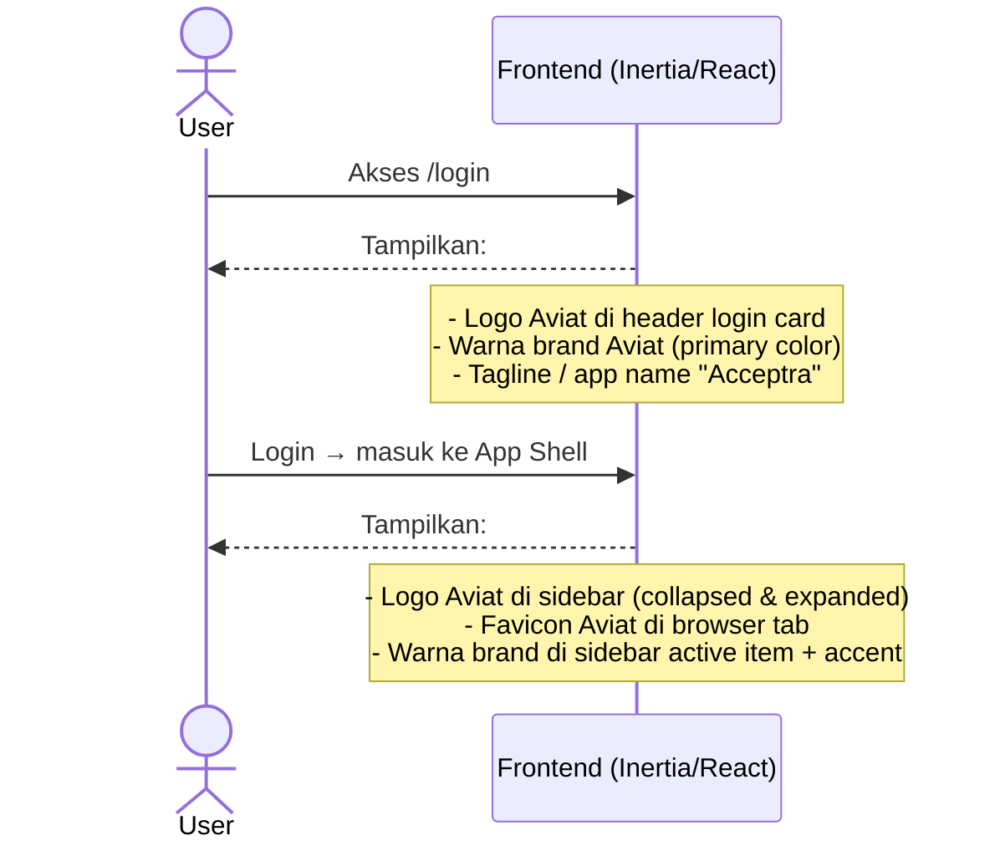
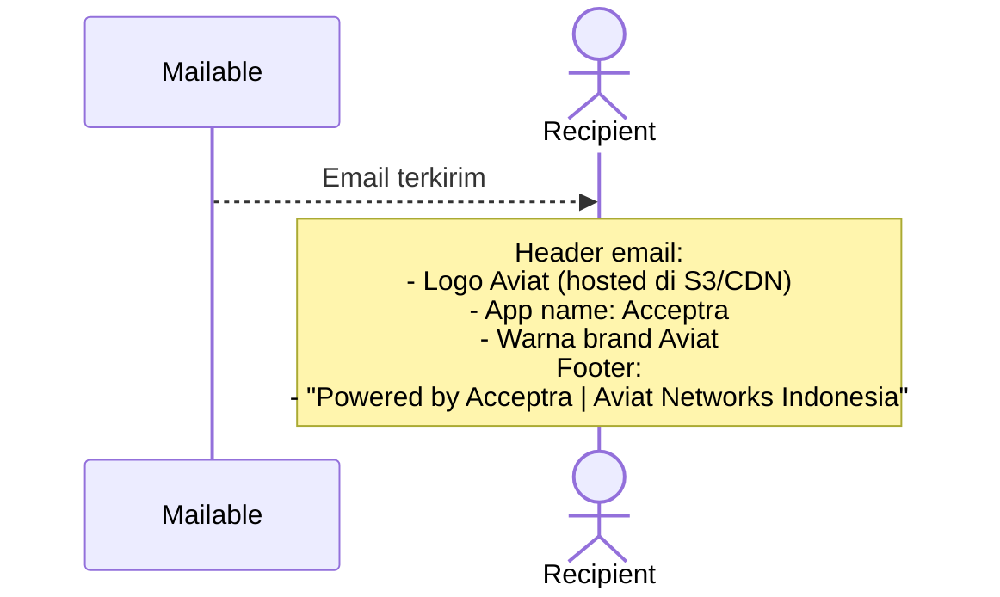

# System Logic: FR-BRD — Branding

| | |
|---|---|
| **Document Version** | v1.0 |
| **FR Group ID** | FR-BRD |
| **FR Group Name** | Branding |
| **Status** | Draft |
| **Last Updated** | 2026-06-23 |
| **Author** | System Analyst AI |
| **Source** | SRS §3.19 · IA §5.1 · Design System Acceptra v2.0 |

---

## 1. Overview

Modul ini mendefinisikan penerapan identitas visual Aviat Networks pada seluruh tampilan aplikasi. Branding Aviat muncul di UI (header, login, email). Dokumen PDF ATP tetap menggunakan format baku XLSmart — tidak diubah sistem.

**Cakupan FR:**
| FR ID | Deskripsi | Prioritas |
|---|---|---|
| FR-BRD-01 | Logo & identitas Aviat tampil di UI (header, login, email) | MUST |
| FR-BRD-02 | Isi PDF ATP tetap memakai format baku XLSmart | MUST |

---

## 2. Actors

| Actor | Keterlibatan |
|---|---|
| System / Designer | Implementasi aset visual |
| Semua pengguna | Melihat branding di setiap halaman |

---

## 3. Sequence Diagrams

### Scenario 1: Branding di Login Page & App Shell

---

### Scenario 2: Branding di Email

---

## 4. API Contract

Tidak ada endpoint khusus untuk branding — semua dilakukan via konfigurasi aset statis.

---

## 5. Data Flow

| Layer | Implementasi |
|---|---|
| Logo | File SVG/PNG Aviat di `public/assets/` atau CDN |
| Warna | CSS custom properties (`--color-brand-*`) di Tailwind config |
| Email template | Laravel email layout (`resources/views/vendor/mail/`) |
| Favicon | `/public/favicon.ico` Aviat |

---

## 6. Security Rules

| Rule | Deskripsi |
|---|---|
| N/A | Tidak ada security concern khusus pada branding |

---

## 7. Business Rules

| Rule ID | Deskripsi |
|---|---|
| BR-BRD-01 | Logo Aviat tampil di: halaman login, sidebar App Shell, header email (SRS FR-BRD-01) |
| BR-BRD-02 | Isi dokumen PDF ATP tidak diubah; sistem hanya meng-stamp TTD + metadata di kolom yang sudah ada di format baku XLSmart (SRS FR-BRD-02) |
| BR-BRD-03 | Gaya visual: Minimalist Corporate (solid surfaces, no glassmorphism) — sesuai Design System v2.0 |

---

## 8. Edge Cases

| Skenario | Penanganan |
|---|---|
| Logo Aviat tidak load (CDN down) | Gunakan `alt` text "Aviat Networks"; logo di `public/` sebagai fallback |
| PDF format XLSmart berubah | Update manual placement config; bukan perubahan code branding |

---

## 9. Traceability

| Scenario | SRS FR | IA Page | Implementasi |
|---|---|---|---|
| Logo di UI | FR-BRD-01 | App Shell §5.1, Login §6.1 | `resources/js/layouts/AppShell.tsx` |
| Logo di email | FR-BRD-01 | — | `resources/views/vendor/mail/html/header.blade.php` |
| Format PDF ATP | FR-BRD-02 | — | `PdfStampingService` (stamp-only, no reformat) |
