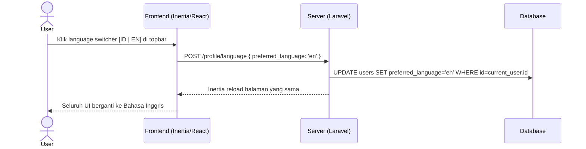
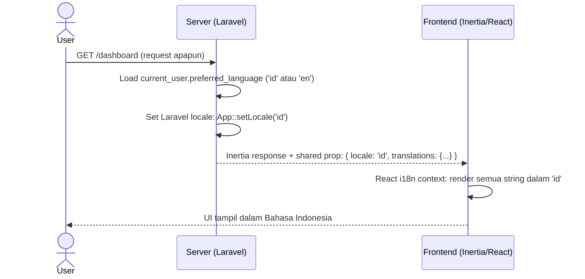
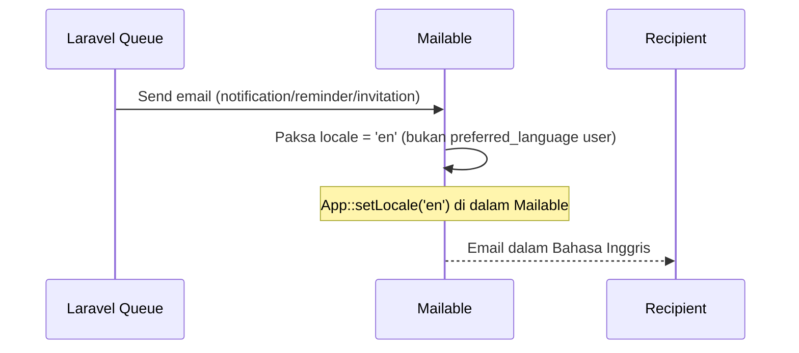

# System Logic: FR-I18N — Internationalization

| | |
|---|---|
| **Document Version** | v1.0 |
| **FR Group ID** | FR-I18N |
| **FR Group Name** | Internationalization (i18n) |
| **Status** | Draft |
| **Last Updated** | 2026-06-23 |
| **Author** | System Analyst AI |
| **Source** | SRS §3.18 · IA §5.3 · Data Model §3.1 |

---

## 1. Overview

Acceptra mendukung dua bahasa UI: **Indonesia (id)** dan **Inggris (en)**. Preferensi bahasa disimpan per user dan dapat diganti kapan saja. Email selalu dalam Bahasa Inggris. Isi PDF tidak diterjemahkan. Semua teks UI dieksternalisasi ke file bahasa (tidak di-hardcode).

**Cakupan FR:**
| FR ID | Deskripsi | Prioritas |
|---|---|---|
| FR-I18N-01 | UI ID + EN, switcher per user | MUST |
| FR-I18N-02 | Teks UI dieksternalisasi | MUST |
| FR-I18N-03 | Email selalu Bahasa Inggris | MUST |
| FR-I18N-04 | Isi PDF tidak diterjemahkan | MUST |

---

## 2. Actors

| Actor | Keterlibatan |
|---|---|
| Semua pengguna | Switch bahasa UI via topbar atau profil |
| System | Render email dalam EN; render PDF tanpa terjemahan |

---

## 3. Sequence Diagrams

### Scenario 1: User Switch Bahasa (Topbar Switcher)



---

### Scenario 2: UI Render dalam Bahasa User



---

### Scenario 3: Email selalu dalam Bahasa Inggris (FR-I18N-03)



---

## 4. API Contract

### 4.1 Form Actions

#### POST /profile/language — Update Bahasa Preferensi
**Request Body:**
```json
{ "preferred_language": "id | en" }
```

**Success Response:**
```
Inertia redirect → halaman yang sama (dengan locale baru)
```

---

#### Shared Props (dikirim ke semua Inertia pages)
```json
{
  "auth": { "user": { "preferred_language": "id" } },
  "locale": "id"
}
```

---

## 5. Data Flow

| Step | Input | Process | Output |
|---|---|---|---|
| 1 | Switch language request | UPDATE `users.preferred_language` | User preference saved |
| 2 | Any page request | Load `preferred_language` → set Laravel locale | Correct locale active |
| 3 | Frontend render | React i18n reads locale + translations | UI in selected language |
| 4 | Email send | Force `locale='en'` in Mailable | English email |

---

## 6. Security Rules

| Rule | Deskripsi |
|---|---|
| N/A | Tidak ada security concern khusus pada i18n |

---

## 7. Business Rules

| Rule ID | Deskripsi |
|---|---|
| BR-I18N-01 | Default bahasa = `id` (Indonesia) untuk semua user baru (SRS FR-I18N-01) |
| BR-I18N-02 | Seluruh teks UI dieksternalisasi; tidak ada hardcode string di view/component (SRS FR-I18N-02) |
| BR-I18N-03 | Email selalu EN terlepas dari `preferred_language` user (SRS FR-I18N-03) |
| BR-I18N-04 | Isi dokumen PDF tidak diterjemahkan — format ATP tetap format baku XLSmart (SRS FR-I18N-04) |
| BR-I18N-05 | Language switcher tersedia di topbar dan di `/profile` |

---

## 8. Validations

| Field | Rule |
|---|---|
| `preferred_language` | Must be `id` or `en` |

---

## 9. Edge Cases

| Skenario | Penanganan |
|---|---|
| Translation key belum ada | Fallback ke key name (bukan error); log missing key |
| User ganti bahasa saat mengisi form | Halaman reload; form state hilang (Inertia full reload) |

---

## 10. Traceability

| Scenario | SRS FR | IA Page | Data Model | Controller |
|---|---|---|---|---|
| Switch bahasa | FR-I18N-01 | Topbar §5.3, `Profile/Edit` §6.22 | `users.preferred_language` | `ProfileController` |
| Teks dieksternalisasi | FR-I18N-02 | Semua halaman | — | Laravel lang files + React i18n |
| Email dalam EN | FR-I18N-03 | — | — | Mailable (force locale) |
| PDF tidak diterjemahkan | FR-I18N-04 | — | — | `PdfStampingService` |
