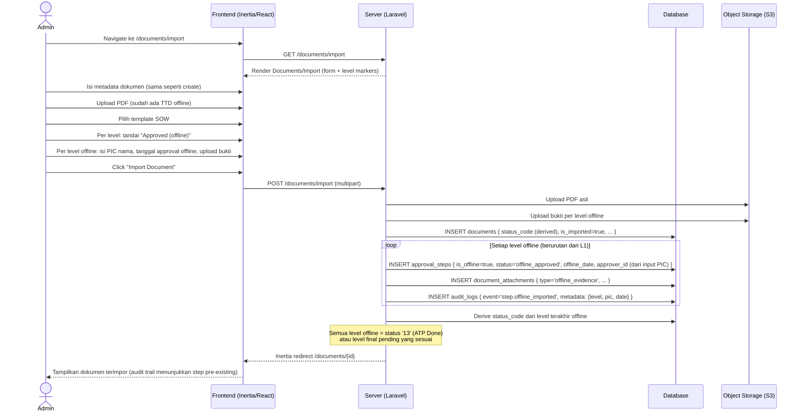
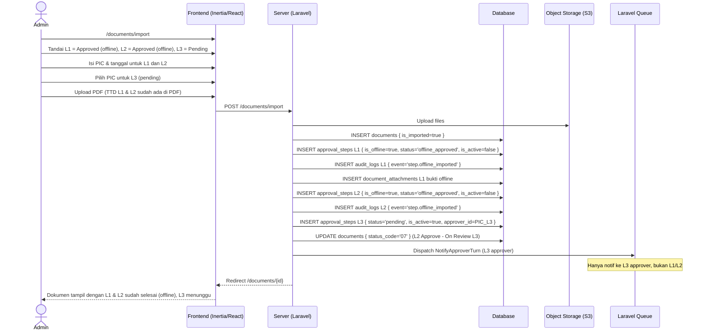
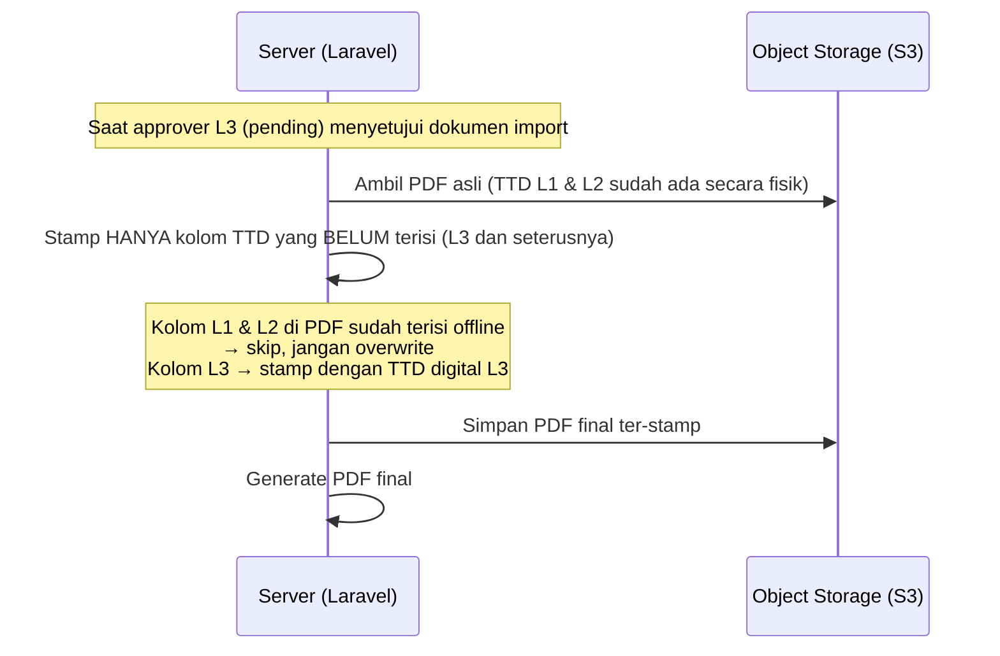

# System Logic: FR-IMP — Import Dokumen Berjalan

| | |
|---|---|
| **Document Version** | v1.0 |
| **FR Group ID** | FR-IMP |
| **FR Group Name** | Import Dokumen Berjalan (Offline) |
| **Status** | Draft |
| **Last Updated** | 2026-06-23 |
| **Author** | System Analyst AI |
| **Source** | SRS §3.6 · IA §6.12 · Data Model §3.6–3.7–3.8 |

---

## 1. Overview

Modul ini memungkinkan Admin mengimpor dokumen ATP yang **sebagian atau seluruh level approval-nya sudah dilakukan secara offline** (di luar sistem). Fitur ini digunakan untuk migrasi data awal atau dokumen yang sudah ditandatangani sebelum sistem digunakan. Sistem menetapkan status awal sesuai level terakhir yang sudah di-approve offline, dan hanya notifikasi ke approver **pending berikutnya**.

**Cakupan FR:**
| FR ID | Deskripsi | Prioritas |
|---|---|---|
| FR-IMP-01 | Opsi menandai dokumen sudah punya approval offline | MUST |
| FR-IMP-02 | Tiap level dapat ditandai Approved (offline) atau Pending | MUST |
| FR-IMP-03 | Level offline: isi PIC, tanggal, attachment bukti | MUST |
| FR-IMP-04 | Level offline berurutan dari awal; sistem set status & notif hanya approver pending berikutnya | MUST |
| FR-IMP-05 | Audit trail mencatat step offline sebagai pre-existing | MUST |
| FR-IMP-06 | Stamping approver pending hanya mengisi kotak kosong | MUST |

---

## 2. Actors

| Actor | Role Kode | Keterlibatan |
|---|---|---|
| Admin | `admin` | Import dokumen berjalan |
| Super Admin | `super_admin` | Sama dengan Admin |
| System | — | Set status, notifikasi approver pending, catat audit |

---

## 3. Sequence Diagrams

### Scenario 1: Import Dokumen — Semua Level Sudah Offline Approved



---

### Scenario 2: Import Dokumen — Sebagian Level Offline, Sebagian Pending



---

### Scenario 3: Stamping PDF Import (FR-IMP-06)



---

## 4. API Contract

### 4.1 Inertia Routes

| Method | Route | Inertia Page | Akses |
|---|---|---|---|
| GET | `/documents/import` | `Documents/Import` | Admin, Super Admin |

**Props `Documents/Import`:**
```json
{
  "templates": [
    { "id": "uuid", "name": "SOW Install Microwave", "levels": [...] }
  ],
  "defaults": {
    "vendor_contractor": "PT Aviat Solusi Komunikasi Indonesia"
  }
}
```

---

### 4.2 Form Actions

#### POST /documents/import — Import Dokumen Offline
**Request:** `multipart/form-data`

```json
{
  "vendor_contractor": "string (required)",
  "pt_index": "string (required)",
  "project_code": "string (nullable)",
  "link_id": "string (nullable)",
  "link_name": "string (nullable)",
  "tower_id_ne": "string (nullable)",
  "site_name_ne": "string (nullable)",
  "tower_id_fe": "string (nullable)",
  "site_name_fe": "string (nullable)",
  "template_id": "uuid (required)",
  "pdf_file": "file (required)",
  "levels": [
    {
      "level_order": 1,
      "is_offline": true,
      "approver_name": "string (required if offline)",
      "approver_id": "uuid (nullable — user di sistem, nullable jika offline only)",
      "offline_date": "date (required if offline, format: YYYY-MM-DD)",
      "evidence_file": "file (nullable, bukti approval offline)"
    },
    {
      "level_order": 2,
      "is_offline": true,
      "approver_name": "string",
      "approver_id": "uuid",
      "offline_date": "2026-05-10",
      "evidence_file": null
    },
    {
      "level_order": 3,
      "is_offline": false,
      "approver_id": "uuid (required — PIC untuk pending level)"
    }
  ]
}
```

**Aturan level offline:**
- Level offline harus berurutan dari L1 ke atas — tidak bisa skip (L1 offline, L2 pending, L3 offline = invalid)
- Minimal L1 harus ditandai offline jika import (dokumen punya TTD parsial di PDF)

**Success Response:**
```
Inertia redirect → /documents/{id}
Flash: "Document imported successfully."
```

**Error Response (422):**
```json
{
  "errors": {
    "levels": ["Offline levels must be sequential from the beginning."],
    "levels.0.offline_date": ["Offline date is required for offline levels."],
    "levels.2.approver_id": ["Approver is required for pending levels."]
  }
}
```

---

## 5. Data Flow

| Step | Input | Process | Output |
|---|---|---|---|
| 1 | Form import data | Validate: offline levels berurutan dari L1 | Validated payload |
| 2 | PDF + bukti files | Upload ke S3 | File paths |
| 3 | Offline level data | INSERT `approval_steps` (is_offline=true, status='offline_approved') | Step records |
| 4 | Evidence files | INSERT `document_attachments` (type='offline_evidence') | Attachment records |
| 5 | Offline steps | INSERT `audit_logs` (event='step.offline_imported') | Audit entries |
| 6 | Last offline level | Derive `status_code` dokumen | `documents.status_code` |
| 7 | First pending level | SET `approval_steps.is_active=true` | Active step |
| 8 | Active approver | Queue: send notification | Notif approver pending |

---

## 6. Security Rules

| Rule | Deskripsi |
|---|---|
| Hanya Admin+ | Route `/documents/import` — `admin` dan `super_admin` saja |
| File evidence | Bukti offline disimpan di S3 dengan signed URL; tidak publik |
| Audit immutable | Log import tidak dapat diubah |

---

## 7. Business Rules

| Rule ID | Deskripsi |
|---|---|
| BR-IMP-01 | Level offline harus berurutan dari L1 — tidak boleh ada gap (SRS FR-IMP-04) |
| BR-IMP-02 | Dokumen import wajib `is_imported=true` di `documents` |
| BR-IMP-03 | Setiap step offline wajib menyertakan: PIC name, offline_date; bukti opsional (SRS FR-IMP-03) |
| BR-IMP-04 | Notifikasi hanya dikirim ke approver level **pending pertama** setelah chain offline (SRS FR-IMP-04) |
| BR-IMP-05 | Audit trail mencatat semua step offline sebagai `event='step.offline_imported'` (SRS FR-IMP-05) |
| BR-IMP-06 | Saat PDF final di-generate, stamp HANYA kolom yang belum terisi (level pending) — level offline di-skip (SRS FR-IMP-06) |
| BR-IMP-07 | Status dokumen di-derive dari kondisi level: jika semua level offline → `'13'`; jika ada pending → status level terakhir offline + 1 (mis. L2 offline terakhir → `'07'`) |

---

## 8. Validations

| Field | Rule | Error Message (EN) |
|---|---|---|
| `pdf_file` | Required, application/pdf, max 20MB | "PDF is required / Invalid type / Too large" |
| `levels[offline].offline_date` | Required for offline, valid date, not in future | "Offline date is required and must be a past date" |
| `levels[offline].approver_name` | Required for offline | "Approver name is required for offline levels" |
| `levels[pending].approver_id` | Required for pending, must be valid user with matching role | "Please select a valid approver for pending levels" |
| `levels` sequence | Offline levels must start from L1, no gaps | "Offline levels must be sequential from L1" |

---

## 9. Edge Cases

| Skenario | Penanganan |
|---|---|
| Semua level offline | Status `'13'` (ATP Done); PDF final adalah PDF yang diupload (tidak perlu stamp) |
| L1 offline, L2 offline, L3 offline, L4 pending | Status `'10'` (L3 Approve - On Review L4); notif hanya ke L4 approver |
| Evidence tidak diupload | Diizinkan (opsional); catatan di notes |
| PIC offline tidak terdaftar sebagai user di sistem | `approver_id=NULL`; hanya `approver_name` yang diisi (untuk catatan historis) |
| Template berubah setelah import | Snapshot dokumen import tetap dari template yang dipilih saat import |

---

## 10. Traceability

| Scenario | SRS FR | IA Page | Data Model | Controller |
|---|---|---|---|---|
| Import dengan offline levels | FR-IMP-01, 02, 03 | `Documents/Import` §6.12 | `approval_steps.is_offline` | `DocumentController@import` |
| Sequential offline validation | FR-IMP-04 | — | `approval_steps.level_order` | `ImportDocumentService` |
| Audit pre-existing | FR-IMP-05 | `Documents/Show` (Audit Trail tab) | `audit_logs.event='step.offline_imported'` | `AuditService` |
| Stamp hanya kotak kosong | FR-IMP-06 | — | `approval_steps.is_offline` | `PdfStampingService` |
