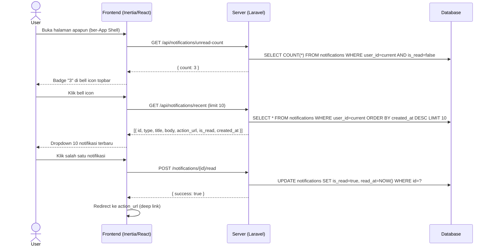
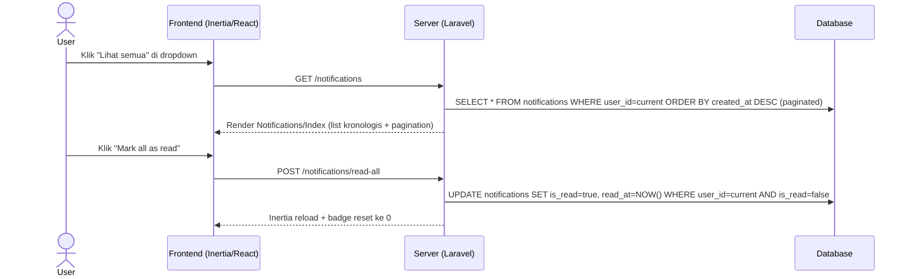
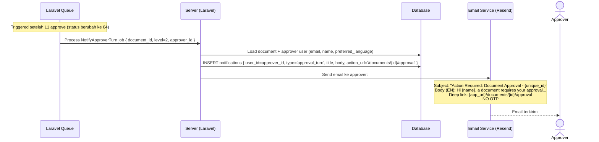
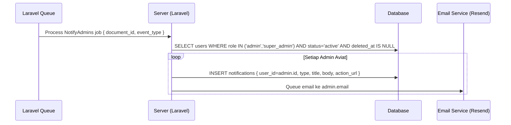
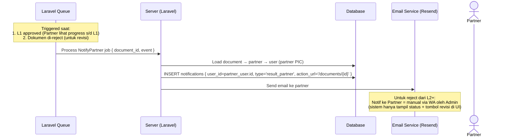

# System Logic: FR-NTF — Notifications

| | |
|---|---|
| **Document Version** | v1.0 |
| **FR Group ID** | FR-NTF |
| **FR Group Name** | Notifications |
| **Status** | Draft |
| **Last Updated** | 2026-06-23 |
| **Author** | System Analyst AI |
| **Source** | SRS §3.13 · IA §6.21 · Data Model §3.11 · SRS §10.2 (Matriks Notifikasi) |

---

## 1. Overview

Modul ini mengelola notifikasi in-app dan email untuk semua event signifikan dalam alur dokumen. Notifikasi in-app menampilkan badge unread di topbar, dropdown 10 terbaru, dan halaman penuh. Email selalu dalam Bahasa Inggris dan berisi deep link ke halaman tujuan (tanpa OTP). WhatsApp otomatis tidak termasuk v1.

**Cakupan FR:**
| FR ID | Deskripsi | Prioritas |
|---|---|---|
| FR-NTF-01 | In-app: badge unread, dropdown 10 terbaru, mark-as-read, halaman penuh | MUST |
| FR-NTF-02 | Email (Bahasa Inggris) memuat ringkasan + deep link (tanpa OTP) | MUST |
| FR-NTF-03 | Event submission, reminder, approval, rejected → ke semua Admin Aviat | MUST |
| FR-NTF-04 | Approver giliran aktif menerima notifikasi saat dokumen tiba di levelnya | MUST |
| FR-NTF-05 | Partner menerima notif hasil s/d L1 & saat reject (untuk revisi) | MUST |
| FR-NTF-06 | Notifikasi sesuai matriks trigger (SRS §10.2) | MUST |
| FR-NTF-07 | WhatsApp otomatis — pengembangan berikutnya | NICE |

---

## 2. Actors

| Actor | Notifikasi yang Diterima |
|---|---|
| Semua Admin Aviat | Submission, Approve/Punchlist, Reject, Flow completed, Reminder |
| Approver giliran aktif | Approval turn arrived, Punchlist revised (jika pembuat), Reassigned |
| Partner pemilik | Hasil s/d L1, Reject (untuk revisi) |
| System | Trigger semua notifikasi via queue |

---

## 3. Sequence Diagrams

### Scenario 1: In-App Notification Bell + Dropdown



---

### Scenario 2: Halaman Notifikasi Penuh + Mark All as Read



---

### Scenario 3: Email Notification — Approval Turn (FR-NTF-04)



---

### Scenario 4: Notifikasi ke Semua Admin (event: submission, approved, rejected)



---

### Scenario 5: Notifikasi ke Partner (hasil s/d L1 & reject untuk revisi)



---

## 4. API Contract

### 4.1 Inertia Routes

| Method | Route | Inertia Page | Akses |
|---|---|---|---|
| GET | `/notifications` | `Notifications/Index` | Semua role |

**Props `Notifications/Index`:**
```json
{
  "notifications": {
    "data": [
      {
        "id": "uuid",
        "type": "approval_turn",
        "title": "Document Requires Your Approval",
        "body": "Document ACC-2026-0001 (SOW Install) is waiting for your approval.",
        "action_url": "/documents/uuid-v7/approval",
        "is_read": false,
        "created_at": "2026-06-23T10:00:00Z"
      }
    ],
    "links": {},
    "meta": { "total": 25, "unread_count": 3 }
  }
}
```

---

### 4.2 Form Actions / JSON Endpoints

#### GET /api/notifications/unread-count
**Response:**
```json
{ "count": 3 }
```

#### GET /api/notifications/recent
**Query:** `?limit=10`
**Response:**
```json
{
  "data": [
    { "id": "uuid", "type": "string", "title": "string", "body": "string", "action_url": "string", "is_read": false, "created_at": "datetime" }
  ]
}
```

#### POST /notifications/{id}/read — Mark satu notifikasi sebagai dibaca
**Request:** No body
**Response:** `{ "success": true }`

#### POST /notifications/read-all — Mark semua sebagai dibaca
**Request:** No body
**Response:**
```
Inertia reload
```

---

## 5. Data Flow (Matriks Trigger — SRS §10.2)

| Event | Penerima | In-App | Email |
|---|---|:---:|:---:|
| Dokumen disubmit | Semua Admin Aviat | ✅ | ✅ |
| Giliran approval tiba | Approver giliran aktif | ✅ | ✅ |
| Approve / w-Punchlist | Semua Admin Aviat | ✅ | ✅ |
| Reject | Semua Admin Aviat | ✅ | ✅ |
| Alur selesai (13/14) | Semua Admin + approver terkait | ✅ | ✅ |
| Admin revisi punchlist (→ status 15) | Approver pembuat punchlist | ✅ | ✅ |
| Reassign | Approver baru | ✅ | ✅ |
| Hasil s/d L1 & reject (revisi) | Partner pemilik | ✅ | ✅ |
| Pending > interval (weekday) | Approver terkait + semua Admin | ✅ (tidak ada badge) | ✅ |

---

## 6. Notification Type Values

| Type | Event |
|---|---|
| `submission` | Dokumen disubmit |
| `approval_turn` | Giliran approval tiba |
| `approved` | Approve / Approve with Punchlist |
| `rejected` | Reject |
| `flow_completed` | Alur selesai (status 13/14) |
| `punchlist_revised` | Admin upload revisi punchlist |
| `reassigned` | Reassign ke approver baru |
| `result_partner` | Hasil s/d L1 & reject (revisi) ke Partner |
| `reminder` | Reminder pending weekday |

---

## 7. Security Rules

| Rule | Deskripsi |
|---|---|
| User scope | Hanya notifikasi milik `user_id = current_user` yang bisa dilihat/mark-read |
| Email deep link | Link menggunakan UUID v7 — tidak enumerable (SRS NFR-SEC-08) |
| No OTP | Email tidak mengandung OTP (SRS C-9) |
| SPF/DKIM/DMARC | Email transaksional menggunakan domain setting Resend |

---

## 8. Business Rules

| Rule ID | Deskripsi |
|---|---|
| BR-NTF-01 | In-app: badge = total `is_read=false` per user; dropdown = 10 terbaru (SRS FR-NTF-01) |
| BR-NTF-02 | Email selalu Bahasa Inggris; in-app mengikuti `preferred_language` user (SRS FR-NTF-02, FR-I18N-03) |
| BR-NTF-03 | Event submission, approve, reject selalu ke **semua Admin Aviat** (SRS FR-NTF-03) |
| BR-NTF-04 | Approver giliran aktif = approver di step `is_active=true` (SRS FR-NTF-04) |
| BR-NTF-05 | Partner hanya notif s/d L1 + reject untuk revisi; reject dari L2+ disampaikan **manual Admin via WA** (SRS FR-NTF-05, A-7) |
| BR-NTF-06 | Semua notifikasi via queue (non-blocking) (SRS NFR-PERF-03) |

---

## 9. Edge Cases

| Skenario | Penanganan |
|---|---|
| Email bounce | Email tetap ter-queue dan dikirim; jika gagal, Resend webhook log → Sentry |
| User punya banyak notifikasi unread | Badge menampilkan angka aktual; dropdown selalu 10 terbaru |
| Notifikasi untuk user inactive | INSERT tetap terjadi; user tidak bisa login, tapi record ada jika aktif kembali |
| Topbar polling | Gunakan Inertia polling atau SWR (interval 30 detik) untuk update badge; jangan SSE/WebSocket di v1 |

---

## 10. Traceability

| Scenario | SRS FR | IA Page | Data Model | Service / Controller |
|---|---|---|---|---|
| In-app bell + dropdown | FR-NTF-01 | Topbar §5.3 | `notifications` | `NotificationController` |
| Email notification | FR-NTF-02 | — | `notifications` | `NotificationMailer` via Queue |
| Notify all admins | FR-NTF-03 | — | `users.role IN (admin, super_admin)` | `NotificationService@notifyAdmins` |
| Notify approver turn | FR-NTF-04 | `Approvals/Index` §6.7 | `approval_steps.approver_id` | `NotificationService@notifyApproverTurn` |
| Notify partner | FR-NTF-05 | `Dashboard/Partner` §6.5 | `documents.partner_id` | `NotificationService@notifyPartner` |
| Halaman notifikasi penuh | FR-NTF-01 | `Notifications/Index` §6.21 | `notifications` | `NotificationController@index` |
