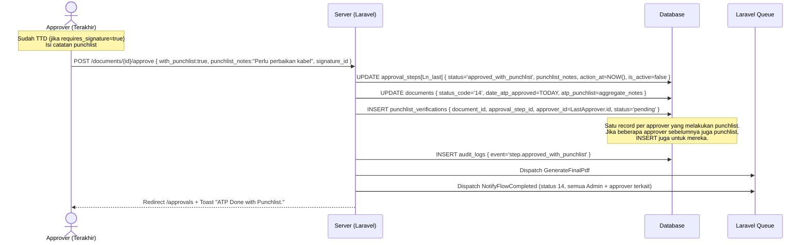
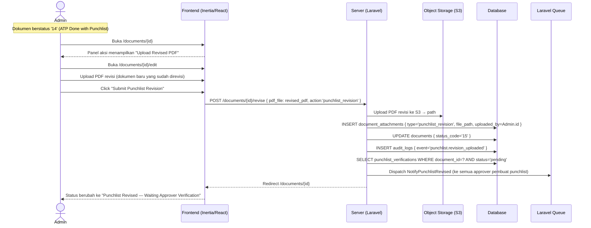
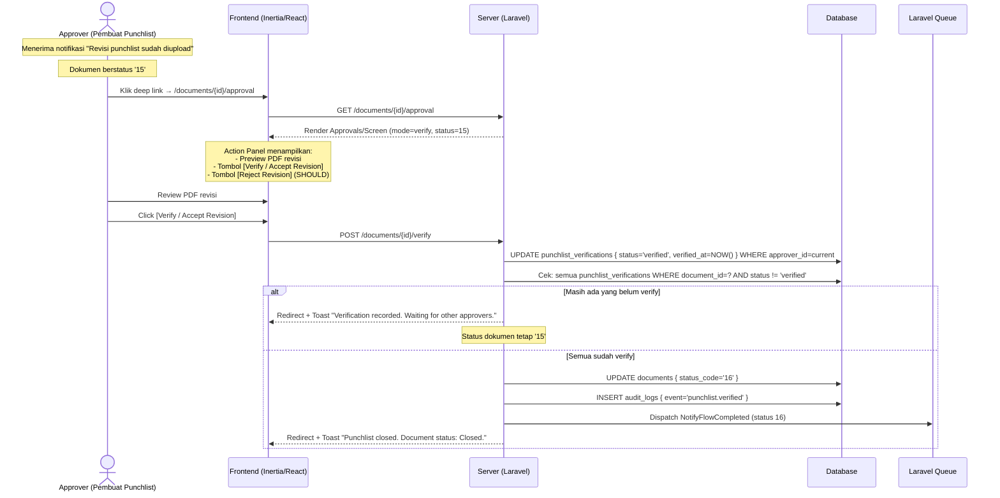

# System Logic: FR-PCL — Punchlist Management

| | |
|---|---|
| **Document Version** | v1.0 |
| **FR Group ID** | FR-PCL |
| **FR Group Name** | Punchlist Management |
| **Status** | Draft |
| **Last Updated** | 2026-06-23 |
| **Author** | System Analyst AI |
| **Source** | SRS §3.11 · IA §6.9 · Data Model §3.9 · SRS §7 (Status 14–16) |

---

## 1. Overview

Modul punchlist mengelola siklus **14 → 15 → 16** setelah approver terakhir menyetujui dengan catatan punchlist. Admin mengupload PDF revisi, lalu setiap approver yang membuat punchlist melakukan verifikasi. Status `16 (Closed)` dicapai saat **semua** approver pembuat punchlist sudah verify. Approver dapat menolak revisi (kembali ke status 14).

**Cakupan FR:**
| FR ID | Deskripsi | Prioritas |
|---|---|---|
| FR-PCL-01 | Approver terakhir approve dengan punchlist → status `14` | MUST |
| FR-PCL-02 | Admin upload PDF revisi → status `15` → notifikasi semua approver pembuat punchlist | MUST |
| FR-PCL-03 | Tiap pembuat punchlist Verify/Accept Revision | MUST |
| FR-PCL-04 | Penutupan per-approver; status `16` saat semua pembuat punchlist verify | MUST |
| FR-PCL-05 | Isi punchlist = satu kolom catatan bebas | MUST |
| FR-PCL-06 | Approver dapat menolak revisi (kembali ke status 14) | SHOULD |

---

## 2. Actors

| Actor | Role Kode | Keterlibatan |
|---|---|---|
| Approver (pembuat punchlist) | `approver_*` | Approve with punchlist; verify/reject revisi |
| Admin / Super Admin | `admin`, `super_admin` | Upload PDF revisi punchlist |
| System | — | Buat `punchlist_verifications`, notifikasi, derive status 16 |

---

## 3. Sequence Diagrams

### Scenario 1: Approver Terakhir Approve with Punchlist → Status 14



---

### Scenario 2: Admin Upload PDF Revisi Punchlist → Status 15



---

### Scenario 3: Approver Verify Revisi → Status 16 (saat semua verify)



---

### Scenario 4: Approver Tolak Revisi → Kembali ke Status 14 (FR-PCL-06 — SHOULD)

```mermaid
sequenceDiagram
    actor Approver as Approver (Pembuat Punchlist)
    participant Frontend as Frontend (Inertia/React)
    participant Server as Server (Laravel)
    participant Database

    Note over Approver: Dokumen status '15'; approver merasa revisi tidak memuaskan

    Approver->>Frontend: Click [Reject Revision]
    Frontend-->>Approver: Modal: textarea "Alasan penolakan revisi" (required)
    Approver->>Frontend: Isi alasan
    Approver->>Frontend: Confirm

    Frontend->>Server: POST /documents/{id}/verify { action:'reject', notes:"Masih ada kabel tidak rapi" }

    Server->>Database: UPDATE punchlist_verifications { status='rejected', notes } WHERE approver_id=current
    Server->>Database: UPDATE documents { status_code='14' }
    Server->>Database: INSERT audit_logs { event='punchlist.revision_rejected' }

    Server-->>Frontend: Redirect + Toast "Revision rejected. Document returned to status 14."
    Note over Server: Admin perlu upload ulang PDF revisi yang diperbaiki
```

---

## 4. API Contract

### 4.1 Inertia Routes

| Method | Route | Inertia Page | Akses |
|---|---|---|---|
| GET | `/documents/{id}/approval` (mode verify) | `Approvals/Screen` | Approver pembuat punchlist (status 15) |
| GET | `/documents/{id}/edit` (punchlist upload) | `Documents/Edit` | Admin, Super Admin (status 14) |

**Props `Approvals/Screen` (mode verify, status 15):**
```json
{
  "mode": "verify",
  "document": { "id": "uuid", "status_code": "15" },
  "punchlist_revision_pdf": {
    "url": "signed_s3_url",
    "filename": "revised_atp.pdf",
    "uploaded_at": "datetime",
    "uploaded_by": "Admin Name"
  },
  "my_punchlist": {
    "notes": "Perlu perbaikan kabel di segment A-B",
    "created_at": "datetime"
  },
  "all_verifications": [
    { "approver_name": "John", "status": "verified", "verified_at": "datetime" },
    { "approver_name": "Jane", "status": "pending" }
  ]
}
```

---

### 4.2 Form Actions

#### POST /documents/{id}/revise (punchlist revision upload) — Admin
**Request:** `multipart/form-data`
```json
{
  "pdf_file": "file (required, PDF, max 20MB)",
  "action": "punchlist_revision"
}
```

**Success Response:**
```
Inertia redirect → /documents/{id}
Flash: "Punchlist revision uploaded. Approvers have been notified."
Status: '15'
```

---

#### POST /documents/{id}/verify — Approver Verify/Reject Revision
**Request Body:**
```json
{
  "action": "verify | reject",
  "notes": "string (required if action=reject)"
}
```

**Success Response (verify, belum semua):**
```
Inertia redirect → /approvals
Flash: "Verification recorded."
Status: '15' (unchanged)
```

**Success Response (verify, semua verify):**
```
Inertia redirect → /approvals
Flash: "All verifications complete. Document closed."
Status: '16'
```

**Success Response (reject):**
```
Inertia redirect → /approvals
Flash: "Revision rejected. Admin will be notified."
Status: '14'
```

---

## 5. Data Flow

| Step | Input | Process | Output |
|---|---|---|---|
| 1 | Last approve w/ punchlist | INSERT `punchlist_verifications` per punchlist-maker | Verification records |
| 2 | Admin upload revised PDF | INSERT `document_attachments` (type=punchlist_revision) | Attachment record |
| 3 | Upload complete | UPDATE `documents.status_code='15'` | Status advance |
| 4 | Notify punchlist makers | Queue: send notification to all approvers with pending punchlist_verifications | Emails sent |
| 5 | Approver verify | UPDATE `punchlist_verifications` status='verified' | Record updated |
| 6 | All verified check | SELECT COUNT(*) WHERE status != 'verified' | 0 = all done |
| 7 | All done | UPDATE `documents.status_code='16'` | Final closed status |
| 8 | Approver reject | UPDATE status='rejected', revert doc to '14' | Back to punchlist |

---

## 6. Security Rules

| Rule | Deskripsi |
|---|---|
| Verify hanya pembuat punchlist | Policy: hanya approver yang punya `punchlist_verifications` record untuk dokumen ini |
| Upload revisi hanya Admin+ | Policy: hanya `admin` / `super_admin` yang dapat upload punchlist revision |
| Revised PDF tidak publik | Signed URL seperti attachment lainnya |

---

## 7. Business Rules

| Rule ID | Deskripsi |
|---|---|
| BR-PCL-01 | Status `14` dicapai hanya saat approver **terakhir** approve with punchlist (SRS FR-PCL-01) |
| BR-PCL-02 | `punchlist_verifications` dibuat untuk setiap approver yang melakukan `approved_with_punchlist` (bisa lebih dari satu jika beberapa level punchlist) (SRS FR-PCL-02) |
| BR-PCL-03 | Admin upload PDF revisi → status `15`; notif ke **semua** approver pembuat punchlist (SRS FR-PCL-02) |
| BR-PCL-04 | Status `16` tercapai hanya jika **semua** `punchlist_verifications.status='verified'` untuk dokumen terkait (SRS FR-PCL-04) |
| BR-PCL-05 | Isi punchlist = text bebas satu field; tidak ada item/checklist terstruktur (SRS FR-PCL-05) |
| BR-PCL-06 | Approver tolak revisi → status kembali ke `14`; Admin harus upload ulang revisi (SRS FR-PCL-06 — SHOULD) |
| BR-PCL-07 | Partial verify tidak mengubah status dokumen (tetap `15`) sampai semua verify |

---

## 8. Validations

| Field | Rule | Error Message (EN) |
|---|---|---|
| `punchlist_notes` | Required jika action=`approved_with_punchlist` | "Punchlist notes are required" |
| `pdf_file` (revisi) | Required, PDF, max 20MB | "Revised PDF is required" |
| `notes` (reject) | Required jika action=`reject` | "Rejection reason is required" |

---

## 9. Edge Cases

| Skenario | Penanganan |
|---|---|
| Hanya satu approver yang punchlist | Satu record `punchlist_verifications`; status `16` segera setelah satu approver itu verify |
| Beberapa approver (L2 dan L3) keduanya punchlist | Dua record; status `16` hanya setelah KEDUANYA verify |
| Admin upload revisi berkali-kali setelah reject | Setiap upload baru = INSERT `document_attachments` baru; notif ulang; status kembali ke `15` |
| Approver yang punchlist di-reassign | Record `punchlist_verifications.approver_id` tetap ke approver lama; perlu policy decision (kemungkinan: approver baru juga harus verify) |

---

## 10. Traceability

| Scenario | SRS FR | IA Page | Data Model | Controller |
|---|---|---|---|---|
| Create punchlist | FR-PCL-01, 05 | `Approvals/Screen` §6.9 | `approval_steps.punchlist_notes`, `punchlist_verifications` | `ApprovalController@approve` |
| Upload PDF revisi | FR-PCL-02 | `Documents/Edit` §6.14 | `document_attachments.type='punchlist_revision'` | `DocumentController@revise` |
| Verify revision | FR-PCL-03, 04 | `Approvals/Screen` (mode verify) §6.9 | `punchlist_verifications.status` | `PunchlistController@verify` |
| Reject revision | FR-PCL-06 | `Approvals/Screen` §6.9 | `punchlist_verifications.status='rejected'` | `PunchlistController@verify` |
