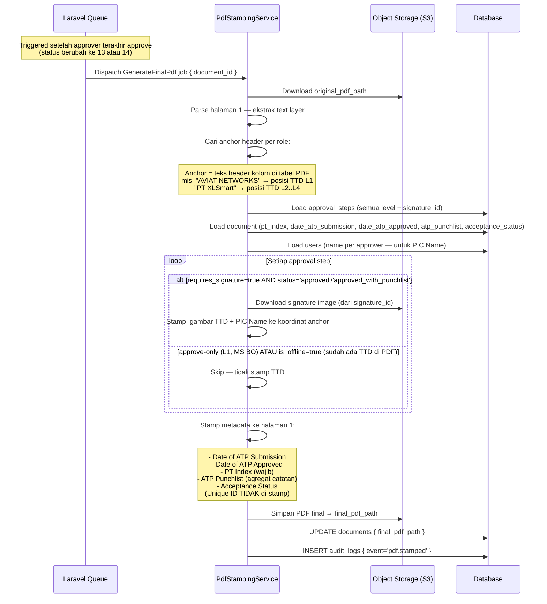
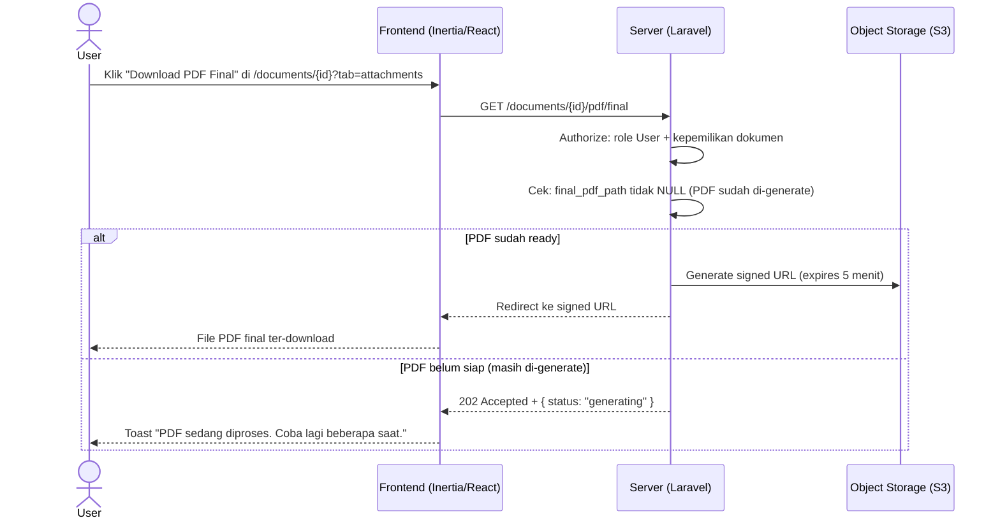

# System Logic: FR-PDF — PDF Stamping

| | |
|---|---|
| **Document Version** | v1.0 |
| **FR Group ID** | FR-PDF |
| **FR Group Name** | PDF Stamping |
| **Status** | Draft |
| **Last Updated** | 2026-06-23 |
| **Author** | System Analyst AI |
| **Source** | SRS §3.10 · IA §6.9 · Data Model §3.6–3.8 |

---

## 1. Overview

Modul ini mengelola pembuatan **PDF final** dengan cara meng-stamp tanda tangan, nama PIC, dan metadata ke PDF asli. Stamp dilakukan via **auto text-anchor** (deteksi teks di halaman 1) atau **manual placement** (fallback universal). PDF asli selalu dipertahankan. Level approve-only tidak meninggalkan TTD di PDF, tetapi tercatat di audit trail.

**Cakupan FR:**
| FR ID | Deskripsi | Prioritas |
|---|---|---|
| FR-PDF-01 | Generate PDF final baru; pertahankan PDF asli | MUST |
| FR-PDF-02 | Stamp halaman 1: TTD + PIC Name (level requires_signature); Date Submission, Date Approved, PT Index, ATP Punchlist, Acceptance Status | MUST |
| FR-PDF-03 | Auto text-anchor; bila gagal → preview halaman 1 + manual placement | MUST |
| FR-PDF-04 | Manual placement = jalur universal semua kasus | MUST |
| FR-PDF-05 | Level approve-only tidak di-stamp TTD tapi tercatat audit trail | MUST |
| FR-PDF-06 | PDF final dapat di-download Admin, Viewer, Partner (miliknya), Approver terkait | MUST |

---

## 2. Actors

| Actor | Role Kode | Keterlibatan |
|---|---|---|
| System (Queue Job) | — | Generate PDF final setelah semua approval selesai |
| Admin / Super Admin | `admin`, `super_admin` | Set manual placement saat anchor gagal; download PDF |
| Partner | `partner` | Download PDF final miliknya |
| Approver | `approver_*` | Download PDF final dokumen terkait |
| Viewer | `viewer` | Download PDF final |

---

## 3. Sequence Diagrams

### Scenario 1: Auto Text-Anchor Stamping (Happy Path)



---

### Scenario 2: Anchor Tidak Ditemukan → Manual Placement

```mermaid
sequenceDiagram
    actor Admin
    participant Frontend as Frontend (Inertia/React)
    participant Server as Server (Laravel)
    participant PdfService as PdfStampingService
    participant Storage as Object Storage (S3)
    participant Database

    Note over Server: Saat dokumen di-submit, PDF di-upload

    Server->>PdfService: Analisis PDF: cari anchor text
    PdfService-->>Server: anchor_found=false (PDF scan / layout tidak dikenal)

    Server-->>Frontend: Props: anchor_failed=true, pdf_page1_url (preview halaman 1)
    Frontend-->>Admin: Tampilkan halaman 1 PDF + UI Manual Placement drag-drop

    Admin->>Frontend: Drag posisi TTD per level
    Admin->>Frontend: Drag posisi metadata fields (date, pt_index, dst.)
    Admin->>Frontend: Click "Save Placement"

    Frontend->>Server: POST /documents/{id}/placement {
        positions: {
            signature_l2: { page:1, x:120, y:340, w:80, h:30 },
            signature_l3: { page:1, x:220, y:340, w:80, h:30 },
            date_submission: { page:1, x:400, y:100, w:120, h:20 },
            pt_index: { page:1, x:400, y:120, w:120, h:20 },
            ...
        }
    }

    Server->>Database: UPDATE documents.template_snapshot += { placement_positions: {...} }
    Server-->>Frontend: Flash "Placement saved. Will be used when generating final PDF."

    Note over Server: Saat PDF final di-generate (setelah last approve),<br/>PdfService membaca placement_positions dari snapshot
```

---

### Scenario 3: Download PDF Final



---

## 4. API Contract

### 4.1 Inertia Routes

| Method | Route | Inertia Page | Akses |
|---|---|---|---|
| GET | `/documents/{id}?tab=attachments` | `Documents/Show` (Attachments tab) | Aviat, Partner (miliknya), Approver terkait |

---

### 4.2 Form Actions

#### POST /documents/{id}/placement — Simpan Manual Placement
**Request Body:**
```json
{
  "positions": {
    "signature_l2": { "page": 1, "x": 120.5, "y": 340.2, "width": 80, "height": 30 },
    "signature_l3": { "page": 1, "x": 220.5, "y": 340.2, "width": 80, "height": 30 },
    "signature_l4": { "page": 1, "x": 320.5, "y": 340.2, "width": 80, "height": 30 },
    "date_submission": { "page": 1, "x": 400, "y": 100, "width": 120, "height": 20 },
    "date_approved": { "page": 1, "x": 400, "y": 122, "width": 120, "height": 20 },
    "pt_index": { "page": 1, "x": 400, "y": 144, "width": 120, "height": 20 },
    "atp_punchlist": { "page": 1, "x": 100, "y": 500, "width": 200, "height": 40 },
    "acceptance_status": { "page": 1, "x": 100, "y": 550, "width": 150, "height": 20 }
  }
}
```

**Success Response:**
```json
{ "message": "Placement saved." }
```

---

#### GET /documents/{id}/pdf/original — Download PDF Asli
**Authorization:** Admin, Super Admin saja (PDF asli tidak untuk Partner/Approver)

**Response:** Redirect ke signed S3 URL

---

#### GET /documents/{id}/pdf/final — Download PDF Final
**Authorization:** Admin, Viewer, Partner (miliknya), Approver terkait

**Response:** Redirect ke signed S3 URL (atau 202 jika masih processing)

---

## 5. Data Flow

| Step | Input | Process | Output |
|---|---|---|---|
| 1 | Trigger: last approval | Queue: dispatch GenerateFinalPdf | Job queued |
| 2 | `original_pdf_path` | Download dari S3 | PDF bytes |
| 3 | PDF bytes | Parse halaman 1, cari anchor text | Anchor positions (atau gagal) |
| 4 | Anchor positions + signatures | Stamp TTD + PIC Name per level requires_signature | PDF ter-stamp (partial) |
| 5 | Document metadata | Stamp: Date Submission, Date Approved, PT Index, Punchlist, Status | PDF ter-stamp penuh |
| 6 | Final PDF bytes | Upload ke S3 | `final_pdf_path` |
| 7 | `final_pdf_path` | UPDATE `documents` | Record updated |
| 8 | Download request | Generate signed URL | Temporary download link |

---

## 6. Security Rules

| Rule | Deskripsi |
|---|---|
| PDF tidak publik | Signed URL dengan TTL 5 menit; tidak ada akses langsung ke S3 |
| PDF asli dipertahankan | `original_pdf_path` tidak pernah dihapus/diganti (SRS FR-PDF-01) |
| Download authorization | Policy check per request berdasarkan role + kepemilikan |
| Unique ID tidak di-stamp | Privacy/bisnis: Unique ID hanya di aplikasi, tidak di PDF (SRS FR-SUB-09) |

---

## 7. Business Rules

| Rule ID | Deskripsi |
|---|---|
| BR-PDF-01 | PDF final di-generate setelah approver terakhir approve (status 13 atau 14) (SRS FR-PDF-01) |
| BR-PDF-02 | Stamp halaman 1 saja: TTD + PIC Name hanya untuk level `requires_signature=true` (SRS FR-PDF-02) |
| BR-PDF-03 | Field yang di-stamp: Date Submission, Date Approved, PT Index, ATP Punchlist, Acceptance Status. **Unique ID TIDAK di-stamp** (SRS FR-PDF-02, FR-SUB-09) |
| BR-PDF-04 | Auto-anchor mencari teks header kolom di halaman 1; bila tidak ditemukan → manual placement (SRS FR-PDF-03) |
| BR-PDF-05 | Manual placement adalah jalur fallback universal yang selalu tersedia (SRS FR-PDF-04) |
| BR-PDF-06 | Level approve-only (L1, MS BO) tidak meninggalkan TTD di PDF, tetapi aksinya tercatat di audit trail (SRS FR-PDF-05) |
| BR-PDF-07 | Dokumen import: stamp hanya kotak yang belum terisi (kotak offline sudah ada TTD fisik) (SRS FR-IMP-06) |
| BR-PDF-08 | PDF generation berjalan **asinkron via queue** — tidak memblokir response (SRS NFR-PERF-02) |

---

## 8. Validations

| Field | Rule | Error |
|---|---|---|
| `positions` | Required jika manual placement; semua field posisi harus numerik | "Invalid placement data" |
| PDF file (original) | Harus valid PDF; tidak korup | Validated saat upload (FR-SUB) |
| `final_pdf_path` | NULL = belum siap; hindari download sebelum ready | 202 Accepted response |

---

## 9. Edge Cases

| Skenario | Penanganan |
|---|---|
| Queue job gagal (S3 down, dll.) | Job masuk retry queue (SRS NFR-REL-04); Admin notified via Sentry |
| PDF asli ter-corrupt setelah upload | PdfService gagal; audit log mencatat error; Admin perlu re-upload PDF |
| Manual placement tidak disimpan sebelum approve | PDF stamping menggunakan default koordinat fallback atau tetap gagal → Admin fix dari halaman dokumen |
| Approver ganti signature setelah approve | `approval_steps.signature_id` tetap merujuk signature lama yang dipakai saat approve; PDF final sudah di-generate dengan sig lama |
| Multiple approver punchlist = banyak catatan | Semua punchlist notes di-agregat ke `documents.atp_punchlist`; di-stamp sebagai satu teks |

---

## 10. Traceability

| Scenario | SRS FR | IA Page | Data Model | Service |
|---|---|---|---|---|
| Generate PDF final | FR-PDF-01, 02 | `Documents/Show` §6.13 | `documents.final_pdf_path` | `PdfStampingService` |
| Auto anchor | FR-PDF-03 | `Documents/Create` §6.11 | `documents.template_snapshot` (placement) | `PdfAnchorService` |
| Manual placement | FR-PDF-04 | `Documents/Create` §6.11 | `documents.template_snapshot.placement_positions` | `PdfAnchorService` |
| Skip approve-only | FR-PDF-05 | — | `approval_steps.requires_signature=false` | `PdfStampingService` |
| Download | FR-PDF-06 | `Documents/Show` Attachments §6.13 | `documents.final_pdf_path` | `AttachmentController` |
