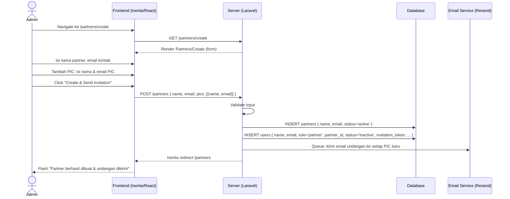
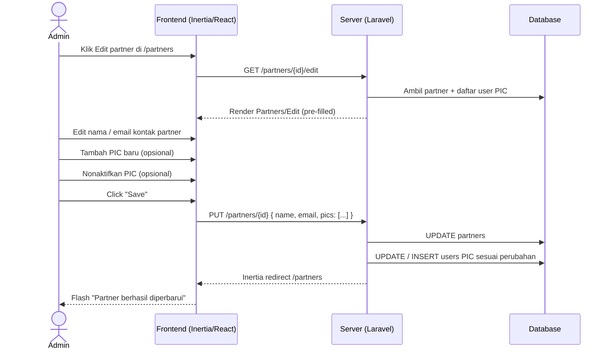
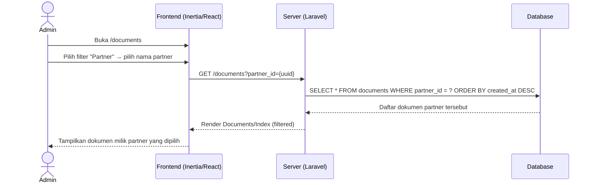
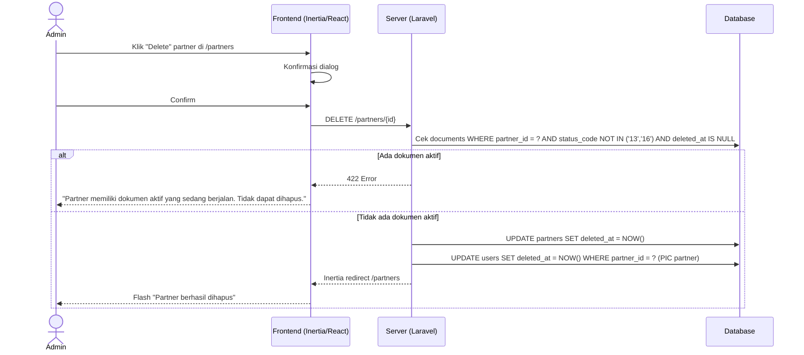

# System Logic: FR-PTR — Partner / Subcon Management

| | |
|---|---|
| **Document Version** | v1.0 |
| **FR Group ID** | FR-PTR |
| **FR Group Name** | Partner / Subcon Management |
| **Status** | Draft |
| **Last Updated** | 2026-06-23 |
| **Author** | System Analyst AI |
| **Source** | SRS §3.3 · IA §6.15–6.16 · Data Model §3.2 |

---

## 1. Overview

Modul ini mengelola master data partner/subkontraktor beserta akun login user PIC-nya. Partner adalah **originator** dokumen — pihak eksternal yang melakukan submission ATP. Admin dan Super Admin mengelola data partner; partner tidak dapat mendaftarkan dirinya sendiri.

**Cakupan FR:**
| FR ID | Deskripsi | Prioritas |
|---|---|---|
| FR-PTR-01 | Admin CRUD data partner (nama + email) beserta akun login partner | MUST |
| FR-PTR-02 | Setiap dokumen terhubung ke satu partner; daftar dokumen dapat difilter per partner | MUST |
| FR-PTR-03 | Satu partner dapat memiliki lebih dari satu user PIC | SHOULD |

---

## 2. Actors

| Actor | Role Kode | Keterlibatan |
|---|---|---|
| Admin | `admin` | CRUD partner, kelola user PIC partner |
| Super Admin | `super_admin` | Sama dengan Admin |
| System | — | Kirim email undangan ke user PIC baru |

---

## 3. Sequence Diagrams

### Scenario 1: Create Partner + User PIC + Send Invitation



---

### Scenario 2: Edit Partner Data



---

### Scenario 3: Filter Dokumen per Partner (FR-PTR-02)



---

### Scenario 4: Soft Delete Partner



---

## 4. API Contract

### 4.1 Inertia Routes

| Method | Route | Inertia Page | Akses |
|---|---|---|---|
| GET | `/partners` | `Partners/Index` | Admin, Super Admin |
| GET | `/partners/create` | `Partners/Create` | Admin, Super Admin |
| GET | `/partners/{id}/edit` | `Partners/Edit` | Admin, Super Admin |

**Props `Partners/Index`:**
```json
{
  "partners": {
    "data": [
      {
        "id": "uuid-v7",
        "name": "PT Maju Bersama",
        "email": "info@majubersama.com",
        "status": "active",
        "pics_count": 2,
        "documents_count": 5
      }
    ],
    "links": {},
    "meta": {}
  }
}
```

**Props `Partners/Edit`:**
```json
{
  "partner": {
    "id": "uuid-v7",
    "name": "string",
    "email": "string",
    "status": "active | inactive",
    "pics": [
      { "id": "uuid-v7", "name": "string", "email": "string", "status": "active | inactive" }
    ]
  }
}
```

---

### 4.2 Form Actions

#### POST /partners — Create Partner
**Request Body:**
```json
{
  "name": "string (required, max 200)",
  "email": "string (required, email format)",
  "pics": [
    {
      "name": "string (required)",
      "email": "string (required, email, unique:users)"
    }
  ]
}
```

**Success Response:**
```
Inertia redirect → /partners
Flash: "Partner created and invitation sent."
```

**Error Response (422):**
```json
{
  "errors": {
    "name": ["Name is required."],
    "pics.0.email": ["Email is already registered."]
  }
}
```

---

#### PUT /partners/{id} — Update Partner
**Request Body:**
```json
{
  "name": "string (required, max 200)",
  "email": "string (required, email format)",
  "status": "string (required, in: active, inactive)",
  "pics": [
    {
      "id": "uuid-v7 | null (null = PIC baru)",
      "name": "string (required)",
      "email": "string (required, email)",
      "status": "active | inactive"
    }
  ]
}
```

**Success Response:**
```
Inertia redirect → /partners
Flash: "Partner updated."
```

---

#### DELETE /partners/{id} — Soft Delete Partner
**Request:** No body

**Success Response:**
```
Inertia redirect → /partners
Flash: "Partner deleted."
```

**Error Response (422):**
```json
{
  "message": "Partner has active documents in progress. Cannot delete."
}
```

---

#### POST /partners/{id}/resend-invitation/{user_id} — Resend Invitation ke PIC
**Request:** No body

**Success Response:**
```
Inertia redirect → /partners/{id}/edit
Flash: "Invitation resent."
```

---

## 5. Data Flow

| Step | Input | Process | Output |
|---|---|---|---|
| 1 | Form partner + PIC data | Validate uniqueness & format | Validated data |
| 2 | Partner data | INSERT `partners` table | Partner record |
| 3 | PIC data list | INSERT `users` (role=partner, partner_id=new_partner) | User PIC records |
| 4 | PIC emails | Generate invitation tokens, queue emails | Undangan terkirim |
| 5 | partner_id filter | Query `documents WHERE partner_id = ?` | Filtered document list |
| 6 | DELETE request | Check active documents guard | Allow or block |

---

## 6. Security Rules

| Rule | Deskripsi |
|---|---|
| Akses terbatas Admin+ | Route `/partners*` dilindungi — hanya `admin` dan `super_admin` |
| Partner tidak self-register | Tidak ada halaman publik untuk Partner mendaftar sendiri |
| UUID v7 di URL | `/partners/{uuid}` — ID tidak enumerable |

---

## 7. Business Rules

| Rule ID | Deskripsi |
|---|---|
| BR-PTR-01 | Setiap dokumen harus terhubung ke tepat satu partner (SRS FR-PTR-02) |
| BR-PTR-02 | Satu partner dapat memiliki banyak user PIC (SHOULD — SRS FR-PTR-03) |
| BR-PTR-03 | Akun user PIC bertipe `role = 'partner'` dengan `partner_id` mengacu ke partner induknya |
| BR-PTR-04 | Partner dengan dokumen aktif (status bukan 13/16) tidak dapat dihapus |
| BR-PTR-05 | Menonaktifkan partner (`status=inactive`) tidak memblokir dokumen yang sudah berjalan |
| BR-PTR-06 | Daftar dokumen di `/documents` dapat difilter by `partner_id` (SRS FR-PTR-02) |

---

## 8. Validations

| Field | Rule | Error Message (EN) |
|---|---|---|
| `name` | Required, max 200 chars | "Partner name is required" |
| `email` | Required, valid email format | "Valid contact email is required" |
| `pics[].name` | Required (min 1 PIC) | "PIC name is required" |
| `pics[].email` | Required, valid email, unique in `users` | "PIC email must be unique" |
| `status` | Must be `active` or `inactive` | "Invalid status" |

---

## 9. Edge Cases

| Skenario | Penanganan |
|---|---|
| Partner email sama dengan email PIC | Diizinkan — `partners.email` adalah kontak umum, berbeda tabel dengan `users.email` |
| Menghapus PIC yang sedang login | PIC soft-deleted; session tetap valid hingga expire |
| Partner dinonaktifkan saat PIC sedang submit | Submission diblokir oleh policy (cek `partner.status = 'active'`) |
| Menambah PIC baru saat edit | PIC baru langsung dapat undangan; PIC lama tidak terganggu |
| Dokumen filter partner yang dihapus | Dokumen tetap terhubung ke data partner (soft delete); filter tetap bekerja karena `partner_id` masih valid |

---

## 10. Traceability

| Scenario | SRS FR | IA Page | Data Model | Controller |
|---|---|---|---|---|
| CRUD Partner | FR-PTR-01 | `Partners/Index`, `Partners/Create`, `Partners/Edit` §6.15–6.16 | `partners` | `PartnerController` |
| Multi PIC per partner | FR-PTR-03 | `Partners/Create`, `Partners/Edit` | `users.partner_id` | `PartnerController` |
| Filter dokumen per partner | FR-PTR-02 | `Documents/Index` §6.10 | `documents.partner_id` | `DocumentController@index` |
