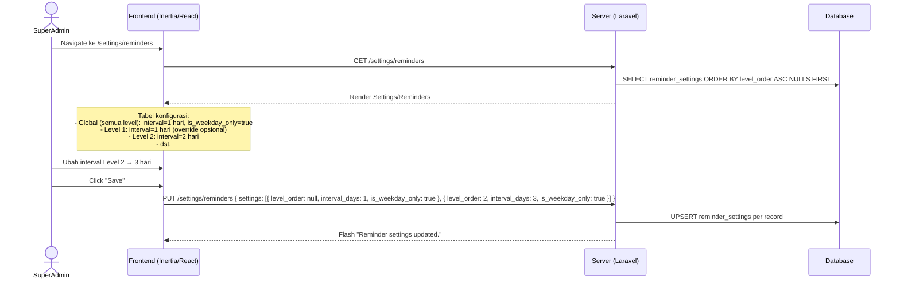
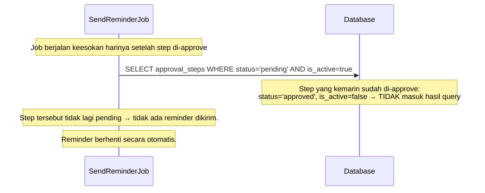

# System Logic: FR-RMD — Email Reminder

| | |
|---|---|
| **Document Version** | v1.0 |
| **FR Group ID** | FR-RMD |
| **FR Group Name** | Email Reminder |
| **Status** | Draft |
| **Last Updated** | 2026-06-23 |
| **Author** | System Analyst AI |
| **Source** | SRS §3.14 · IA §6.20 · Data Model §3.12 |

---

## 1. Overview

Modul ini mengirim email reminder otomatis ke approver yang memiliki step approval **pending** (belum diambil aksi). Reminder dikirim setiap hari kerja (Senin–Jumat) selama step masih pending. Interval dapat dikonfigurasi per level oleh Super Admin. Reminder berhenti otomatis saat step di-approve atau di-reject.

**Cakupan FR:**
| FR ID | Deskripsi | Prioritas |
|---|---|---|
| FR-RMD-01 | Reminder default setiap hari kerja (Senin–Jumat) untuk approval pending | MUST |
| FR-RMD-02 | Interval dapat dikonfigurasi per tingkat approval (default weekday harian) | MUST |
| FR-RMD-03 | Scheduled job memeriksa step pending pada hari kerja | MUST |

---

## 2. Actors

| Actor | Keterlibatan |
|---|---|
| Super Admin | Konfigurasi interval reminder per level di `/settings/reminders` |
| System (Scheduler) | Jalankan job setiap pagi hari kerja |
| Approver | Penerima reminder email |
| Semua Admin Aviat | Penerima reminder (CC) untuk awareness |

---

## 3. Sequence Diagrams

### Scenario 1: Scheduled Reminder Job (Setiap Hari Kerja)

```mermaid
sequenceDiagram
    participant Scheduler as Laravel Scheduler (cron)
    participant Job as SendReminderJob
    participant Database
    participant Queue as Laravel Queue
    participant EmailService as Email Service (Resend)
    actor Approver

    Note over Scheduler: Setiap hari pukul 08:00 WIB (weekday check)

    Scheduler->>Job: Trigger SendPendingReminders
    Job->>Job: Cek hari ini = hari kerja? (Senin–Jumat)

    alt Bukan hari kerja (Sabtu/Minggu)
        Job-->>Scheduler: Skip — tidak kirim reminder
    else Hari kerja
        Job->>Database: Load reminder_settings (global + per level)
        Job->>Database: SELECT approval_steps
            WHERE status='pending'
            AND is_active=true
            AND is_offline=false
            AND (action_at IS NULL OR DATEDIFF(NOW(), action_at) >= interval_days)
        Database-->>Job: List step pending dengan approver_id

        loop Setiap step pending
            Job->>Database: Load approver (email, name) dari approval_steps.approver_id
            Job->>Queue: Dispatch SendReminderEmail { approver_id, document_id, level_order }
            Job->>Queue: Dispatch SendReminderEmail { admin group, document_id } (CC semua Admin)
        end

        Queue->>EmailService: Kirim email reminder ke approver
        Note over EmailService: Subject: "Reminder: Document Awaiting Your Approval - {unique_id}"<br/>Body (EN): This is a reminder that document {unique_id} is still<br/>awaiting your approval since {date}. Please take action.<br/>Link: {app_url}/documents/{id}/approval

        Queue->>EmailService: Kirim email reminder ke semua Admin (awareness)
        EmailService-->>Approver: Email reminder terkirim

        Job->>Database: INSERT notifications { type='reminder', user_id=approver_id, ... }
        Note over Job: In-app reminder tidak punya badge khusus;<br/>masuk ke halaman notifikasi saja
    end
```

---

### Scenario 2: Konfigurasi Reminder Setting (Super Admin)



---

### Scenario 3: Reminder Berhenti Saat Step Di-Approve



---

## 4. API Contract

### 4.1 Inertia Routes

| Method | Route | Inertia Page | Akses |
|---|---|---|---|
| GET | `/settings/reminders` | `Settings/Reminders` | Super Admin |

**Props `Settings/Reminders`:**
```json
{
  "settings": [
    { "id": "uuid", "level_order": null, "interval_days": 1, "is_weekday_only": true, "label": "Global (All Levels)" },
    { "id": "uuid", "level_order": 1, "interval_days": 1, "is_weekday_only": true, "label": "Level 1 (Admin Aviat)" },
    { "id": "uuid", "level_order": 2, "interval_days": 2, "is_weekday_only": true, "label": "Level 2" }
  ]
}
```

---

### 4.2 Form Actions

#### PUT /settings/reminders — Update Reminder Configuration
**Request Body:**
```json
{
  "settings": [
    { "level_order": null, "interval_days": 1, "is_weekday_only": true },
    { "level_order": 1, "interval_days": 1, "is_weekday_only": true },
    { "level_order": 2, "interval_days": 3, "is_weekday_only": true },
    { "level_order": 3, "interval_days": 2, "is_weekday_only": true }
  ]
}
```

**Success Response:**
```
Inertia redirect → /settings/reminders
Flash: "Reminder settings updated."
```

---

#### Internal: Artisan Schedule Command
```bash
# Di App\Console\Kernel.php
$schedule->command('reminders:send')->weekdays()->dailyAt('08:00');
```

Command `reminders:send`:
1. Cek hari kerja
2. Load `reminder_settings`
3. Query pending steps
4. Dispatch `SendReminderEmail` jobs ke queue

---

## 5. Data Flow

| Step | Input | Process | Output |
|---|---|---|---|
| 1 | Cron trigger (08:00 weekday) | Cek hari kerja | Proceed or skip |
| 2 | `reminder_settings` | Load interval per level (global fallback jika tidak ada per-level) | Interval config |
| 3 | `approval_steps` WHERE status=pending AND is_active=true | Filter berdasarkan interval | List step yang perlu reminder |
| 4 | Per step | Queue: SendReminderEmail (approver + admins) | Emails queued |
| 5 | Email sent | INSERT `notifications` (type=reminder) | In-app record |

---

## 6. Security Rules

| Rule | Deskripsi |
|---|---|
| Konfigurasi hanya Super Admin | Route `/settings/reminders` diblok untuk role lain |
| Email tidak mengandung data sensitif | Reminder hanya berisi info dokumen + link; tidak ada credentials |

---

## 7. Business Rules

| Rule ID | Deskripsi |
|---|---|
| BR-RMD-01 | Reminder default = setiap hari kerja (Senin–Jumat) (SRS FR-RMD-01) |
| BR-RMD-02 | Interval dapat dikonfigurasi per level; global setting sebagai fallback (SRS FR-RMD-02) |
| BR-RMD-03 | Job hanya berjalan pada hari kerja; Sabtu–Minggu skip (SRS FR-RMD-03) |
| BR-RMD-04 | Reminder berhenti otomatis saat step tidak lagi `status='pending' AND is_active=true` |
| BR-RMD-05 | Penerima reminder: approver aktif + semua Admin Aviat (SRS §10.2) |
| BR-RMD-06 | Email reminder selalu Bahasa Inggris (SRS FR-I18N-03) |

---

## 8. Validations

| Field | Rule | Error (EN) |
|---|---|---|
| `interval_days` | Min 1, integer | "Interval must be at least 1 day" |
| `is_weekday_only` | Boolean | — |
| `level_order` | Nullable (global) atau integer ≥ 1 | "Invalid level order" |

---

## 9. Edge Cases

| Skenario | Penanganan |
|---|---|
| Approver punya banyak dokumen pending | Satu email per dokumen per approver (bukan satu email aggregated) |
| Hari libur nasional | v1 tidak handle; weekend saja yang di-skip |
| Reminder terkirim tapi step sudah di-approve (race condition) | Step tidak lagi pending saat job jalan → tidak terkirim; jika sudah terkirim, approver akan melihat dokumen sudah tidak perlu aksi |
| `interval_days=3` tapi dokumen baru masuk kemarin | Berdasarkan `created_at` step atau tanggal submission; job menghitung selisih hari |

---

## 10. Traceability

| Scenario | SRS FR | IA Page | Data Model | Service |
|---|---|---|---|---|
| Scheduled reminder | FR-RMD-01, 03 | — | `approval_steps.status`, `reminder_settings` | `SendPendingRemindersCommand` |
| Konfigurasi interval | FR-RMD-02 | `Settings/Reminders` §6.20 | `reminder_settings` | `ReminderSettingController` |
| Email reminder | FR-RMD-01 | — | `notifications.type='reminder'` | `ReminderMailer` via Queue |
