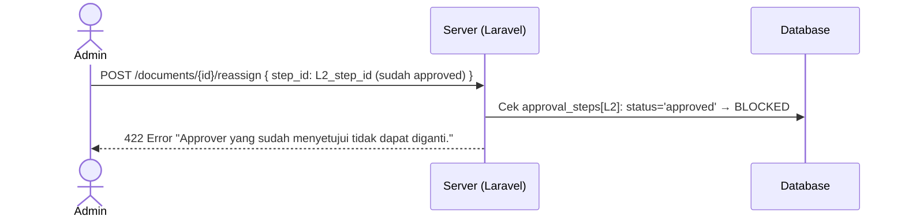

# System Logic: FR-RSG — Reassign Approver

| | |
|---|---|
| **Document Version** | v1.0 |
| **FR Group ID** | FR-RSG |
| **FR Group Name** | Reassign Approver |
| **Status** | Draft |
| **Last Updated** | 2026-06-23 |
| **Author** | System Analyst AI |
| **Source** | SRS §3.12 · IA §8.5 · Data Model §3.10 |

---

## 1. Overview

Modul ini memungkinkan Admin mengganti approver di tengah alur approval — baik untuk step aktif maupun step yang belum tiba gilirannya. Approver lama langsung kehilangan akses ke dokumen. Approver baru mendapat notifikasi segera jika step-nya aktif. Sequence tidak mundur. Seluruh kejadian reassign tercatat di `reassignment_logs` dan audit trail.

**Cakupan FR:**
| FR ID | Deskripsi | Prioritas |
|---|---|---|
| FR-RSG-01 | Hanya Admin/Super Admin | MUST |
| FR-RSG-02 | Berlaku untuk step aktif & step yang belum tiba gilirannya | MUST |
| FR-RSG-03 | Approver yang sudah menyetujui (final) tidak dapat di-reassign | MUST |
| FR-RSG-04 | Form: approver baru (ter-filter role), notes/alasan, attachment | MUST |
| FR-RSG-05 | Approver lama kehilangan akses | MUST |
| FR-RSG-06 | Bila step aktif, approver baru menerima notifikasi; sequence tidak mundur | MUST |
| FR-RSG-07 | Tercatat di audit trail | MUST |

---

## 2. Actors

| Actor | Role Kode | Keterlibatan |
|---|---|---|
| Admin / Super Admin | `admin`, `super_admin` | Melakukan reassign |
| Approver Baru | `approver_*` | Menerima notifikasi, mengambil aksi |
| System | — | Cabut akses lama, beri akses baru, catat log |

---

## 3. Sequence Diagrams

### Scenario 1: Reassign Step Aktif (Approver Sedang Menunggu Giliran)

```mermaid
sequenceDiagram
    actor Admin
    participant Frontend as Frontend (Inertia/React)
    participant Server as Server (Laravel)
    participant Database
    participant Storage as Object Storage (S3)
    participant Queue as Laravel Queue

    Admin->>Frontend: Buka /documents/{id} → klik tombol "Reassign"
    Frontend-->>Admin: Modal Reassign Approver

    Admin->>Frontend: Pilih Level yang di-reassign (misal: L3)
    Frontend->>Server: GET /api/users?role={role_l3}&status=active
    Server-->>Frontend: Daftar approver valid untuk L3 (ter-filter, exclude lama)

    Admin->>Frontend: Pilih approver baru dari dropdown
    Admin->>Frontend: Isi alasan (notes) — required
    Admin->>Frontend: Upload attachment (opsional)
    Admin->>Frontend: Click "Confirm Reassign"

    Frontend->>Server: POST /documents/{id}/reassign {
        step_id: "uuid",
        new_approver_id: "uuid",
        reason: "string",
        attachment: file (optional)
    }

    Server->>Server: Validate:
    Note over Server: - Admin berwenang<br/>- Step belum approved/offline_approved<br/>- New approver = role yang sesuai<br/>- New approver bukan approver yang sama

    Server->>Storage: Upload attachment jika ada → path

    Server->>Database: UPDATE approval_steps { approver_id=new_approver_id } WHERE id=step_id
    Server->>Database: INSERT reassignment_logs { from_approver_id=old, to_approver_id=new, reassigned_by=Admin, reason, attachment_path }
    Server->>Database: INSERT audit_logs { event='step.reassigned', metadata: {step_id, from, to, reason} }

    Note over Server: Approver lama kehilangan akses (via Policy — approver_id tidak lagi = user ini)

    alt Step sedang aktif (is_active=true)
        Server->>Queue: Dispatch NotifyApproverTurn (new_approver_id)
        Note over Queue: Approver baru mendapat notifikasi segera
    else Step belum aktif (future step)
        Note over Server: Notifikasi akan dikirim saat giliran tiba
    end

    Server-->>Frontend: Inertia redirect /documents/{id}
    Frontend-->>Admin: Flash "Approver berhasil di-reassign. Audit trail diperbarui."
```

---

### Scenario 2: Reassign Step Future (Belum Giliran)

```mermaid
sequenceDiagram
    actor Admin
    participant Server as Server (Laravel)
    participant Database

    Note over Admin: Dokumen sedang di L2; Admin ingin ganti approver L4

    Admin->>Server: POST /documents/{id}/reassign { step_id: L4_step_id, new_approver_id, reason }

    Server->>Database: Cek approval_steps[L4]: is_active=false AND status='pending' → boleh reassign
    Server->>Database: UPDATE approval_steps[L4] { approver_id=new }
    Server->>Database: INSERT reassignment_logs
    Server->>Database: INSERT audit_logs

    Note over Server: Tidak ada notifikasi sekarang.<br/>Notifikasi akan muncul saat L4 tiba gilirannya.

    Server-->>Admin: Flash "Approver L4 berhasil diganti."
```

---

### Scenario 3: Guard — Approver yang Sudah Approve Tidak Bisa Direassign (FR-RSG-03)



---

## 4. API Contract

### 4.1 Inertia Routes

| Method | Route | Inertia Page | Akses |
|---|---|---|---|
| GET | `/documents/{id}` | `Documents/Show` (modal reassign inline) | Admin, Super Admin |

---

### 4.2 Form Actions

#### POST /documents/{id}/reassign — Reassign Approver
**Request:** `multipart/form-data`
```json
{
  "step_id": "uuid (required — ID approval_step yang di-reassign)",
  "new_approver_id": "uuid (required — user dengan role sesuai level)",
  "reason": "string (required, min 10 chars)",
  "attachment": "file (nullable, max 5MB)"
}
```

**Success Response:**
```
Inertia redirect → /documents/{id}
Flash: "Approver successfully reassigned."
```

**Error Response (422):**
```json
{
  "errors": {
    "step_id": ["Approver yang sudah menyetujui tidak dapat diganti."],
    "new_approver_id": ["Please select a valid approver with the correct role."],
    "reason": ["Reason is required (min 10 characters)."]
  }
}
```

**Error Response (403):**
```json
{
  "message": "Only Admin or Super Admin can reassign approvers."
}
```

---

## 5. Data Flow

| Step | Input | Process | Output |
|---|---|---|---|
| 1 | `step_id` + `new_approver_id` | Validate: step belum final, role sesuai | Authorized |
| 2 | Attachment (optional) | Upload to S3 | `attachment_path` |
| 3 | `approval_steps.approver_id` | UPDATE ke `new_approver_id` | Access transferred |
| 4 | Reassign event | INSERT `reassignment_logs` | Log record |
| 5 | Reassign event | INSERT `audit_logs` | Audit entry |
| 6 | Step `is_active=true` | Queue: NotifyApproverTurn (new approver) | Notification sent |

---

## 6. Security Rules

| Rule | Deskripsi |
|---|---|
| Hanya Admin+ | Policy enforced server-side |
| Akses approver lama dicabut | Policy: cek `approval_steps.approver_id = current_user.id` — lama sudah tidak match |
| Audit immutable | `reassignment_logs` append-only |

---

## 7. Business Rules

| Rule ID | Deskripsi |
|---|---|
| BR-RSG-01 | Hanya Admin dan Super Admin dapat melakukan reassign (SRS FR-RSG-01) |
| BR-RSG-02 | Berlaku untuk step `status='pending'`, `is_active=true` (aktif) atau `is_active=false` (future) (SRS FR-RSG-02) |
| BR-RSG-03 | Step dengan `status IN ('approved','approved_with_punchlist','offline_approved')` **tidak** dapat di-reassign (SRS FR-RSG-03) |
| BR-RSG-04 | Approver baru harus memiliki role yang sesuai dengan level yang di-reassign (SRS FR-USR-04) |
| BR-RSG-05 | Approver lama langsung kehilangan akses ke `/documents/{id}/approval` (SRS FR-RSG-05) |
| BR-RSG-06 | Sequence tidak mundur; `is_active` step tidak berubah (SRS FR-RSG-06) |
| BR-RSG-07 | Notifikasi ke approver baru **tanpa OTP** (SRS FR-RSG-06) |
| BR-RSG-08 | Semua kejadian tercatat di `reassignment_logs` + `audit_logs` (SRS FR-RSG-07) |

---

## 8. Validations

| Field | Rule | Error Message (EN) |
|---|---|---|
| `step_id` | Required, must be pending step | "Invalid step or already finalized" |
| `new_approver_id` | Required, active user, role must match level | "Please select a valid approver" |
| `reason` | Required, min 10 chars | "Reason is required (min 10 chars)" |
| `attachment` | Optional, max 5MB | "File too large" |

---

## 9. Edge Cases

| Skenario | Penanganan |
|---|---|
| Admin reassign ke approver yang sama | Server reject: "Cannot reassign to the same approver" |
| Reassign approver yang sudah punya banyak dokumen pending | Diizinkan; approver baru akan punya beban tambahan |
| Approver lama online saat reassign dan klik approve | Policy check gagal (approver_id tidak lagi match) → 403 |
| Satu step di-reassign berkali-kali | Setiap reassign = satu entry `reassignment_logs`; tidak ada limit |
| Reassign saat dokumen status 'Need Rectification' | Boleh reassign step future; step yang sedang rejected tidak perlu reassign |

---

## 10. Traceability

| Scenario | SRS FR | IA Page | Data Model | Controller |
|---|---|---|---|---|
| Reassign aktif | FR-RSG-01..07 | `Documents/Show` §6.13, IA §8.5 | `approval_steps.approver_id`, `reassignment_logs` | `ReassignController@store` |
| Reassign future | FR-RSG-02 | `Documents/Show` §6.13 | `approval_steps` (is_active=false) | `ReassignController@store` |
| Guard sudah approve | FR-RSG-03 | — | `approval_steps.status` | `ReassignController@store` |
| Notifikasi approver baru | FR-RSG-06 | — | `notifications` | `NotificationService` |
| Audit trail | FR-RSG-07 | `Documents/Show` tab Audit | `audit_logs`, `reassignment_logs` | `AuditService` |
