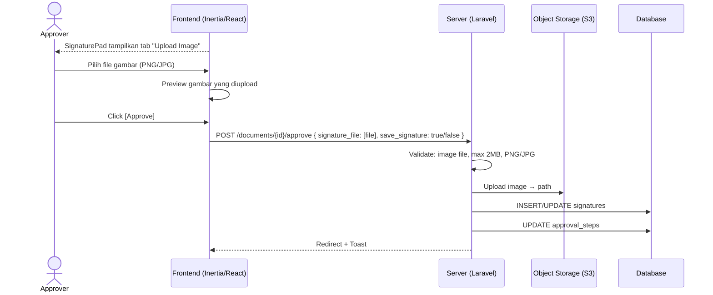
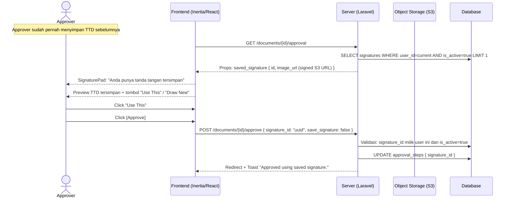
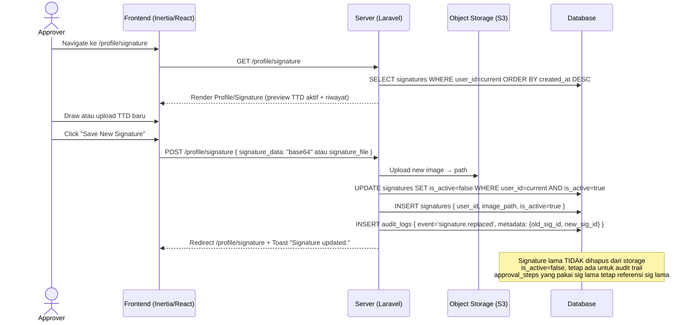

# System Logic: FR-SIG — Digital Signature & Saved Signature

| | |
|---|---|
| **Document Version** | v1.0 |
| **FR Group ID** | FR-SIG |
| **FR Group Name** | Digital Signature & Saved Signature |
| **Status** | Draft |
| **Last Updated** | 2026-06-23 |
| **Author** | System Analyst AI |
| **Source** | SRS §3.9 · IA §6.23 · Data Model §3.3 |

---

## 1. Overview

Modul ini mengelola tanda tangan digital approver berupa **signature image** (draw via canvas atau upload gambar). Approver dapat menyimpan TTD untuk dipakai ulang (Saved Signature). TTD hanya muncul pada level `requires_signature=true`. Tanda tangan v1 adalah image + audit trail — bukan PKI/PSrE (SRS C-6). PIC Name di PDF diambil otomatis dari profil user.

**Cakupan FR:**
| FR ID | Deskripsi | Prioritas |
|---|---|---|
| FR-SIG-01 | TTD via draw (canvas) atau upload gambar | MUST |
| FR-SIG-02 | Opsi simpan tanda tangan saat pertama kali | MUST |
| FR-SIG-03 | Pakai tanda tangan tersimpan tanpa menggambar ulang | MUST |
| FR-SIG-04 | Ganti tanda tangan tersimpan (yang lama non-aktif demi audit) | MUST |
| FR-SIG-05 | PIC Name di PDF diambil otomatis dari nama profil | MUST |
| FR-SIG-06 | Tanda tangan disimpan sebagai image | MUST |

---

## 2. Actors

| Actor | Role Kode | Keterlibatan |
|---|---|---|
| Approver (requires_signature=true) | `approver_ms_rts`, `approver_xls_rth_team`, `approver_xls_rth` | Membuat, menyimpan, menggunakan TTD |
| System | — | Simpan image ke S3, update `is_active` |

---

## 3. Sequence Diagrams

### Scenario 1: Draw Signature Baru + Save

```mermaid
sequenceDiagram
    actor Approver
    participant Frontend as Frontend (Inertia/React)
    participant Server as Server (Laravel)
    participant Storage as Object Storage (S3)
    participant Database

    Note over Approver: Di /documents/{id}/approval (requires_signature=true)
    Frontend-->>Approver: Tampilkan SignaturePad (canvas draw)
    Note over Frontend: Cek saved signature: belum ada → tampilkan canvas kosong

    Approver->>Frontend: Draw tanda tangan di canvas
    Approver->>Frontend: Centang "Save this signature for future use"
    Approver->>Frontend: Click [Approve]

    Frontend->>Frontend: Canvas.toDataURL() → base64 image
    Frontend->>Server: POST /documents/{id}/approve { signature_data: "data:image/png;base64,...", save_signature: true }

    Server->>Server: Decode base64 → image file
    Server->>Storage: Upload image ke S3 → path

    Server->>Database: UPDATE signatures SET is_active=false WHERE user_id=current AND is_active=true
    Server->>Database: INSERT signatures { user_id, image_path, is_active=true }

    Server->>Database: UPDATE approval_steps[Ln] { signature_id=new_sig_id, status='approved', ... }
    Server->>Database: INSERT audit_logs { event='signature.saved' }

    Server-->>Frontend: Redirect /approvals + Toast "Approved & signature saved."
```

---

### Scenario 2: Upload Gambar Tanda Tangan



---

### Scenario 3: Pakai Saved Signature



---

### Scenario 4: Ganti Saved Signature (FR-SIG-04)



---

## 4. API Contract

### 4.1 Inertia Routes

| Method | Route | Inertia Page | Akses |
|---|---|---|---|
| GET | `/profile/signature` | `Profile/Signature` | Semua role |

**Props `Profile/Signature`:**
```json
{
  "active_signature": {
    "id": "uuid",
    "image_url": "signed_s3_url",
    "created_at": "datetime"
  },
  "history": [
    { "id": "uuid", "image_url": "signed_s3_url", "is_active": false, "created_at": "datetime" }
  ]
}
```

---

### 4.2 Form Actions

#### POST /profile/signature — Simpan / Ganti Signature
**Request:** `multipart/form-data`
```json
{
  "signature_data": "string (base64 image, required if no file)",
  "signature_file": "file (PNG/JPG, required if no base64, max 2MB)"
}
```

**Success Response:**
```
Inertia redirect → /profile/signature
Flash: "Signature saved successfully."
```

**Error Response (422):**
```json
{
  "errors": {
    "signature_data": ["Signature is required (draw or upload)."],
    "signature_file": ["Invalid file type. PNG or JPG only.", "File size must not exceed 2MB."]
  }
}
```

---

#### Signature dalam POST /documents/{id}/approve
Signature dikirim bersama aksi approve (lihat FR-APR).

```json
{
  "signature_id": "uuid (jika pakai saved)",
  "signature_data": "base64 (jika draw baru)",
  "signature_file": "file (jika upload baru)",
  "save_signature": true
}
```

---

## 5. Data Flow

| Step | Input | Process | Output |
|---|---|---|---|
| 1 | Canvas draw / file upload | Convert/validate → image | Validated image |
| 2 | Image | Upload to S3 | `image_path` |
| 3 | New signature (if save=true) | UPDATE old → `is_active=false`, INSERT new → `is_active=true` | `signatures` record |
| 4 | `signature_id` | Link ke `approval_steps.signature_id` | Step dengan ref signature |
| 5 | Ganti signature | Old signature `is_active=false` (tidak dihapus) | Audit history preserved |

---

## 6. Security Rules

| Rule | Deskripsi |
|---|---|
| Ownership check | Server validasi `signature_id` milik user yang sedang login |
| File tidak publik | Signature image disimpan di S3; akses via signed URL saja |
| Signature lama tidak dihapus | Pertahankan sebagai bukti audit (SRS FR-SIG-04) |
| MIME validation | Server validasi: PNG atau JPG saja untuk upload |

---

## 7. Business Rules

| Rule ID | Deskripsi |
|---|---|
| BR-SIG-01 | TTD hanya tampil/wajib pada level `requires_signature=true` (SRS FR-APR-04) |
| BR-SIG-02 | Hanya satu `signatures.is_active=true` per user pada satu waktu (SRS FR-SIG-02/04) |
| BR-SIG-03 | Saat ganti signature: lama `is_active=false`, baru `is_active=true` — keduanya tersimpan di DB dan S3 (SRS FR-SIG-04) |
| BR-SIG-04 | `approval_steps.signature_id` mengacu ke signature yang dipakai **saat aksi** — tidak berubah meski user ganti TTD sesudahnya (SRS FR-SIG-04) |
| BR-SIG-05 | PIC Name di PDF dari `users.name` (profil) — bukan dari input manual (SRS FR-SIG-05) |
| BR-SIG-06 | Signature disimpan sebagai image (PNG); bukan SVG atau vector (SRS FR-SIG-06) |

---

## 8. Validations

| Field | Rule | Error Message (EN) |
|---|---|---|
| `signature_data` | Required if no file, must be valid base64 PNG | "Please provide a signature" |
| `signature_file` | Optional alternative, MIME PNG/JPG, max 2MB | "Invalid format or file too large" |
| Canvas tidak kosong | Client-side: cek canvas tidak blank | "Please draw your signature first" |

---

## 9. Edge Cases

| Skenario | Penanganan |
|---|---|
| Approver draw TTD tapi tidak save | TTD dipakai untuk step ini; tidak disimpan di `signatures`; `approval_steps.signature_id=NULL` tapi image disimpan one-time di S3 (linked dari step) |
| User approve di 2 device bersamaan | Database transaction; yang kedua mungkin gagal (step sudah approved) |
| Signature lama dihapus dari S3 | Tidak boleh terjadi; policy S3 tidak izinkan delete signature objects |
| Upload gambar bukan tanda tangan (foto selfie, dll.) | Sistem tidak validasi konten gambar; tanggung jawab pengguna |

---

## 10. Traceability

| Scenario | SRS FR | IA Page | Data Model | Controller |
|---|---|---|---|---|
| Draw / upload TTD | FR-SIG-01, 06 | `Approvals/Screen` §6.9 | `signatures.image_path` | `ApprovalController@approve` |
| Save signature | FR-SIG-02 | `Approvals/Screen`, `Profile/Signature` §6.23 | `signatures.is_active` | `SignatureController` |
| Pakai saved signature | FR-SIG-03 | `Approvals/Screen` §6.9 | `signatures.is_active=true` | `ApprovalController@approve` |
| Ganti signature | FR-SIG-04 | `Profile/Signature` §6.23 | `signatures.is_active` | `SignatureController@store` |
| PIC Name otomatis | FR-SIG-05 | `Approvals/Screen` | `users.name` | `PdfStampingService` |
