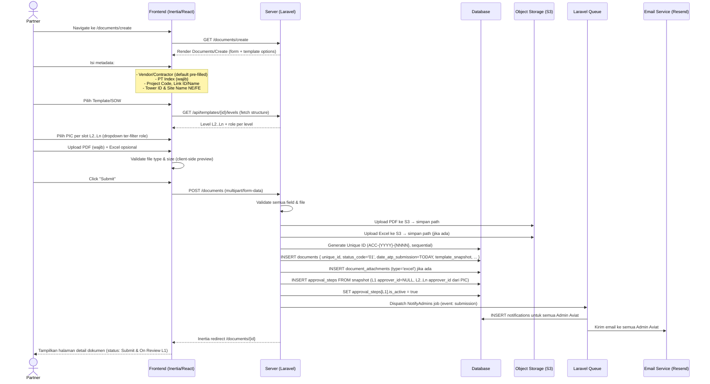
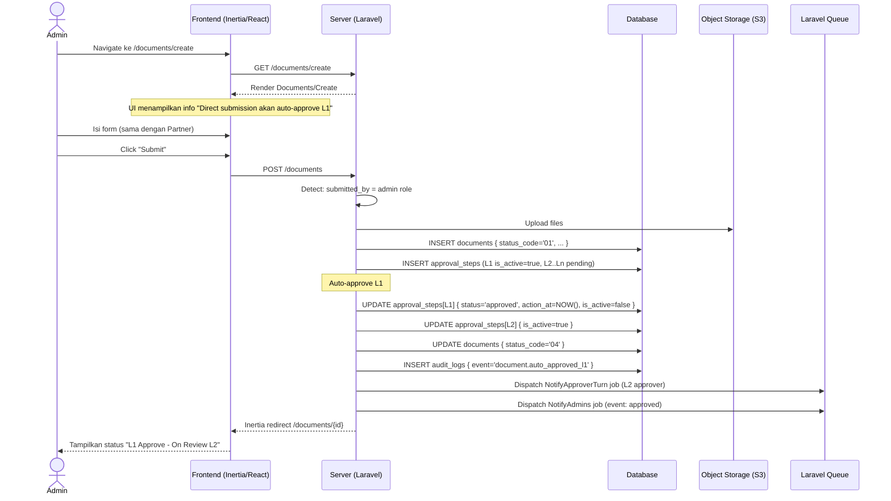
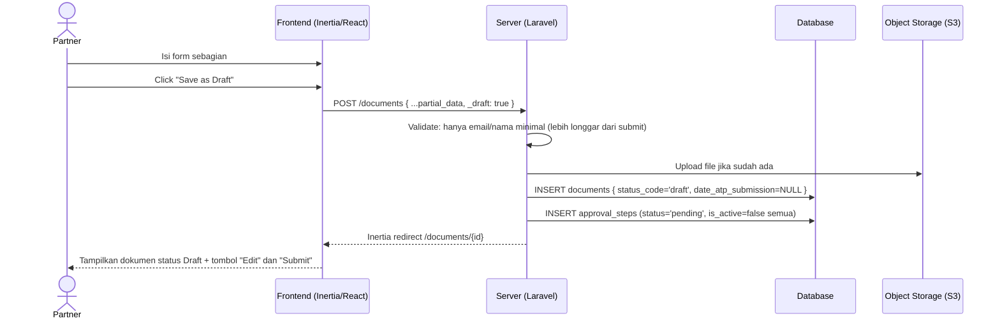
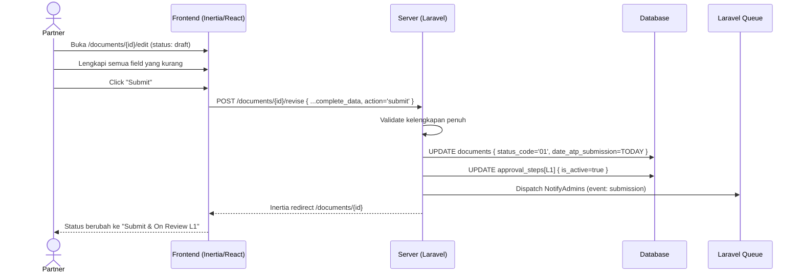
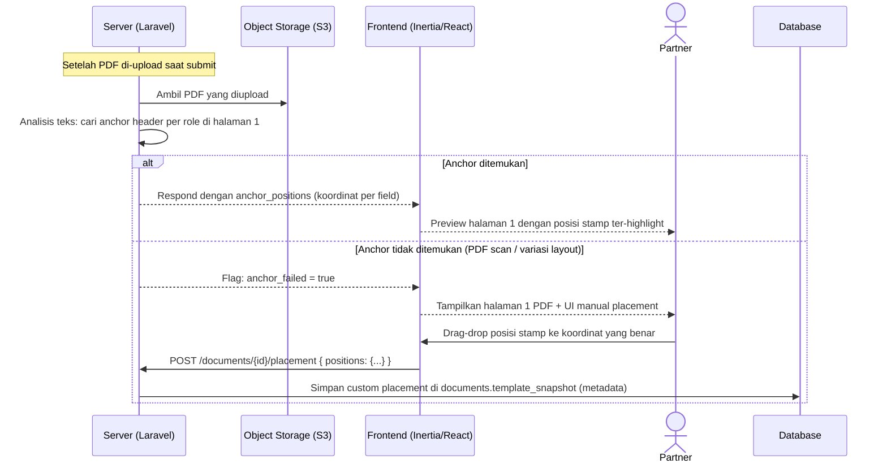

# System Logic: FR-SUB — Document Submission

| | |
|---|---|
| **Document Version** | v1.0 |
| **FR Group ID** | FR-SUB |
| **FR Group Name** | Document Submission |
| **Status** | Draft |
| **Last Updated** | 2026-06-23 |
| **Author** | System Analyst AI |
| **Source** | SRS §3.5 · IA §6.11 · Data Model §3.6–3.7–3.8 |

---

## 1. Overview

Modul ini menangani submission dokumen ATP oleh **Partner** (originator) dan **Admin** (direct submission dengan auto-approve L1). Proses mencakup pengisian metadata, upload PDF + lampiran Excel opsional, pemilihan template SOW, penentuan PIC approver L2..Ln, auto-anchor PDF, serta pengelolaan draft. Dua jalur utama menghasilkan status awal yang berbeda: Partner → status `01`, Admin direct → status `04`.

**Cakupan FR:**
| FR ID | Deskripsi | Prioritas |
|---|---|---|
| FR-SUB-01 | Partner submit: metadata + PDF + Excel opsional + Template + PIC L2..Ln | MUST |
| FR-SUB-02 | L1 tidak dipilih; Admin Aviat manapun bisa approve L1 | MUST |
| FR-SUB-03 | Admin direct submit → auto-approve L1 → status `04` | MUST |
| FR-SUB-04 | Generate Unique ID + isi field otomatis | MUST |
| FR-SUB-05 | Validasi kelengkapan field, PIC, file | MUST |
| FR-SUB-06 | Submit Partner → status `01` → notifikasi semua Admin | MUST |
| FR-SUB-07 | Simpan draft sebelum submit | MUST |
| FR-SUB-08 | Field Vendor/Contractor default "PT Aviat Solusi Komunikasi Indonesia" | MUST |
| FR-SUB-09 | PT Index wajib; Unique ID hanya tampil di aplikasi (tidak di PDF) | MUST |

---

## 2. Actors

| Actor | Role Kode | Keterlibatan |
|---|---|---|
| Partner | `partner` | Submit dokumen (originator); memilih PIC L2..Ln |
| Admin | `admin` | Direct submit (auto-approve L1); memilih PIC L2..Ln |
| Super Admin | `super_admin` | Sama dengan Admin |
| System | — | Generate Unique ID, buat approval steps, kirim notifikasi |

---

## 3. Sequence Diagrams

### Scenario 1: Partner Submit Dokumen (→ Status 01)



---

### Scenario 2: Admin Direct Submit → Auto-Approve L1 (→ Status 04)



---

### Scenario 3: Save as Draft (FR-SUB-07)



---

### Scenario 4: Submit dari Draft



---

### Scenario 5: Anchor PDF & Placement



---

## 4. API Contract

### 4.1 Inertia Routes

| Method | Route | Inertia Page | Akses |
|---|---|---|---|
| GET | `/documents/create` | `Documents/Create` | Partner, Admin, Super Admin |

**Props `Documents/Create`:**
```json
{
  "templates": [
    { "id": "uuid", "name": "SOW Install Microwave", "sow_code": "INSTALL", "levels_count": 4 }
  ],
  "partner": {
    "id": "uuid",
    "name": "PT Maju Bersama"
  },
  "defaults": {
    "vendor_contractor": "PT Aviat Solusi Komunikasi Indonesia"
  }
}
```

---

### 4.2 Form Actions

#### POST /documents — Submit / Save as Draft
**Request:** `multipart/form-data`

```json
{
  "vendor_contractor": "string (required, default pre-filled)",
  "pt_index": "string (required)",
  "project_code": "string (nullable)",
  "link_id": "string (nullable)",
  "link_name": "string (nullable)",
  "tower_id_ne": "string (nullable)",
  "site_name_ne": "string (nullable)",
  "tower_id_fe": "string (nullable)",
  "site_name_fe": "string (nullable)",
  "template_id": "uuid (required)",
  "pics": {
    "2": "uuid (user_id PIC untuk level 2)",
    "3": "uuid (user_id PIC untuk level 3)",
    "4": "uuid (user_id PIC untuk level 4, jika ada)"
  },
  "pdf_file": "file (required for submit, nullable for draft) — max 20MB, application/pdf",
  "excel_file": "file (nullable) — max 10MB, .xlsx/.xls",
  "_draft": "boolean (true = save draft, false/absent = submit)"
}
```

**Success Response (Submit oleh Partner):**
```
Inertia redirect → /documents/{id}
Flash: "Document submitted successfully."
Status dokumen: '01'
Notification: semua Admin Aviat
```

**Success Response (Submit oleh Admin):**
```
Inertia redirect → /documents/{id}
Flash: "Document submitted and L1 auto-approved."
Status dokumen: '04'
Notification: approver L2 + semua Admin
```

**Success Response (Draft):**
```
Inertia redirect → /documents/{id}
Flash: "Draft saved."
Status dokumen: 'draft'
```

**Error Response (422):**
```json
{
  "errors": {
    "pt_index": ["PT Index is required."],
    "template_id": ["Please select a SOW template."],
    "pics.2": ["Please select an approver for Level 2."],
    "pdf_file": ["PDF file is required.", "File must be a valid PDF.", "File size must not exceed 20MB."]
  }
}
```

---

#### GET /api/templates/{id}/levels — Fetch Level Structure for PIC Slots
**Response:**
```json
{
  "data": [
    { "level_order": 2, "role": "approver_ms_bo", "role_label": "Approver MS BO", "requires_signature": false },
    { "level_order": 3, "role": "approver_ms_rts", "role_label": "Approver MS RTS", "requires_signature": true },
    { "level_order": 4, "role": "approver_xls_rth", "role_label": "Approver XLS RTH", "requires_signature": true }
  ]
}
```

---

#### POST /documents/{id}/placement — Save Manual PDF Placement
**Request Body:**
```json
{
  "positions": {
    "signature_l2": { "page": 1, "x": 120, "y": 340, "width": 80, "height": 30 },
    "signature_l3": { "page": 1, "x": 220, "y": 340, "width": 80, "height": 30 },
    "date_submission": { "page": 1, "x": 400, "y": 100, "width": 120, "height": 20 }
  }
}
```

**Success Response:**
```json
{ "message": "Placement saved." }
```

---

## 5. Data Flow

| Step | Input | Process | Output |
|---|---|---|---|
| 1 | Form data + files | Validate completeness | Validated payload |
| 2 | PDF file | Upload to S3 | `original_pdf_path` |
| 3 | Excel file | Upload to S3 | `document_attachments` record (type=excel) |
| 4 | `template_id` | Load `template_levels` → build JSON | `template_snapshot` |
| 5 | Year counter | `SELECT MAX(unique_id) WHERE unique_id LIKE 'ACC-{YYYY}-%'` | `unique_id = ACC-{YYYY}-{NNNN}` |
| 6 | INSERT documents | Set `status_code='01'`, `date_atp_submission=TODAY` | Document record |
| 7 | Snapshot levels | INSERT `approval_steps` (L1: `approver_id=NULL`, L2+: PIC ids) | Approval step records |
| 8 | Submitter role | If admin: auto-approve L1 → advance to L2 | `status_code='04'` |
| 9 | Notification event | Queue: INSERT notifications + send email | Admins notified |

---

## 6. Security Rules

| Rule | Deskripsi |
|---|---|
| File type validation | Server-side: cek MIME type PDF (application/pdf) & Excel (.xlsx/.xls) — tidak hanya ekstensi |
| File size limit | PDF max 20MB, Excel max 10MB |
| S3 file access | File tidak pernah publik; akses via signed URL atau proxy ber-otorisasi |
| Partner scope | Partner hanya bisa submit untuk `partner_id` miliknya sendiri |
| CSRF | Semua POST dilindungi CSRF token |

---

## 7. Business Rules

| Rule ID | Deskripsi |
|---|---|
| BR-SUB-01 | Partner submit → status `01`; notifikasi **semua** Admin Aviat (SRS FR-SUB-06) |
| BR-SUB-02 | Admin direct submit → auto-approve L1 → status `04` (SRS FR-SUB-03) |
| BR-SUB-03 | L1 tidak memiliki PIC tetap; semua Admin dapat approve (SRS FR-SUB-02) |
| BR-SUB-04 | Unique ID `ACC-{YYYY}-{NNNN}` di-generate sequential per tahun; reset ke 0001 setiap 1 Januari (SRS FR-SUB-04) |
| BR-SUB-05 | `date_atp_submission` auto-set saat pertama submit (bukan saat draft) (SRS FR-SUB-04) |
| BR-SUB-06 | PT Index wajib; tampil di form & di-stamp ke PDF; Unique ID **tidak** di-stamp ke PDF (SRS FR-SUB-09) |
| BR-SUB-07 | Vendor/Contractor default "PT Aviat Solusi Komunikasi Indonesia" (SRS FR-SUB-08) |
| BR-SUB-08 | Satu dokumen maksimal 1 lampiran Excel (SRS FR-ATT-01) |
| BR-SUB-09 | PIC L2..Ln ter-filter sesuai role level; L1 tidak dipilih |
| BR-SUB-10 | Dokumen PDF asli (`original_pdf_path`) tidak pernah diubah setelah upload |

---

## 8. Validations

| Field | Rule | Error Message (EN) |
|---|---|---|
| `pt_index` | Required, max 100 chars | "PT Index is required" |
| `template_id` | Required, must be active template | "Please select a valid SOW template" |
| `pics[level]` | Required per level (L2..Ln), role must match level | "Please select an approver for Level {n}" |
| `pdf_file` | Required (for submit), MIME=application/pdf, max 20MB | "PDF file is required / Invalid file type / File too large" |
| `excel_file` | Optional, MIME=xlsx/xls, max 10MB | "Invalid file type / File too large" |
| `vendor_contractor` | Required, max 200 chars | "Vendor/Contractor is required" |

---

## 9. Edge Cases

| Skenario | Penanganan |
|---|---|
| Unique ID race condition (submit bersamaan) | Gunakan database transaction + SELECT FOR UPDATE atau sequence counter |
| PDF tidak bisa di-anchor (scan/variasi) | Tampilkan manual placement UI; placement wajib sebelum submit |
| Partner submit dengan template yang di-deactivate | Validasi: template harus `status='active'` |
| Ganti template setelah pilih PIC | PIC slots di-reset; user harus pilih ulang |
| Draft dihapus sebelum submit | Soft delete document + hapus file dari S3 (cleanup job) |
| Excel dihapus saat edit draft | `document_attachments` record dihapus; file di S3 di-queue cleanup |
| Submit dokumen saat koneksi putus | File sudah di-upload, tapi INSERT gagal → file orphan di S3 (cleanup job periodik) |

---

## 10. Traceability

| Scenario | SRS FR | IA Page | Data Model | Controller |
|---|---|---|---|---|
| Partner submit | FR-SUB-01, 05, 06 | `Documents/Create` §6.11 | `documents`, `approval_steps` | `DocumentController@store` |
| Admin direct submit | FR-SUB-03 | `Documents/Create` §6.11 | `documents.status_code='04'` | `DocumentController@store` |
| L1 no PIC | FR-SUB-02 | — | `approval_steps.approver_id=NULL` | `DocumentController@store` |
| Generate Unique ID | FR-SUB-04 | `Documents/Create` | `documents.unique_id` | `UniqueIdService` |
| Save draft | FR-SUB-07 | `Documents/Create` | `documents.status_code='draft'` | `DocumentController@store` |
| PT Index | FR-SUB-09 | `Documents/Create` | `documents.pt_index` | `DocumentController@store` |
| Notifikasi submit | FR-SUB-06 | — | `notifications` | `NotificationService` |
