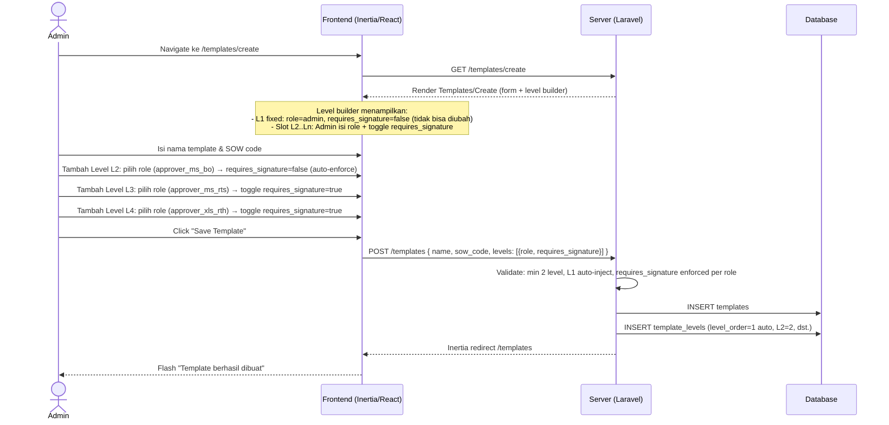
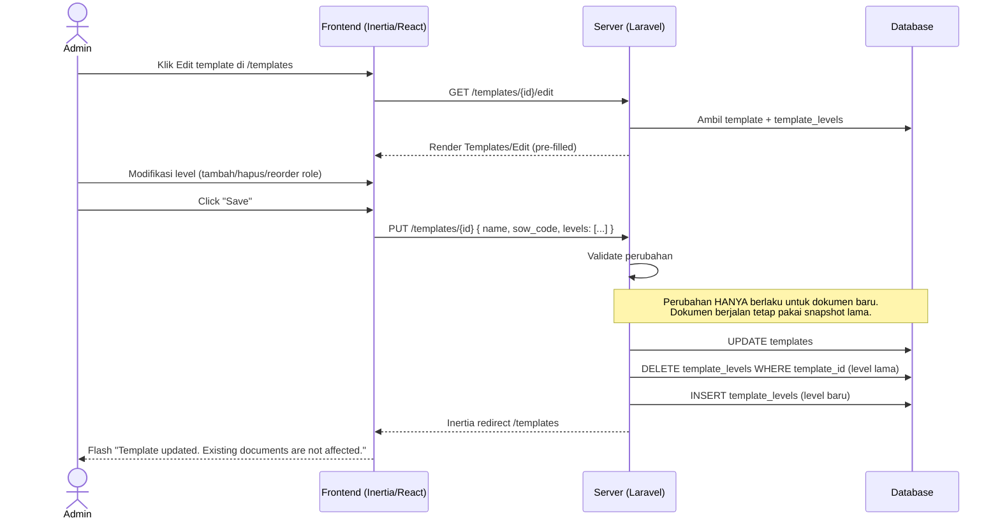
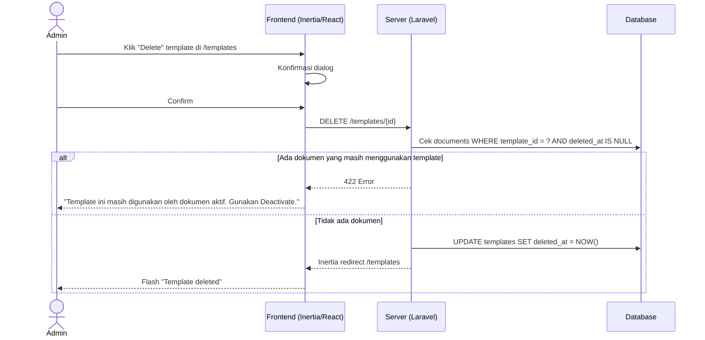
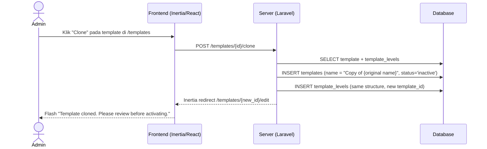
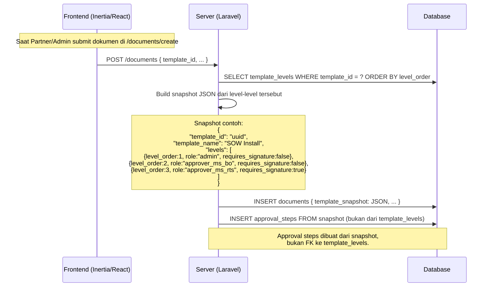

# System Logic: FR-TPL — Template / SOW Management

| | |
|---|---|
| **Document Version** | v1.0 |
| **FR Group ID** | FR-TPL |
| **FR Group Name** | Template / SOW Management |
| **Status** | Draft |
| **Last Updated** | 2026-06-23 |
| **Author** | System Analyst AI |
| **Source** | SRS §3.4 · IA §6.17–6.18 · Data Model §3.4–3.5 |

---

## 1. Overview

Modul ini mengelola **template struktur alur approval per SOW** (Scope of Work). Template menentukan berapa level approval, role apa yang dibutuhkan di setiap level, dan apakah tanda tangan wajib (`requires_signature`). Template hanya menyimpan **struktur** — PIC approver dipilih saat submission dokumen. Dokumen yang sudah submit menyimpan **snapshot** template sehingga perubahan template tidak mempengaruhi dokumen berjalan.

**Cakupan FR:**
| FR ID | Deskripsi | Prioritas |
|---|---|---|
| FR-TPL-01 | Admin CRUD template SOW (soft delete) | MUST |
| FR-TPL-02 | Template menyimpan struktur level: `{role, requires_signature}`, tanpa PIC | MUST |
| FR-TPL-03 | Mendukung jumlah level bervariasi (3 atau 4 level) | MUST |
| FR-TPL-04 | L1 (Admin Aviat) selalu `requires_signature=false`; MS BO juga false | MUST |
| FR-TPL-05 | Template yang dipakai dokumen tidak dapat dihapus permanen | MUST |
| FR-TPL-06 | Dokumen menyimpan snapshot struktur template saat dibuat | MUST |
| FR-TPL-07 | Clone template | SHOULD |

---

## 2. Actors

| Actor | Role Kode | Keterlibatan |
|---|---|---|
| Admin | `admin` | CRUD template |
| Super Admin | `super_admin` | CRUD template + clone |

---

## 3. Sequence Diagrams

### Scenario 1: Create Template dengan Level Builder



---

### Scenario 2: Edit Template (tanpa mempengaruhi dokumen berjalan)



---

### Scenario 3: Soft Delete Template (dengan Guard Dokumen Aktif)



---

### Scenario 4: Clone Template (FR-TPL-07 — SHOULD)



---

### Scenario 5: Snapshot Template saat Dokumen Submit (FR-TPL-06)



---

## 4. API Contract

### 4.1 Inertia Routes

| Method | Route | Inertia Page | Akses |
|---|---|---|---|
| GET | `/templates` | `Templates/Index` | Admin, Super Admin |
| GET | `/templates/create` | `Templates/Create` | Admin, Super Admin |
| GET | `/templates/{id}/edit` | `Templates/Edit` | Admin, Super Admin |

**Props `Templates/Index`:**
```json
{
  "templates": {
    "data": [
      {
        "id": "uuid-v7",
        "name": "SOW Install Microwave",
        "sow_code": "INSTALL",
        "status": "active",
        "levels_count": 4,
        "levels_summary": [
          { "level_order": 1, "role": "admin", "requires_signature": false },
          { "level_order": 2, "role": "approver_ms_bo", "requires_signature": false },
          { "level_order": 3, "role": "approver_ms_rts", "requires_signature": true },
          { "level_order": 4, "role": "approver_xls_rth", "requires_signature": true }
        ],
        "documents_count": 12
      }
    ]
  }
}
```

**Props `Templates/Create` & `Templates/Edit`:**
```json
{
  "template": null,
  "available_roles": [
    { "code": "admin", "label": "Admin Aviat (L1 — approve only)", "requires_signature_locked": false },
    { "code": "approver_ms_bo", "label": "Approver MS BO (approve only)", "requires_signature_locked": false },
    { "code": "approver_ms_rts", "label": "Approver MS RTS", "requires_signature_locked": false },
    { "code": "approver_xls_rth_team", "label": "Approver XLS RTH Team", "requires_signature_locked": false },
    { "code": "approver_xls_rth", "label": "Approver XLS RTH", "requires_signature_locked": false }
  ]
}
```

---

### 4.2 Form Actions

#### POST /templates — Create Template
**Request Body:**
```json
{
  "name": "string (required, max 200)",
  "sow_code": "string (nullable, max 50)",
  "description": "string (nullable)",
  "levels": [
    {
      "level_order": 2,
      "role": "approver_ms_bo",
      "requires_signature": false
    },
    {
      "level_order": 3,
      "role": "approver_ms_rts",
      "requires_signature": true
    }
  ]
}
```

**Note:** `level_order = 1` (L1 Admin Aviat, `requires_signature=false`) selalu di-inject otomatis oleh server — tidak perlu dikirim dari frontend.

**Success Response:**
```
Inertia redirect → /templates
Flash: "Template created successfully."
```

**Error Response (422):**
```json
{
  "errors": {
    "name": ["Template name is required."],
    "levels": ["At least one approval level (beyond L1) is required."],
    "levels.0.role": ["Please select a valid role."]
  }
}
```

---

#### PUT /templates/{id} — Update Template
**Request Body:** Sama dengan POST.

**Success Response:**
```
Inertia redirect → /templates
Flash: "Template updated. Running documents are not affected."
```

---

#### DELETE /templates/{id} — Soft Delete / Deactivate
**Request:** No body

**Success Response:**
```
Inertia redirect → /templates
Flash: "Template deleted."
```

**Error Response (422):**
```json
{
  "message": "Template is used by existing documents. Use Deactivate instead."
}
```

---

#### POST /templates/{id}/clone — Clone Template (SHOULD)
**Request:** No body

**Success Response:**
```
Inertia redirect → /templates/{new_id}/edit
Flash: "Template cloned. Review and activate before using."
```

---

## 5. Data Flow

| Step | Input | Process | Output |
|---|---|---|---|
| 1 | Template form (name, levels) | Validate structure, inject L1 auto | Validated template data |
| 2 | Validated data | INSERT `templates` + `template_levels` | Template record + level records |
| 3 | Edit request | DELETE old levels + INSERT new levels | Updated structure (dokumen lama tidak terpengaruh) |
| 4 | DELETE request | Check documents count guard | Allow delete or block |
| 5 | Submission dokumen (template_id) | SELECT template_levels → build JSON snapshot | `document.template_snapshot` |
| 6 | Snapshot JSON | INSERT `approval_steps` dari snapshot | Steps per dokumen (independen dari template) |

---

## 6. Security Rules

| Rule | Deskripsi |
|---|---|
| Akses terbatas Admin+ | Route `/templates*` — hanya `admin` dan `super_admin` |
| Snapshot immutability | `documents.template_snapshot` tidak pernah diubah setelah submit |
| UUID v7 | `/templates/{uuid}` tidak enumerable |

---

## 7. Business Rules

| Rule ID | Deskripsi |
|---|---|
| BR-TPL-01 | L1 (`level_order=1`) selalu `role='admin'`, `requires_signature=false` — auto-inject server, tidak bisa diubah user (SRS FR-TPL-04) |
| BR-TPL-02 | `role='approver_ms_bo'` selalu `requires_signature=false` — enforce di server (SRS FR-TPL-04) |
| BR-TPL-03 | Template mendukung 3–4 level (atau lebih); tidak ada hardcode jumlah level (SRS FR-TPL-03) |
| BR-TPL-04 | Template menyimpan **struktur saja** — PIC dipilih saat submission (SRS FR-TPL-02) |
| BR-TPL-05 | Dokumen menyimpan snapshot JSONB saat submit; edit template setelahnya tidak berpengaruh (SRS FR-TPL-06) |
| BR-TPL-06 | Template yang dipakai dokumen tidak dapat hard-delete; gunakan soft-delete atau deactivate (SRS FR-TPL-05) |
| BR-TPL-07 | `UNIQUE (template_id, level_order)` — urutan level unik per template |
| BR-TPL-08 | Approval steps dokumen dibuat **dari snapshot**, bukan FK ke `template_levels` |

---

## 8. Validations

| Field | Rule | Error Message (EN) |
|---|---|---|
| `name` | Required, max 200 chars | "Template name is required" |
| `sow_code` | Optional, max 50 chars, unique per active template | "SOW code already exists" |
| `levels` | Min 1 level user-defined (L1 auto), max tidak dibatasi | "At least one approval level is required" |
| `levels[].role` | Required, must be valid approver role (bukan `partner`, `viewer`) | "Please select a valid approver role" |
| `levels[].requires_signature` | Boolean required; auto-false untuk admin & approver_ms_bo | — |
| `levels[].level_order` | Must be sequential starting from 2 (1 auto) | — |

---

## 9. Edge Cases

| Skenario | Penanganan |
|---|---|
| Edit template yang sedang dipakai dokumen aktif | Diizinkan; warning ditampilkan bahwa dokumen berjalan tidak terpengaruh |
| Clone template inactive | Clone dibuat dengan `status='inactive'`; Admin harus aktifkan secara manual |
| Template dengan level_order gap (mis. 1,3,5) | Server re-sequence saat save menjadi 1,2,3 |
| Duplikasi role dalam satu template | Diizinkan (mis. 2 approver dengan role sama di level berbeda) |
| Menghapus level dari template yang punya dokumen | Level dihapus dari template; dokumen lama tetap pakai snapshot |
| Template dengan satu level saja (hanya L1) | Tidak valid; wajib minimal L2 |

---

## 10. Traceability

| Scenario | SRS FR | IA Page | Data Model | Controller |
|---|---|---|---|---|
| CRUD Template | FR-TPL-01 | `Templates/Index`, `Templates/Create`, `Templates/Edit` §6.17–6.18 | `templates`, `template_levels` | `TemplateController` |
| Level structure | FR-TPL-02, 03, 04 | `Templates/Create` §6.18 | `template_levels.requires_signature` | `TemplateController` |
| Guard dokumen aktif | FR-TPL-05 | `Templates/Index` | `documents.template_id` | `TemplateController@destroy` |
| Snapshot saat submit | FR-TPL-06 | `Documents/Create` §6.11 | `documents.template_snapshot` | `DocumentController@store` |
| Clone template | FR-TPL-07 | `Templates/Index` | `templates`, `template_levels` | `TemplateController@clone` |
