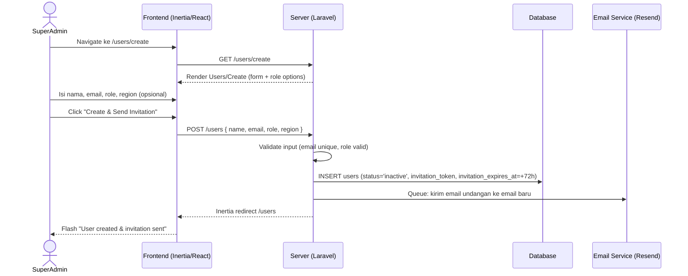
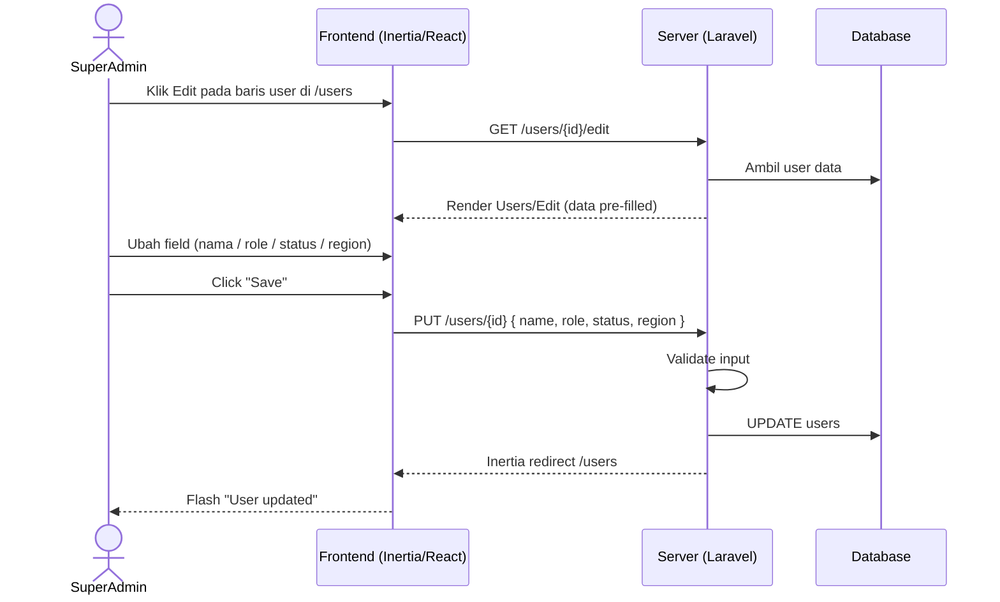
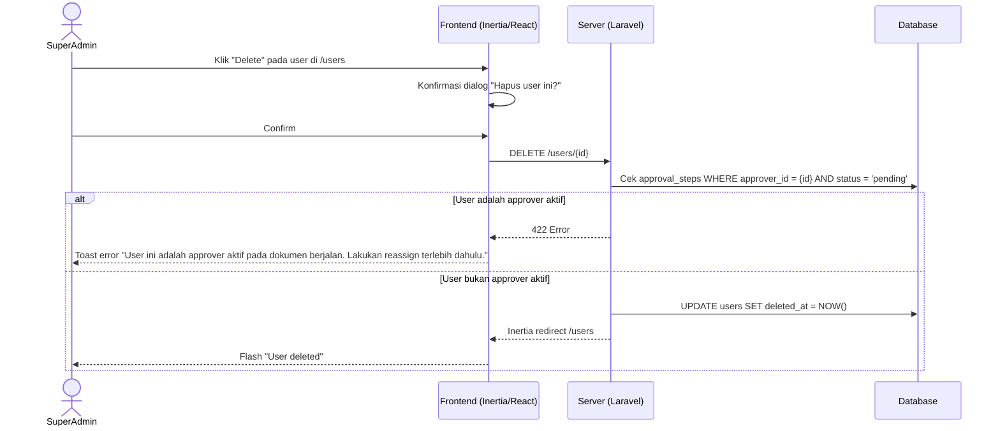
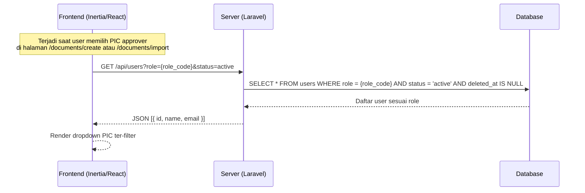
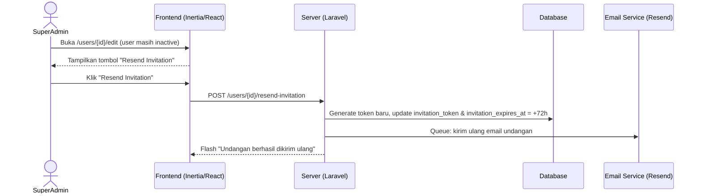

# System Logic: FR-USR — User Management

| | |
|---|---|
| **Document Version** | v1.0 |
| **FR Group ID** | FR-USR |
| **FR Group Name** | User Management |
| **Status** | Draft |
| **Last Updated** | 2026-06-23 |
| **Author** | System Analyst AI |
| **Source** | SRS §3.2 · IA §6.19 · Data Model §3.1 |

---

## 1. Overview

Modul ini mengelola CRUD pengguna sistem beserta penugasan role. Hanya **Super Admin** yang memiliki akses ke modul ini. Setiap user memiliki tepat satu role dari 8 role yang tersedia. Soft delete diterapkan dengan guard: user yang menjadi approver aktif tidak dapat dihapus.

**Cakupan FR:**
| FR ID | Deskripsi | Prioritas |
|---|---|---|
| FR-USR-01 | Super Admin CRUD user (soft delete) | MUST |
| FR-USR-02 | 8 role didukung; satu user = satu role | MUST |
| FR-USR-03 | Atribut user: nama, email, role, status, region (opsional) | MUST |
| FR-USR-04 | Pada pemilihan PIC approver, daftar user ter-filter sesuai role level | MUST |
| FR-USR-05 | User yang menjadi approver aktif tidak dapat dihapus → arahkan reassign | MUST |
| FR-USR-06 | Hak akses ditegakkan via RBAC | MUST |

---

## 2. Actors

| Actor | Role Kode | Keterlibatan |
|---|---|---|
| Super Admin | `super_admin` | Full CRUD user + kirim undangan |
| System | — | Kirim email undangan via queue |

---

## 3. Sequence Diagrams

### Scenario 1: Create User + Send Invitation



---

### Scenario 2: Edit User (Update Data / Status)



---

### Scenario 3: Soft Delete User (dengan Guard Approver Aktif)



---

### Scenario 4: Filter User by Role (untuk Pemilihan PIC Approver — FR-USR-04)



---

### Scenario 5: Resend Invitation



---

## 4. API Contract

### 4.1 Inertia Routes

| Method | Route | Inertia Page | Akses |
|---|---|---|---|
| GET | `/users` | `Users/Index` | Super Admin |
| GET | `/users/create` | `Users/Create` | Super Admin |
| GET | `/users/{id}/edit` | `Users/Edit` | Super Admin |

**Props `Users/Index`:**
```json
{
  "users": {
    "data": [
      {
        "id": "uuid-v7",
        "name": "string",
        "email": "string",
        "role": "string",
        "region": "string | null",
        "status": "active | inactive",
        "created_at": "datetime"
      }
    ],
    "links": {},
    "meta": {}
  },
  "filters": { "role": "string | null", "status": "string | null" }
}
```

**Props `Users/Create`:**
```json
{
  "roles": ["super_admin", "admin", "viewer", "partner", "approver_ms_bo", "approver_ms_rts", "approver_xls_rth_team", "approver_xls_rth"]
}
```

---

### 4.2 Form Actions

#### POST /users — Create User
**Request Body:**
```json
{
  "name": "string (required, max 150)",
  "email": "string (required, email, unique:users)",
  "role": "string (required, in: 8 valid roles)",
  "region": "string (nullable, max 100)",
  "partner_id": "uuid (required if role=partner)"
}
```

**Success Response:**
```
Inertia redirect → /users
Flash: "User berhasil dibuat dan undangan telah dikirim."
```

**Error Response (422):**
```json
{
  "errors": {
    "email": ["Email sudah terdaftar."],
    "role": ["Role tidak valid."]
  }
}
```

---

#### PUT /users/{id} — Update User
**Request Body:**
```json
{
  "name": "string (required, max 150)",
  "role": "string (required, in: 8 valid roles)",
  "status": "string (required, in: active, inactive)",
  "region": "string (nullable, max 100)"
}
```

**Note:** Email tidak dapat diubah setelah akun dibuat.

**Success Response:**
```
Inertia redirect → /users
Flash: "User berhasil diperbarui."
```

---

#### DELETE /users/{id} — Soft Delete User
**Request:** No body

**Success Response:**
```
Inertia redirect → /users
Flash: "User berhasil dihapus."
```

**Error Response (422) — Guard aktif:**
```json
{
  "message": "User ini adalah approver aktif pada dokumen berjalan. Lakukan reassign terlebih dahulu."
}
```

---

#### POST /users/{id}/resend-invitation
**Request:** No body

**Success Response:**
```
Inertia redirect → /users/{id}/edit
Flash: "Undangan berhasil dikirim ulang."
```

---

#### GET /api/users — Filter by Role (JSON endpoint untuk dropdown PIC)
**Query Params:**
```
?role=approver_ms_rts&status=active
```

**Response:**
```json
{
  "data": [
    { "id": "uuid-v7", "name": "John Doe", "email": "john@example.com" }
  ]
}
```

---

## 5. Data Flow

| Step | Input | Process | Output |
|---|---|---|---|
| 1 | Form data (name, email, role) | Validate uniqueness & role validity | Validated data |
| 2 | Validated data | INSERT to `users` table (status=inactive) | User record |
| 3 | User record | Generate invitation token (hashed, 72h expiry) | Token stored |
| 4 | Token | Queue email job | Email undangan terkirim |
| 5 | role_code param | Query `users WHERE role = ? AND status = 'active'` | Filtered user list untuk PIC dropdown |
| 6 | DELETE request | Check `approval_steps` for active pending steps | Guard: allow or block |

---

## 6. Security Rules

| Rule | Deskripsi |
|---|---|
| Akses hanya Super Admin | Route `/users*` dilindungi Policy `UserPolicy` — hanya `super_admin` yang lolos |
| Email tidak dapat diubah | Mencegah identity hijacking setelah akun aktif |
| Soft delete only | Data user tidak pernah dihapus permanen dari database |
| UUID v7 di URL | `/users/{uuid}` — ID tidak dapat dienumerasi |

---

## 7. Business Rules

| Rule ID | Deskripsi |
|---|---|
| BR-USR-01 | Satu user = tepat satu role dari 8 role valid (SRS FR-USR-02) |
| BR-USR-02 | User dengan `role = 'partner'` wajib memiliki `partner_id` yang valid |
| BR-USR-03 | Email adalah identifier unik; tidak dapat diubah setelah dibuat |
| BR-USR-04 | User approver aktif (punya `approval_steps.status = 'pending'`) tidak bisa soft-delete (SRS FR-USR-05) |
| BR-USR-05 | Dropdown PIC saat submission hanya menampilkan user dengan role sesuai level & status active (SRS FR-USR-04) |
| BR-USR-06 | Tombol "Resend Invitation" hanya muncul untuk user dengan `status = 'inactive'` |

---

## 8. Validations

| Field | Rule | Error Message (EN) |
|---|---|---|
| `name` | Required, max 150 chars | "Name is required" / "Name cannot exceed 150 characters" |
| `email` | Required, valid email, unique in `users` | "Email is required" / "Email is already registered" |
| `role` | Required, must be one of 8 valid roles | "Please select a valid role" |
| `partner_id` | Required when role = `partner` | "Partner is required for Partner users" |
| `region` | Optional, max 100 chars | "Region cannot exceed 100 characters" |
| `status` | Required (on edit), must be `active` or `inactive` | "Please select a valid status" |

---

## 9. Edge Cases

| Skenario | Penanganan |
|---|---|
| Super Admin menghapus dirinya sendiri | Block: "Anda tidak dapat menghapus akun Anda sendiri" |
| Mengubah role user yang merupakan approver aktif | Warning ditampilkan; jika dilanjutkan, update role saja (step existing tidak berubah, tapi perlu reassign) |
| Email undangan bounce/tidak terkirim | Admin dapat resend dari halaman edit |
| User dinonaktifkan (`status=inactive`) yang sedang login | Session tetap valid sampai expire; login berikutnya ditolak |
| Duplikasi email saat create | Server validation: 422 dengan pesan jelas |

---

## 10. Traceability

| Scenario | SRS FR | IA Page | Data Model | Controller |
|---|---|---|---|---|
| CRUD User | FR-USR-01, 03 | `Users/Index`, `Users/Create`, `Users/Edit` §6.19 | `users` | `UserController` |
| Role assignment | FR-USR-02 | `Users/Create`, `Users/Edit` | `users.role` | `UserController` |
| Filter PIC approver | FR-USR-04 | `Documents/Create` §6.11 | `users.role` | `UserController@filterByRole` |
| Guard approver aktif | FR-USR-05 | `Users/Index` §6.19 | `approval_steps.approver_id` | `UserController@destroy` |
| RBAC enforcement | FR-USR-06 | Semua halaman | — | `UserPolicy`, middleware |
